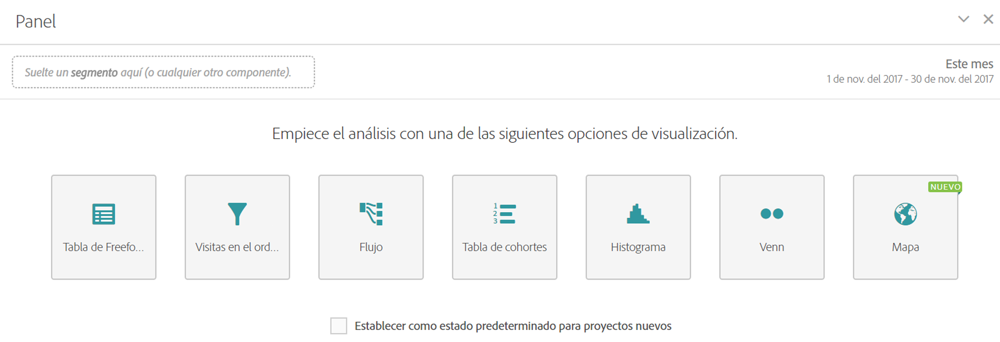

# Panel en blanco

Un panel en blanco resalta todas las visualizaciones que puede crear desde dentro de un panel, incluidas Improvisado, Mapa, Visitas en el orden previsto, Flujo, Histograma, Cohorte y Venn. También puede elegir que Panel en blanco sea el estado inicial predeterminado de sus proyectos, en vez de usar un panel improvisado.

