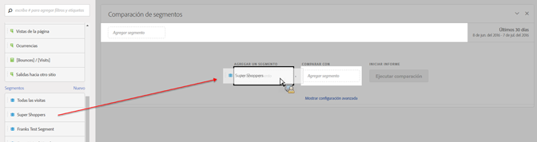
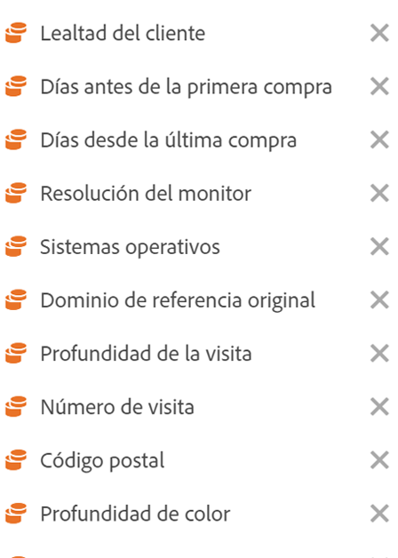

# Comparar segmentos

Explica cómo comparar segmentos en Analysis Workspace.

>[!NOTE]
>
>You can also compare segments within a [fallout analysis](../../../../analyze/analysis-workspace/visualizations/fallout/compare-segments-fallout.md#section_E0B761A69B1545908B52E05379277B56).

## Compare segments {#section_8F2BFC45131C49B4A2E08A063CD7A91F}

1. Navigate to **[!UICONTROL Analytics]** &gt; **[!UICONTROL Workspace]** and open a project.

1. En el carril **[!UICONTROL Paneles]** del margen izquierdo, seleccione **Comparación de segmentos]y arrástrelo hasta un proyecto nuevo o existente.[!UICONTROL **

   

1. Asegúrese de que el intervalo de fechas de la comparación está definido correctamente.
1. Seleccione segmentos para comparar y suéltelos en el panel. Por ejemplo, imaginemos que tiene un segmento “Supercompradores”.

   

   Una vez que ha soltado el segmento en el panel, Analytics crea automáticamente un segmento **[!UICONTROL Todos los demás]que incluye todos los demás que NO estén en el segmento que ha elegido (en este caso, todos los “No supercompradores”).** Esto evita que tenga que crear dicho segmento. El segmento Todos los demás se añade automáticamente al panel del campo **[!UICONTROL Comparar con].** Puede eliminarlo libremente y comparar Supercompradores con cualquier otro segmento que desee.

   

1. Haga clic en **[!UICONTROL Mostrar configuración avanzada]para excluir componentes (dimensiones, métricas o segmentos) de su análisis de comparación de segmentos.** Para obtener más información, consulte [Excluir componentes de comparación](../../../../analyze/analysis-workspace/c-panels/c-segment-comparison/compare-segments.md#section_5E98FFA0744140C08D83700E3F025937).

1. Una vez que ha seleccionado el segmento “Comparar con” correcto, haga clic en **[!UICONTROL Crear]**.

   Esta acción inicia un proceso en el servidor que busca diferencias estadísticas entre los segmentos a través de cada dimensión, métrica y otros segmentos. En la parte superior de la herramienta, se muestra una barra de progreso que indica el tiempo que queda hasta la finalización del análisis de cada métrica y dimensión, en busca de diferencias importantes. Además, se da prioridad y se analizan primero las métricas, dimensiones y segmentos que más utiliza con el fin de ofrecerle los resultados más relevantes cuanto antes.

   Una vez que el proceso del servidor ha completado el análisis, podrá observar una serie de imágenes nuevas:

   

   

1. Interprete los resultados de su Comparación de segmentos revisando [nuevas visualizaciones, tablas y resúmenes](../../../../analyze/analysis-workspace/c-panels/c-segment-comparison/segment-comparison.md#concept_74FAC1C6D0204F9190A110B0D9005793).

## Exclude components from comparison {#section_5E98FFA0744140C08D83700E3F025937}

A veces, es posible que desee excluir algunas dimensiones, métricas o segmentos de comparaciones de segmentos. Por ejemplo, supongamos que desea comparar el segmento de usuarios móviles de EE. UU. con los usuarios móviles alemanes. No tendría sentido incluir alguna dimensión relacionada con la geografía, ya que habrá diferencias evidentes en la ubicación entre estos dos segmentos. Puede excluirlos. A continuación se muestra cómo:

1. Después de haber arrastrado los segmentos que desea comparar en el panel, haga clic en **[!UICONTROL Mostrar opciones avanzadas]para excluir componentes (dimensiones, métricas o segmentos) del análisis de comparación de segmentos.**

   

1. Arrastre y suelte los componentes que desea excluir en cualquier sitio del panel **[!UICONTROL Componentes excluidos].** (podría decirse que es una “lista negra” de componentes para excluir). Puede definir estos componentes como predeterminados o hacer clic en **[!UICONTROL Borrar todo]para volver a empezar.**

   

1. Haga clic en **[!UICONTROL Establecer como predeterminado]** para excluir dichos componentes de **todas** las comparaciones de segmentos.

1. Si alguna vez necesita revisar la lista de componentes excluidos, haga doble clic, por ejemplo, en Dimensiones y aparecerá la lista de dimensiones excluidas:

   

1. Simplemente elimine las dimensiones no deseadas haciendo clic en la x junto a ellas y guarde la lista haciendo clic en **[!UICONTROL Establecer como predeterminado]**.

