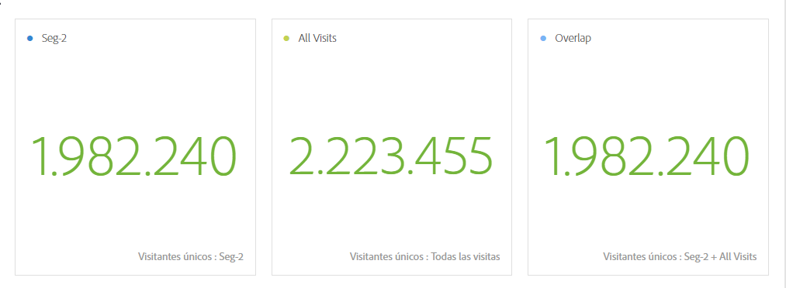

# Información general del panel de comparación de segmentos

El panel Comparación de segmentos es una parte de la herramienta de [IQ de segmento](../../segment-iq.md) que detecta las diferencias estadísticamente más significativas entre un número ilimitado de segmentos. La función se repite mediante un análisis automatizado de todas las dimensiones y métricas a las que tiene acceso. De forma automática, muestra las características clave de los segmentos de audiencia que dirigen el KPI de su empresa y le permite observar cuánto se superponen los segmentos.

## Creación de un panel de comparación de segmentos

1. Inicie sesión en [experiencecloud.adobe.com](https://experiencecloud.adobe.com) con sus credenciales de Adobe ID.
1. Haga clic en el icono de 9 cuadrados en la esquina superior derecha y, a continuación, haga clic en el logotipo de Analytics.
1. En la barra de navegación superior, haga clic en Workspace.
1. Haga clic en el botón Crear nuevo proyecto.
1. En la ventana emergente modal, compruebe que está seleccionado “Proyecto en blanco” y, a continuación, haga clic en Crear.
1. Haga clic en el botón Paneles de la izquierda y, a continuación, arrastre el panel Comparación de segmentos por encima o por debajo del panel de tabla improvisada creado automáticamente.

   

1. Seleccione segmentos para comparar y suéltelos en el panel.

   

   Después de arrastrar un segmento al panel, Analytics crea automáticamente un segmento [!UICONTROL “Todos los demás”] que incluye a todos los que NO están en el segmento que ha elegido. Se trata de un segmento que se utiliza con frecuencia en el panel de comparación, pero puede eliminarlo y comparar otro segmento de su elección.

   

1. Una vez que haya determinado qué dos segmentos comparar, haga clic en [!UICONTROL Generar].

   Esta acción inicia un proceso backend que busca diferencias estadísticas entre los dos segmentos seleccionados y todas las dimensiones, métricas y otros segmentos. Una barra de progreso en la parte superior del panel indica el tiempo restante hasta que se analizan todas las métricas y dimensiones. Las métricas, dimensiones y segmentos utilizados con más frecuencia tienen prioridad para ejecutarse primero, de modo que los resultados más relevantes se devuelvan de manera oportuna.

## Excluir componentes de comparación

A veces se desea excluir algunas dimensiones, métricas o segmentos de las comparaciones de segmentos. Por ejemplo, desea comparar el segmento “Usuarios móviles de EE. UU.” con “Usuarios móviles alemanes”. Incluir dimensiones relacionadas con la geografía no tendría sentido, ya que estos segmentos ya implican esas diferencias.

1. Una vez que los dos segmentos deseados estén en el panel, haga clic en [!UICONTROL “Mostrar opciones avanzadas”].
1. Arrastre y suelte los componentes que desea excluir en cualquier sitio del panel [!UICONTROL Componentes excluidos].

   

Haga clic en [!UICONTROL Establecer como predeterminado] para excluir automáticamente los componentes actuales en todas las comparaciones de segmentos futuras. Si desea editar componentes excluidos, haga clic en un tipo de componente y, a continuación, haga clic en la “X” situada junto a un componente para volver a incluirlos en el análisis. Haga clic en “Borrar todo” para volver a incluir todos los componentes en la comparación de segmentos.

## Visualización de un informe de comparación de segmentos

Una vez que Adobe termina de analizar los dos segmentos deseados, muestra sus resultados a través de varias visualizaciones:

### Tamaño y superposición

Ilustra los tamaños comparativos de cada segmento seleccionado y cuánto se superponen entre sí mediante un diagrama de Venn. Puede situarse sobre la imagen para ver cuántos visitantes estaban en cada sección superpuesta o no superpuesta. También puede hacer clic en la superposición para crear un segmento totalmente nuevo si desea hacer un análisis en mayor profundidad. Si los dos segmentos son mutuamente excluyentes, no se muestra ninguna superposición entre los dos círculos (normalmente se ve con segmentos que utilizan un contenedor de visita individual).

### Resúmenes de población

A la derecha de la visualización Tamaño y superposición, se muestra el recuento total de visitantes únicos en cada segmento y superposición.

### Métricas principales

Muestra las métricas más significativas estadísticamente entre los dos segmentos. Cada fila de dicha tabla representa una métrica diferenciadora, ordenada según lo diferente que sea de cada segmento. Una puntuación de diferencia de 1 significa que tiene relevancia estadística, mientras que una puntuación de diferencia de 0 significa que no tiene relevancia estadística.

Esta visualización es similar a las tablas improvisada en Analysis Workspace. Si desea realizar un análisis más profundo de una métrica específica, pase el ratón sobre un elemento de línea y haga clic en “Crear imagen”. Se crea una nueva tabla para analizar esa métrica específica. Si una métrica no es relevante para el análisis, pase el ratón sobre el elemento de línea y haga clic en la “X” para eliminarla.

>[!NOTE]
>
>Las métricas que se agreguen a esta tabla una vez finalizada la comparación de segmentos no reciben una puntuación de diferencia.

### Métrica a lo largo del tiempo por segmento

A la derecha de la tabla de métricas se encuentra la visualización vinculada. Puede hacer clic en un elemento de línea en la tabla de la izquierda y esta visualización se actualiza para mostrar esa métrica con las tendencias históricas.

### Dimensiones principales

Muestra los elementos de dimensión más significativos estadísticamente en todas las dimensiones. Cada fila muestra el porcentaje de cada segmento con este elemento de dimensión. Por ejemplo, esta tabla podría revelar que el 100% de los visitantes del segmento A tenían el elemento de dimensión “Tipo de explorador: Google”, mientras que solo el 19,6% del “segmento B” tenía este elemento de dimensión. Una puntuación de diferencia de 1 significa que tiene relevancia estadística, mientras que una puntuación de diferencia de 0 significa que no tiene relevancia estadística.

Esta visualización es similar a las tablas improvisada en Analysis Workspace. Si desea una análisis más profunda en un elemento de dimensión específico, pase el ratón sobre un elemento de línea y haga clic en &#39;Crear elemento visual&#39;. Se crea una nueva tabla para analizar ese elemento de dimensión específico. Si un elemento de dimensión es irrelevante para la análisis, pase el ratón sobre el elemento de línea y haga clic en la &#39;X&#39; para eliminarlo.

>[!NOTE]
>
>Los elementos de Dimension agregados a esta tabla después de que la comparación de segmentos haya finalizado no reciben una puntuación de diferencia.

### Elementos de dimensión por segmento

A la derecha de la tabla de dimensiones se encuentra la visualización de gráfico de barras vinculada. Muestra todos los elementos de dimensión mostrados en un gráfico de barras. Al hacer clic en un elemento de línea en la tabla de la izquierda, se actualiza la visualización de la derecha.

### Segmentos principales

Muestra qué otros segmentos (que no sean los dos seleccionados para la comparación) tienen una superposición estadísticamente significativa. Por ejemplo: esta tabla puede mostrar que un tercer segmento, “Visitantes repetidos”, se superpone con el segmento A pero no con el segmento B. Una puntuación de diferencia de 1 significa que tiene relevancia estadística, mientras que una puntuación de diferencia de 0 significa que no tiene relevancia estadística.

Esta visualización es similar a las tablas improvisada en Analysis Workspace. Si desea realizar un análisis más profundo de un segmento específico, pase el ratón sobre un elemento de línea y haga clic en “Crear elemento visual”. Se crea una nueva tabla para analizar ese segmento específico. Si un segmento no es relevante para el análisis, pase el ratón sobre el elemento de línea y haga clic en la “X” para eliminarlo.

>[!NOTE]
>
>Los segmentos que se agreguen a esta tabla después de que la comparación de segmentos haya finalizado no reciben una puntuación de diferencia.

### Superposición de segmentos

A la derecha de la tabla de segmentos se encuentra la visualización de diagrama de Venn vinculada. Muestra el segmento más significativo estadísticamente aplicado a los segmentos comparados. Por ejemplo, “Segmento A” + “Segmento estadísticamente significativo” vs. “Segmento B” + “Segmento estadísticamente significativo”. Al hacer clic en un elemento de línea de segmento en la tabla de la izquierda, se actualiza el diagrama de Venn de la derecha.

