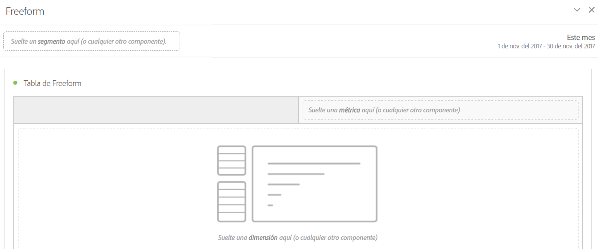

# Panel de forma libre

>[!BEGINSHADEBOX]

_Este artículo documenta el panel de forma libre en_  _&#x200B;**Adobe Analytics**._ _Vea [Panel de forma libre](/help/analyze/analysis-workspace/c-panels/freeform-panel.md) para la_  _&#x200B;**Customer Journey Analytics** versión de este artículo._

>[!ENDSHADEBOX]

Un **[!UICONTROL panel de forma libre]** es un panel en blanco con una visualización de [tabla de forma libre](/help/analyze/analysis-workspace/visualizations/freeform-table/freeform-table.md) como el estado inicial predeterminado.

## Utiliza

Para usar un **[!UICONTROL panel de forma libre]**:

1. Cree un **[!UICONTROL panel de forma libre]**. Para obtener información sobre cómo crear un panel, consulta [Crear un panel](panels.md#create-a-panel).

   

1. Consulte la [guía de componentes de Analytics](/help/components/home.md) sobre cómo añadir componentes al panel de forma libre y la visualización [Tabla de forma libre](/help/analyze/analysis-workspace/visualizations/freeform-table/freeform-table.md).

>[!MORELIKETHIS]
>
>[Crear un panel](/help/analyze/analysis-workspace/c-panels/panels.md#create-a-panel)
>[Guía de componentes de Analytics](/help/components/home.md)
>[Visualización de tabla de forma libre](/help/analyze/analysis-workspace/visualizations/freeform-table/freeform-table.md)
>
