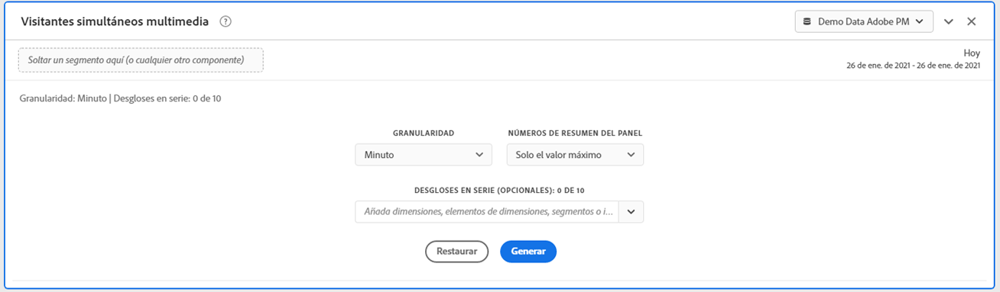
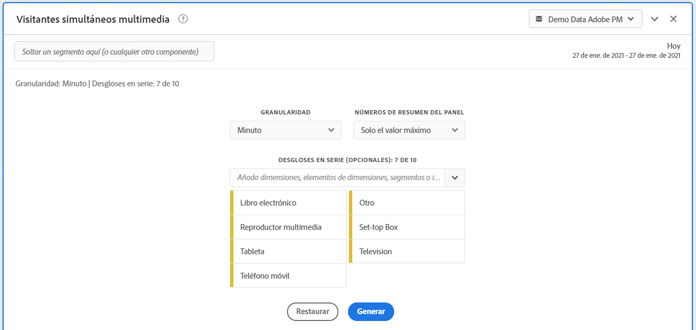
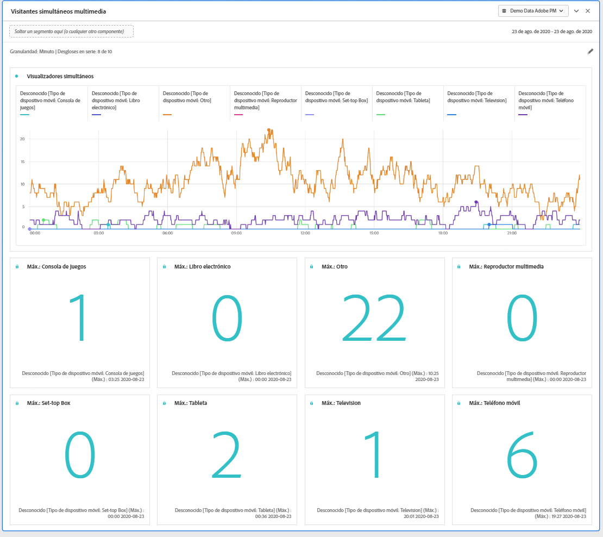

# Panel de visualizadores simultáneos de medios

Los clientes de Media Analytics pueden analizar los visualizadores simultáneos para comprender dónde se produjo la concurrencia máxima o dónde se produjeron los descensos y proporcionar una valiosa perspectiva de la calidad del contenido y la participación del visualizador, así como ayudar a solucionar problemas o a planificar el volumen o la escala.

En Analysis Workspace, los visualizadores simultáneos comprende la cantidad de visitantes únicos que visualizan sus flujos de medios en un momento específico, independientemente de la cantidad de sesiones.

El panel Visualizadores simultáneos de medios permite el análisis de los visualizadores simultáneos a lo largo del tiempo, con detalles sobre la concurrencia máxima y la capacidad de desglosar y comparar.  Para acceder al panel Visualizadores simultáneos de medios , vaya a un grupo de informes con los componentes de Media Analytics habilitados. A continuación, haga clic en el icono del panel en el extremo izquierdo y arrastre el panel al proyecto de Analysis Workspace.

## Entradas de panel {#Input}

Puede configurar el panel Visualizadores simultáneos de medios con esta configuración de entrada:

| Configuración | Descripción |
|---|---|
| Intervalo de fecha del panel | El intervalo de fechas predeterminado del panel es Hoy.  Puede editarlo para ver un solo día o varios meses a la vez.    Esta visualización está limitada a 1440 filas de datos (por ejemplo, 24 horas con una granularidad por minuto).  Si la combinación de intervalo de fechas y granularidad genera más de 1440 filas, la granularidad se actualiza automáticamente para dar cabida al intervalo de fechas completo. |
| Granularidad | El valor predeterminado de granularidad es Minuto.    Esta visualización está limitada a 1440 filas de datos (por ejemplo, 24 horas con una granularidad por minuto).  Si la combinación de intervalo de fechas y granularidad genera más de 1440 filas, la granularidad se actualiza automáticamente para dar cabida al intervalo de fechas completo. |
| Números de resumen del panel | Para ver los detalles de fecha y hora de los espectadores simultáneos, hay disponible un número de resumen. El máximo muestra detalles para la concurrencia máxima. El Mínimo muestra los detalles de la emisión.  El panel predeterminado muestra Máximo solamente, pero puede cambiarlo para mostrar Mínimo o Máximo y Mínimo.  Si utiliza desgloses, se muestra un número de resumen para cada uno. |
| Desglose de serie | De forma opcional, puede desglosar la visualización por segmentos, dimensiones, elementos de dimensión o intervalos de fechas.   - Puede ver hasta 10 líneas a la vez. Los desgloses están limitados a un solo nivel.  - Al arrastrar una dimensión, los elementos de dimensión principales se seleccionarán automáticamente en función del intervalo de fechas del panel seleccionado.  - Para comparar intervalos de fechas, arrastre 2 o más intervalos de fechas al filtro de desglose de series. |

### Vista predeterminada

### Vista de desglose de series

## Salida de panel {#Output}

El panel Visualizadores simultáneos de medios devuelve un gráfico de líneas y números de resumen para incluir detalles de los visualizadores simultáneos máximo y/o mínimo.  En la parte superior del panel, se proporciona una línea de resumen para recordarle la configuración del panel seleccionada.

En cualquier momento, puede editar y reconstruir el panel haciendo clic en el lápiz de edición en la parte superior derecha.

Si seleccionó el desglose de series, se mostrará una línea en el gráfico de líneas y un número de resumen para cada uno:

### Fuente de datos

La única métrica que se puede usar en este panel es Visualizadores simultáneos:

| Métrica | Descripción |
|---|---|
| Visualizadores simultáneos | Número de visitantes únicos que ven sus flujos de medios en un punto específico en el tiempo, independientemente del número de sesiones.  Esto es diferente a los informes de espectadores simultáneos en la sección Informes , que utiliza Sesiones activas concurrentes.  El uso de visitantes únicos permite eliminar los &quot;picos&quot; no deseados en los límites de los programas (donde las sesiones finalizan y comienzan al mismo tiempo). |

Una tabla improvisada no está disponible en esta vista.  Para ver la fuente de datos, puede hacer clic con el botón derecho en el gráfico de líneas y descargarlo como archivo .csv .  Se incluirán los desgloses de serie.

## Preguntas frecuentes {#FAQ}

| Pregunta | Respuesta |
|---|---|
| ¿Dónde está la tabla improvisada? ¿Cómo puedo ver la fuente de datos? | La tabla improvisada no está disponible en esta vista.  Puede descargar la fuente de datos haciendo clic con el botón derecho en el gráfico de líneas y descargando el archivo CSV. |
| ¿Por qué cambió mi granularidad? | Esta visualización está limitada a 1440 filas de datos (por ejemplo, 24 horas con una granularidad por minuto).  Si la combinación de intervalo de fechas y granularidad genera más de 1440 filas, la granularidad se actualizará automáticamente para dar cabida al intervalo de fechas completo.  Al cambiar de un intervalo de fechas más grande a uno más pequeño, la granularidad se actualiza con el detalle más bajo permitido una vez que se cambia el intervalo de fechas. Para ver una granularidad más alta, edite el panel y vuelva a generar. |
| ¿Cómo comparo nombres de vídeo, segmentos, tipos de contenido, etc.? | Para compararlos en una sola visualización, arrastre segmentos, dimensiones o elementos de dimensión específicos en el filtro de desglose de series.  La vista está limitada a 10 desgloses.  Para ver más de 10, debe usar varios paneles. |
| ¿Cómo comparo intervalos de fechas? | Para comparar intervalos de fechas en una sola visualización, utilice los desgloses de series arrastrando 2 o más intervalos de fechas.  Estos intervalos de fechas anularán el intervalo de fechas del panel. |
| ¿Cómo cambio el tipo de visualización? | Este panel solo permite la visualización de líneas de la serie temporal. |
| ¿Puedo ejecutar la detección de anomalías? | No.  La detección de anomalías no está disponible para este panel. |
| ¿Por qué utilizar visitantes únicos en lugar de sesiones activas? | El uso de visitantes únicos permite eliminar los picos no deseados en los límites de los programas (donde las sesiones finalizan y comienzan al mismo tiempo). |
| ¿Qué significa tener visualizadores simultáneos de mayor granularidad que minutos? | Con una granularidad de más de un minuto, los espectadores simultáneos son la suma de espectadores simultáneos únicos para todos los minutos dentro de ese intervalo de tiempo.  Por ejemplo, a nivel de granularidad de hora, los visualizadores simultáneos son la suma de los visualizadores simultáneos únicos para todos los minutos dentro de la hora. |
| ¿Qué sucede si deseo ver más de 1 día en la granularidad de nivel de minuto? | Para acceder a los datos con granularidad de nivel de minuto durante un máximo de 1 mes a la vez, puede utilizar las API de Analytics 2.0. Para obtener más información, consulte [Obtener datos de informes JSON de espectadores simultáneos con las API de Analytics 2.0](https://docs.adobe.com/content/help/en/media-analytics/using/media-reports/media-default-reports/get-concurrent-json20.html). |
| ¿El panel del espacio de trabajo muestra la misma información que el informe Espectadores simultáneos? | No.  En Analysis Workspace, los visualizadores simultáneos se definen como el número de visitantes únicos que visualizan su flujo de medios en un momento específico, independientemente del número de sesiones.  Esto es diferente a los informes de espectadores simultáneos en la sección Informes , que utiliza Sesiones activas concurrentes.  El uso de visitantes únicos permite eliminar picos no deseados en los límites de los programas, ya que las sesiones finalizan y comienzan al mismo tiempo. |

<!-- For more information about Media Concurrent Viewers, visit [MA doc page]( https://url). -->
