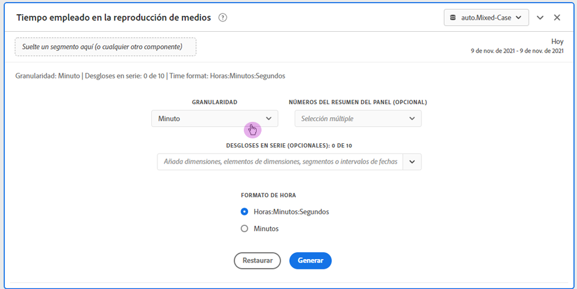
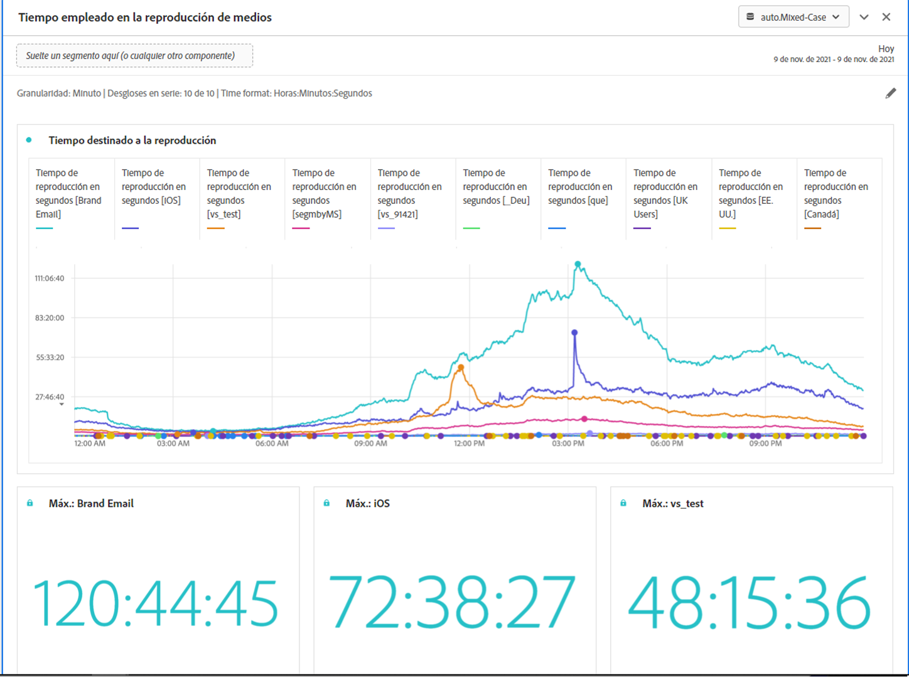

# Panel Tiempo invertido en la reproducción de medios {#media-playback-time-spent-panel}

<!-- markdownlint-disable MD034 -->

>[!CONTEXTUALHELP]
>id="workspace_mediaplaybacktimespent_button"
>title="Tiempo invertido en la reproducción de medios"
>abstract="Cree un panel para analizar el consumo de vídeo a lo largo del tiempo, con varios niveles de granularidad, y la capacidad de realizar desgloses y comparaciones."

<!-- markdownlint-enable MD034 -->

<!-- markdownlint-disable MD034 -->

>[!CONTEXTUALHELP]
>id="workspace_mediaplaybacktimespent_panel"
>title="Tiempo invertido en la reproducción de medios"
>abstract="Analice el consumo de vídeo a lo largo del tiempo, seleccione varias granularidades, desglose y compare.  **Granularidad**: seleccione el período de tiempo en el que desea ver los visualizadores simultáneos. **Números de resumen del panel (opcional)**: opción para mostrar números de resumen con detalles de fecha u hora para cada línea. Máximo mostrará detalles del tiempo máximo de reproducción consumido. Mínimo mostrará los detalles de la emisión. La suma muestra detalles de la suma total de tiempo de reproducción transcurrido. **Desglose por serie (opcional)**: desglose la visualización por segmentos, dimensiones, elementos de dimensión o intervalos de fechas. Puede ver hasta 10 líneas a la vez. Los desgloses se limitan a un solo nivel. **Formato de hora**: opción para mostrar el formato de hora de las visualizaciones en horas o minutos."

<!-- markdownlint-enable MD034 -->

>[!BEGINSHADEBOX]

_Este artículo documenta el panel Tiempo invertido en la reproducción de contenido en_  _&#x200B;**Adobe Analytics**._ _Consulte [Panel de tiempo invertido en la reproducción de contenido](/help/analyze/analysis-workspace/c-panels/media-playback-time-spent.md)) para la versión de_  _&#x200B;**Customer Journey Analytics** de este artículo._

>[!ENDSHADEBOX]

>[!NOTE]
>
>El panel Audiencia media por minuto de medios solo está disponible para los clientes que han adquirido el complemento de Adobe Analytics para medios de streaming.
>
>Póngase en contacto con su representante de ventas de Adobe o con el equipo de cuentas de Adobe para obtener más información.
>

El panel **[!UICONTROL Tiempo invertido en la reproducción de medios]** permite analizar la reproducción a lo largo del tiempo, con detalles sobre los picos de simultaneidad y la posibilidad de realizar desgloses y comparaciones. 

En Analysis Workspace, el tiempo invertido en la reproducción es la cantidad de tiempo empleado en visualizar las transmisiones de medios en un momento determinado. Incluye pausa, búfer y el tiempo para el inicio.

Los clientes que hayan adquirido el complemento de Adobe Analytics para medios de streaming pueden analizar el tiempo invertido en la reproducción para obtener un valioso insight en la calidad del contenido y en la participación del visualizador. Y para ayudar a solucionar problemas o a planificar el volumen o la escala.

El tiempo invertido en la reproducción puede ayudarle a conocer lo siguiente:

* Dónde se produjo el pico de simultaneidad.

* Dónde se produjeron los abandonos.

>[!BEGINSHADEBOX]

Consulte  [Panel de tiempo invertido en la reproducción de medios](https://video.tv.adobe.com/v/338699?quality=12&learn=on){target="_blank"} para ver un vídeo de demostración.

>[!ENDSHADEBOX]

## Usar

Para usar un panel **[!UICONTROL Tiempo invertido en la reproducción de medios]**:

1. Cree un panel **[!UICONTROL Tiempo invertido en la reproducción de medios]**. Para obtener información sobre cómo crear un panel, consulta [Crear un panel](panels.md#create-a-panel).

1. Asegúrese de seleccionar una vista de datos para el panel que tenga componentes configurados del complemento de Adobe Analytics para medios de streaming.

1. Especifica la [entrada](#panel-input) para el panel.

1. Observa la [salida](#panel-output) del panel.

### Entrada de panel

Puede configurar el panel Tiempo invertido en la reproducción de contenido con esta configuración de entrada:

| Configuración | Descripción |
|---|---|
| Intervalo de fecha del panel | El intervalo de fechas predeterminado del panel es Hoy. Puede editarlo para ver un solo día o varios meses a la vez. Esta visualización está limitada a 1440 filas de datos (por ejemplo, 24 horas con una granularidad por minuto). Si la combinación de intervalo de fechas y granularidad genera más de 1440 filas, la granularidad se actualiza automáticamente para dar cabida al intervalo de fechas completo. |
| Granularidad | El valor predeterminado de granularidad es Minuto. Esta visualización está limitada a 1440 filas de datos (por ejemplo, 24 horas con una granularidad por minuto). Si la combinación de intervalo de fechas y granularidad genera más de 1440 filas, la granularidad se actualiza automáticamente para dar cabida al intervalo de fechas completo. |
| Números de resumen del panel | Para ver los detalles de fecha y hora del tiempo invertido en la reproducción, hay disponible un número de resumen. El Máximo muestra detalles para la concurrencia máxima. El Mínimo muestra los detalles de la emisión. Suma recoge el tiempo total de reproducción invertido para la selección. El panel predeterminado muestra Máximo solamente, pero puede cambiarlo para mostrar Mínimo, Suma o cualquier combinación de los tres. Si utiliza desgloses, se muestra un número de resumen para cada uno. |
| Desglose de serie | De forma opcional, puede desglosar la visualización por filtros, dimensiones, elementos de dimensión o intervalos de fechas.
: Puede ver hasta 10 líneas a la vez. Los desgloses se limitan a un solo nivel.

- Al arrastrar una dimensión, los elementos de dimensión principales se seleccionarán automáticamente en función del intervalo de fechas del panel seleccionado.
: Para comparar intervalos de fechas, arrastre 2 o más intervalos de fechas al filtro de desglose de series. |
| Formato de hora | Puede ver el tiempo de reproducción transcurrido en `Hours:Minutes:Seconds` (valor predeterminado) o en `Minutes` (que se muestra en números enteros redondeados a 0,5). |
| Visualización de la secuencia de fechas | Si ha colocado al menos dos filtros de intervalo de fechas como desgloses de serie, aparecerá la opción para seleccionar la superposición (predeterminada) o secuencial. La superposición mostrará las líneas con un inicio común del eje x para que se ejecuten en paralelo, mientras que la secuencial mostrará las líneas con su inicio específico del eje x. Si los datos se alinean (por ejemplo, el filtro 1 termina a las 8:44 pm y el filtro 2 comienza a las 8:45 pm), las líneas se mostrarán en secuencia. |

### Salida del panel

El panel Tiempo invertido en la reproducción de contenido devuelve un gráfico de líneas y números de resumen para incluir detalles sobre el tiempo de reproducción máximo, mínimo o total. En la parte superior del panel, se proporciona una línea de resumen para recordarle la configuración del panel seleccionada.

En cualquier momento, seleccione  para editar y reconstruir el panel.

Si seleccionó el desglose de series, se mostrará una línea en el gráfico de líneas y un número de resumen para cada:

### Fuente de datos

La única métrica que se puede usar en este panel es Tiempo invertido en la reproducción.

| Métrica | Descripción |
|---|---|
| Tiempo invertido en la reproducción | Total de `hours:minutes:seconds` (o `minutes`) de contenido visualizado durante la granularidad seleccionada, incluidas la pausa, el búfer y el tiempo para el inicio. |

## Preguntas frecuentes

| Pregunta | Respuesta |
|---|---|
| ¿Dónde está la tabla de forma libre? ¿Cómo puedo ver la fuente de datos? | 

La tabla de forma libre no está disponible en esta vista. Para descargar la fuente de datos, en el menú contextual del gráfico de líneas, seleccione la opción para descargar el archivo CSV.
 |
| 
¿Por qué ha cambiado la granularidad?
 | 
Esta visualización está limitada a 1440 filas de datos (por ejemplo, 24 horas con una granularidad por minuto). Si la combinación de intervalo de fechas y granularidad genera más de 1440 filas, la granularidad se actualiza automáticamente para dar cabida al intervalo de fechas completo.

Al cambiar de un intervalo de fechas más grande a uno más pequeño, la granularidad se actualiza al menor detalle permitido una vez cambiado el intervalo de fechas. Para ver una granularidad mayor, edite el panel y vuélvalo a a generar.
 |
| 

¿Cómo comparo nombres de vídeo, filtros, tipos de contenido, etc.?
 | 
Para compararlos en una sola visualización, arrastre filtros, dimensiones o elementos de dimensión específicos en el filtro de desglose de la serie.

La vista está limitada a 10 desgloses. Para ver más de 10, debe usar varios paneles.
 |
| ¿Cómo comparo intervalos de fechas? | Para comparar intervalos de fechas en una sola visualización, utilice los desgloses de series arrastrando 2 o más intervalos de fechas. Estos intervalos de fechas anulan el intervalo de fechas del panel. |
| ¿Cómo cambio el tipo de visualización? | 

Este panel solo permite la visualización de líneas de la serie temporal.
 |
| ¿Puedo ejecutar la detección de anomalías? | 

No. La detección de anomalías no está disponible para este panel.
 |

>[!MORELIKETHIS]
>
>[Crear un panel](/help//analyze/analysis-workspace/c-panels/panels.md#create-a-panel)
>&#x200B;>[Panel Público medio por minuto de medios](average-minute-audience-panel.md)
>&#x200B;>[Panel Visualizadores simultáneos de medios](media-concurrent-viewers.md)
>

<!--
# Media Playback Time Spent panel

In Analysis Workspace, Playback Time Spent is the amount of time spent viewing your media streams at a specific point in time. It includes pause, buffer, and time to start.

The Media Playback Time Spent panel enables analysis of playback over time, with details on peak concurrency and the ability to break down and compare. 

Customers who have purchased the Streaming Media Collection Add-on can analyze playback time spent to gain valuable insight into the quality of content and viewer engagement, and to help when troubleshooting or planning for volume or scale.

Playback Time Spent can help you understand:

* Where peak concurrency occurred

* Where drop-offs occurred 

Following is a video overview of this panel:

>[!VIDEO](https://video.tv.adobe.com/v/338699)

## Use the Media Playback Time Spent panel

1. Go to a report suite with streaming media components enabled. 
1. Select the panel icon on the far-left, then drag the panel into your Analysis Workspace project.
1. Continue with the following sections to customize the Media Playback Time Spent panel

   * [Panel Inputs](#panel-inputs)
   * [Panel Output](#panel-output)

## Panel Inputs {#Input}

You can configure the Media Playback Time Spent panel using these input settings:

|Setting|Description|
|---|---|
|Panel date range|The panel date range default is Today. You may edit it to view a single day or many months at a time. This visualization is limited to 1440 rows of data (for example, 24-hours at minute-level granularity). If a date range and granularity combination results in more than 1440 rows, the granularity is automatically updated to accommodate the full date range.|
|Granularity|The granularity default is Minute. This visualization is limited to 1440 rows of data (for example, 24-hours at minute-level granularity). If a date range and granularity combination results in more than 1440 rows, the granularity is automatically updated to accommodate the full date range.|
|Panel summary numbers|To see date or time details for playback time spent, a summary number is available. The Maximum shows details for peak concurrency. The Minimum shows details for the trough. Sum adds up the total playback time spent for the selection. The panel default shows Maximum only, but you can change it to show Minimum, Sum, or any combination of the three. If you are using breakdowns, a summary number is displayed for each.|
|Series breakdown|Optionally, you can break down your visualization by segments, dimensions, dimension items, or date ranges.
- You may view up to 10 lines at a time. Breakdowns are limited to a single level.

- When dragging a dimension, the top dimension items will be automatically selected based on the selected panel date range.
- To compare date ranges, drag 2 or more date ranges into the series breakdown filter.|
|Time format|You can view the playback time spent in either `Hours:Minutes:Seconds` (default) or in `Minutes` (which is displayed in whole numbers, rounded up at .5). |
|Date sequence display|If you've placed at least two date range segments as series breakdowns you'll see the option to select either overlay (default) or sequential. Overlay will display the lines with a common x-axis start so that they run in parallel, while sequential will display the lines with their specific x-axis start. If the data lines up (for example, segment 1 ends at 8:44 pm and segment 2 starts at 8:45 pm), then the lines will show in sequence. |

## Default view

## Panel Output {#Output}

The Media Playback Time Spent panel returns a line chart and summary numbers to include details for the maximum, minimum, and/or sum of playback time spent. At the top of the panel, a summary line is provided to remind you of the panel settings you selected.

At any time, you can edit and rebuild the panel by clicking the edit pencil on the top right.

If you selected series breakdown, a line on the line chart and a summary number is displayed for each:

### Data Source

The only metric that can be used in this panel is Playback Time Spent.

|Metric|Description|
|---|---|
|Playback Time Spent|Total `hours:minutes:seconds` (or `minutes`) of content viewed during the selected granularity including pause, buffer, and time to start.|

## FAQs

|Question|Answer|
|---|---|
|Where is the Freeform table? How can I see the data source?|The Freeform table is not available in this view. You can download the data source by right-clicking on the line chart and downloading the CSV file.|
|Why did my granularity change?|This visualization is limited to 1440 rows of data (for example, 24-hours at minute-level granularity). If a date range and granularity combination results in more than 1440 rows, the granularity will be automatically updated to accommodate the full date range. 
When changing from a larger date range to a smaller one, the granularity will be updated to the lowest detail allowable once the date range is changed. To view a higher granularity, edit the panel and rebuild.
|
| How do I compare video names, segments, content types, etc?| To compare these in a single visualization, drag segments, dimensions, or specific dimension items in the series breakdown filter.The view is limited to 10 breakdowns. To view more than 10, you must use multiple panels.|
|How do I compare date ranges?|To compare date ranges in a single visualization, use the series breakdowns by dragging 2 or more date ranges. These date ranges will override the panel date range.|
|How do I change the visualization type?|This panel only allows for the line visualization for the time series.|
|Can I run anomaly detection?|No. Anomaly detection is not available for this panel.|

-->
