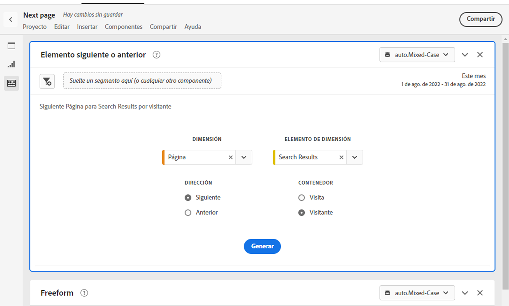
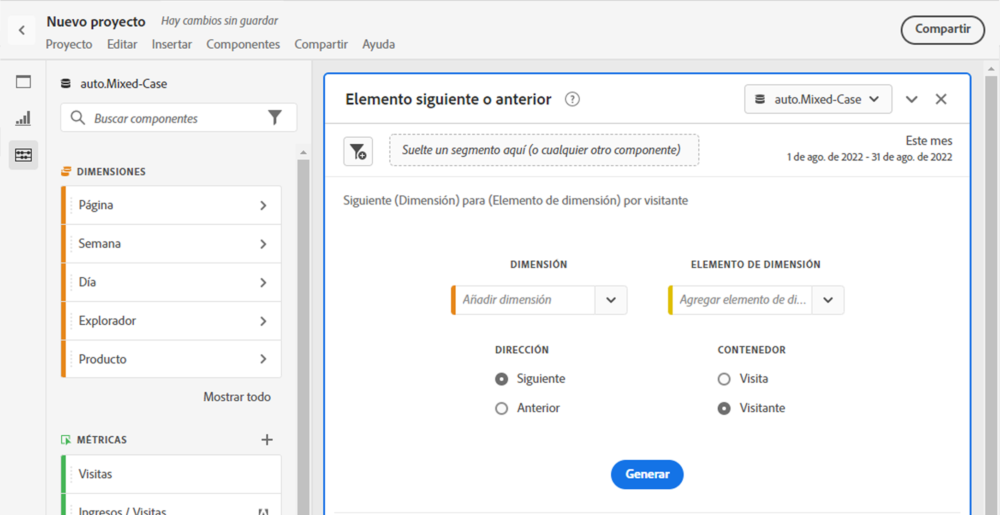
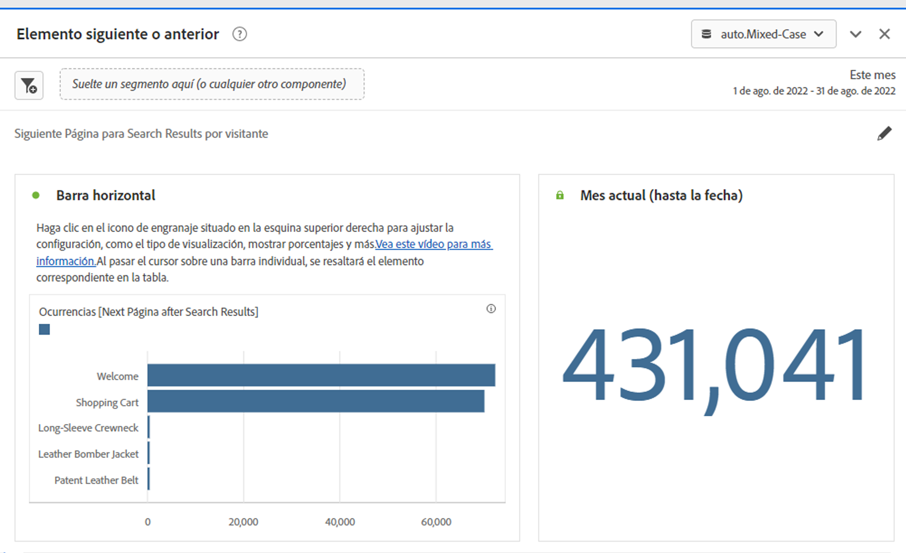
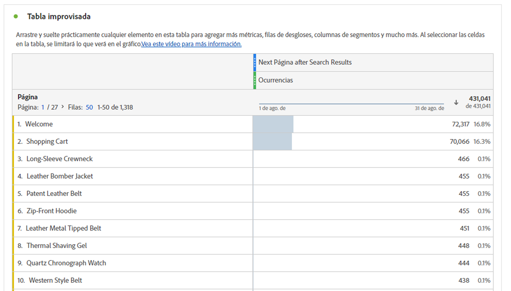

# Panel de elemento siguiente o anterior {#next-or-previous-item-panel}

>[!CONTEXTUALHELP]
>id="workspace_nextorpreviousitem_button"
>title="Elemento siguiente o anterior"
>abstract="Cree un panel para comprender las dimensiones anteriores de las que provienen las personas o la siguiente dimensión a la que se dirigen."

>[!CONTEXTUALHELP]
>id="workspace_nextorpreviousitem_panel"
>title="Elemento siguiente o anterior"
>abstract="Analice cuáles son los lugares más habituales de los que proceden o a los que se dirigen los visitantes.  **Dimensión**: seleccione una dimensión. Por ejemplo, **Página**. **Elemento de dimensión**: seleccione un elemento de dimensión específico. Por ejemplo, **Página principal**. **Dirección**: seleccione **Siguiente** para ver los elementos de dimensión que aparecen justo después del elemento de dimensión seleccionado. Seleccione **Anterior** para ver los elementos de dimensión que conducen al elemento de dimensión seleccionado. **Contenedor**: seleccione **Sesión** para ver los elementos de dimensión siguientes o anteriores de la misma sesión, o **Persona** para ver el elemento de dimensión siguiente o anterior de la misma persona."

>[!BEGINSHADEBOX]

_Este artículo documenta el panel Elemento siguiente o anterior en_  _&#x200B;**Adobe Analytics**._ _Vea el [panel de elemento siguiente o anterior](https://experienceleague.adobe.com/es/docs/analytics/analyze/analysis-workspace/panels/next-previous)) para la versión de_  _&#x200B;**Customer Journey Analytics** de este artículo._

>[!ENDSHADEBOX]

El panel **[!UICONTROL Elemento siguiente o anterior]** contiene varias tablas y visualizaciones para identificar el elemento de dimensión siguiente o anterior de una dimensión específica. Por ejemplo, es posible que desee explorar a qué páginas fueron más a menudo los clientes después de visitar la página de inicio.

## Utiliza

Para usar un panel **[!UICONTROL Elemento siguiente o anterior]**:

1. Cree un panel **[!UICONTROL Elemento siguiente o anterior]**. Para obtener información sobre cómo crear un panel, consulta [Crear un panel](panels.md#create-a-panel).

1. Especifica la [entrada](#panel-input) para el panel.

1. Observa la [salida](#panel-output) del panel.

### Entrada de panel

Puede configurar el panel [!UICONTROL Elemento siguiente anterior] utilizando la siguiente configuración:

| Entrada | Descripción |
| --- | --- |
| **[!UICONTROL Dimensión]** | Seleccione la dimensión para la que desea explorar los elementos siguientes o anteriores. |
| **[!UICONTROL Elemento de dimensión]** | Seleccione el elemento de dimensión específico en el centro de la consulta siguiente/anterior. |
| **[!UICONTROL Dirección]** | Especifique si está buscando el elemento de dimensión [!UICONTROL Siguiente] o el [!UICONTROL Anterior]. |
| **[!UICONTROL Contenedor]** | Seleccione el contenedor [!UICONTROL Sesión] o [!UICONTROL Persona] (valor predeterminado) para determinar el ámbito de la consulta. |

{style="table-layout:auto"}

Seleccione **[!UICONTROL Generar]** para generar el panel.

### Salida del panel

El panel [!UICONTROL Elemento siguiente o anterior] devuelve un conjunto completo de datos y visualizaciones para ayudarle a comprender mejor qué ocurrencias siguen o preceden a elementos de dimensión específicos.

| Visualización | Descripción |
| --- | --- |
| **[!UICONTROL Barra horizontal]** | Enumera los elementos siguientes (o anteriores) en función del elemento de dimensión seleccionado. Al pasar el puntero por encima de una barra individual, se resaltará el elemento correspondiente en la tabla de forma libre. |
| **[!UICONTROL Número de resumen]** | Número de resumen de alto nivel de todas las ocurrencias de elementos de dimensión siguientes o anteriores para el mes actual (hasta ahora). |
| **[!UICONTROL Tabla de forma libre]** | Enumera los elementos siguientes (o anteriores) en función del elemento de dimensión seleccionado, en formato de tabla. Por ejemplo, cuáles eran las páginas más populares (por ocurrencias) a las que se dirigían los visitantes después (o antes) de la página principal o de la página de Workspace. |

{style="table-layout:auto"}

>[!MORELIKETHIS]
>
>[Crear un panel](/help//analyze/analysis-workspace/c-panels/panels.md#create-a-panel)
>

<!--
# Next or previous item panel

This panel contains a number of tables and visualizations to easily identify the next or previous dimension item for a specific dimension. For example, you might want to explore which pages customers went to most often after they visited the Home page.

## Access the panel

You can access the panel from within [!UICONTROL Reports] or within [!UICONTROL Workspace].

| Access point | Description |
| --- | --- |
| [!UICONTROL Reports] | <ul><li>The panel is already dropped into a project.</li><li>The left rail is collapsed.</li><li>If you selected [!UICONTROL Next page], default settings have already been applied, such as [!UICONTROL Page] for [!UICONTROL Dimension], and the top page as the [!UICONTROL Dimension Item], [!UICONTROL Next] for [!UICONTROL Direction] and [!UICONTROL Visit] for [!UICONTROL Container]. You can modify all these settings.</li></ul>|
| Workspace | Create a new project and select the Panel icon in the left rail. Then drag the [!UICONTROL Next or previous item] panel above the Freeform table. Notice that the [!UICONTROL Dimension] and [!UICONTROL Dimension Item] fields are left blank. Select a dimension from the drop-down list. [!UICONTROL Dimension items] are populated based on the [!UICONTROL dimension] you chose. The top dimension item gets added, but you can select a different item. The defaults are Next and Visitor. Again, you can modify these as well.
 |

{style="table-layout:auto"}

## Panel Inputs {#Input}

You can configure the [!UICONTROL Next or previous item] panel panel using these input settings:

| Setting | Description |
| --- | --- |
| Segment (or other component) drop zone | You can drag and drop segments or other components to further filter your panel results. |
| Dimension | The dimension for which you want to explore next or previous items. |
| Dimension Item | The specific item at the center of your next/previous inquiry. |
| Direction | Specify whether you are looking for the [!UICONTROL Next] or the [!UICONTROL Previous] dimension item. |
| Container | [!UICONTROL Visit] or [!UICONTROL Visitor] (default) determine the scope of your inquiry. |

{style="table-layout:auto"}

Click **[!UICONTROL Build]** to build the panel.

## Panel output {#output}

The [!UICONTROL Next or previous item] panel returns a rich set of data and visualizations to help you better understand what occurrences follow or precede specific dimension items.

| Visualization | Description |
| --- | --- |
| Horizontal bar | Lists the next (or previous) items based on the dimension item you chose. Hovering over an individual bar highlights the corresponding item in the Freeform table. |
| Summary number | High-level summary number of all next or previous dimension item occurrences for the current month (so far.) |
| Freeform table | Lists the next (or previous) items based on the dimension item you chose, in a table format. For example, which were the most popular pages (by occurrences) that people went to after (or before) the home page or the workspace page. |

{style="table-layout:auto"}

-->