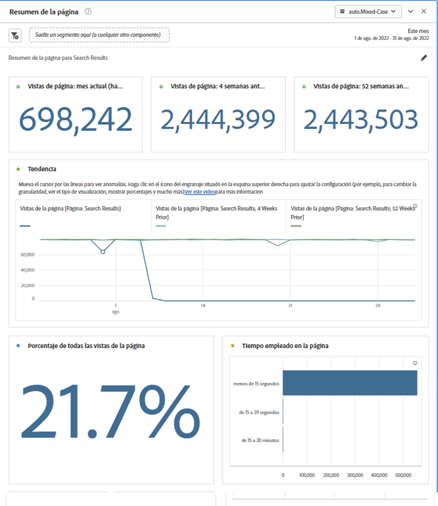
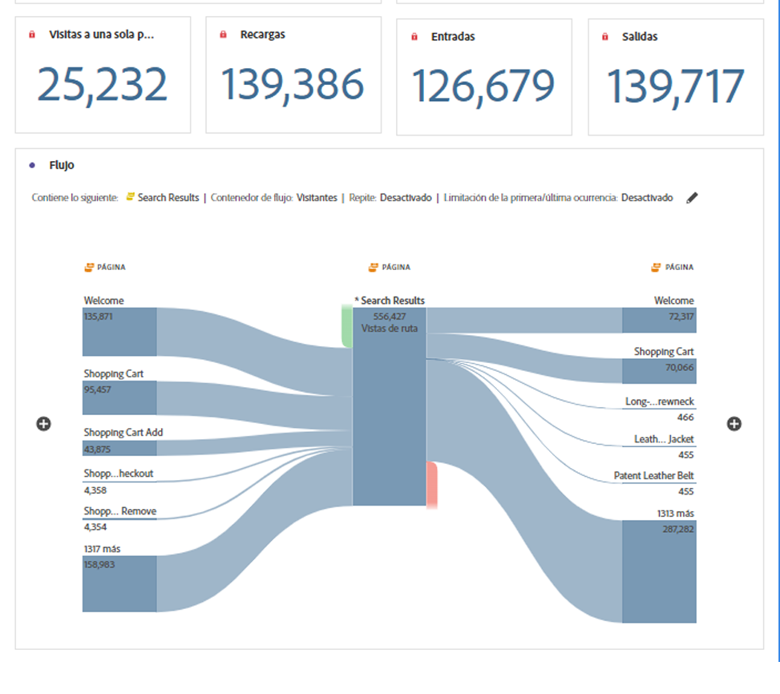

# Panel Resumen de página

Este panel le permite explorar fácilmente las estadísticas clave sobre páginas específicas.

## Acceso al panel

Puede acceder al panel desde [!UICONTROL Informes] o en [!UICONTROL Workspace].

| Punto de acceso | Descripción |
| --- | --- |
| [!UICONTROL Informes] | <ul><li>El panel ya se ha colocado en un proyecto.</li><li>El carril izquierdo está contraído.</li><li>Solo se admite la dimensión Página.</li><li>Ya se ha aplicado una configuración predeterminada, en este caso la página más visitada para[!UICONTROL Página] dimensión. Puede modificar esta configuración.</li></ul> |
| Workspace | Cree un nuevo proyecto y seleccione el icono Panel en el carril izquierdo. Arrastre el [!UICONTROL Resumen de página] Panel sobre la tabla de forma libre. Observe que la [!UICONTROL Elemento de Dimension] El campo se deja en blanco. Seleccione un elemento de dimensión en la lista desplegable. |

## Entradas de panel {#Input}

Puede configurar las variables [!UICONTROL Resumen de página] panel con esta configuración de entrada:

| Configuración | Descripción |
| --- | --- |
| Zona de colocación de segmentos (u otro componente) | Puede arrastrar y soltar segmentos u otros componentes para filtrar aún más los resultados del panel. |
| Elemento de dimensión de página | En la lista desplegable, seleccione el elemento de dimensión Página cuyas estadísticas clave desee explorar. |

{style="table-layout:auto"}

Clic **[!UICONTROL Generar]** para generar el panel.

## Salida de panel {#output}

El [!UICONTROL Resumen de página] El panel devuelve un completo conjunto de datos de métricas y visualizaciones para ayudarle a comprender mejor las estadísticas sobre páginas específicas.

| Métrica/Visualización | Descripción |
| --- | --- |
| [!UICONTROL Page views] - Mes actual, hasta ahora | Número de vistas de página de esta página en el mes actual. |
| [!UICONTROL Page views] - 4 semanas antes | Número de vistas de página de esta página durante el último mes. |
| [!UICONTROL Page views] - 52 semanas antes | Número de vistas de página de esta página durante el último año. |
| [!UICONTROL Tendencia] | Gráfico de vista de página de tendencias de este mes, 4 semanas antes y 52 semanas antes. |
| [!UICONTROL Porcentaje de todas las vistas de página] | Un número de resumen para el porcentaje de todas las vistas de página que fueron a esta página. |
| [!UICONTROL Tiempo invertido en la página] | Gráfico de barras horizontales que enumera el tiempo empleado en esta página. |
| [!UICONTROL Visitas de página única] | Un número de resumen que enumera el número de vistas de página donde esta fue la única página visitada. |
| [!UICONTROL Recargas] | El [!UICONTROL Recargas] La métrica muestra el número de veces que un elemento de dimensión estuvo presente durante una recarga. La forma más común de activar una recarga es a través de un visitante que actualiza su explorador. |
| [!UICONTROL Entradas] | El [!UICONTROL Entradas] Esta métrica muestra el número de veces que un elemento determinado se captura como el primer valor de una visita. |
| [!UICONTROL Salidas] | El [!UICONTROL Salidas] Esta métrica muestra el número de veces que un elemento determinado se captura como el último valor de una visita. |
| [!UICONTROL Flujo] | Diagrama de flujo con la página seleccionada como punto focal. Puede profundizar en los datos como en cualquier otro [Diagrama de flujo](/help/analyze/analysis-workspace/visualizations/c-flow/create-flow.md). |

{style="table-layout:auto"}

