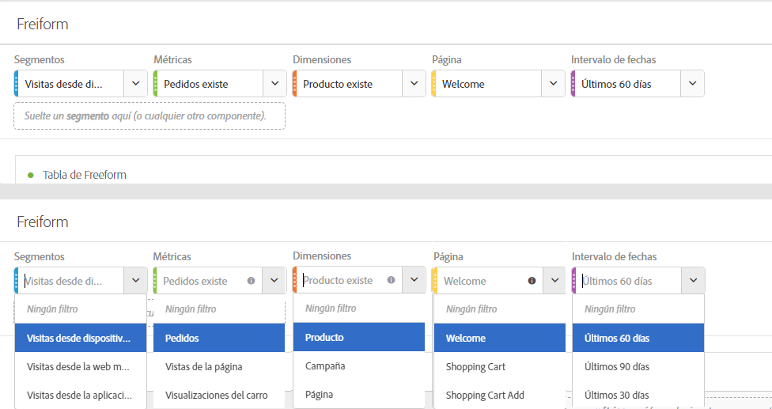
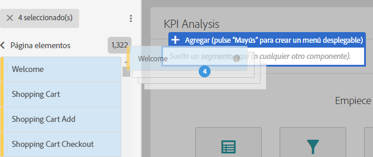
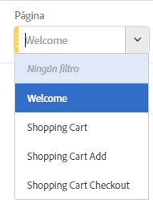
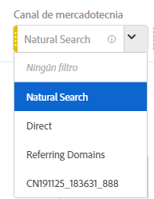

# Resumen de paneles

Un panel es una colección de tablas y visualizaciones. Puede acceder a los paneles desde el icono que hay en la parte superior izquierda de Workspace. Los paneles son útiles si desea organizar sus proyectos por periodos de tiempo, unidades de negocio, geografía, etcétera. Hay disponibles seis tipos de paneles en Analysis Workspace:

* [Panel en blanco](blank-panel.md)
* [Panel de información rápida](quickinsight.md)
* [Panel de Analytics for Target](a4t-panel.md) (próximamente)
* [Panel de Attribution](attribution.md)
* [Panel de forma libre](freeform-panel.md)
* [panel de comparación de segmentos](c-segment-comparison/segment-comparison.md)

Los paneles Quick Insights, Vacío e Improvisado son lugares ideales para dar sus primeros pasos en el mundo de los análisis, mientras que Analytics for Target, Attribution IQ y Comparación de segmentos están pensados para análisis más avanzados. Hay un botón `"+"` disponible en los proyectos para que pueda agregar paneles en blanco en cualquier momento.

El panel inicial predeterminado es el improvisado, pero también puede convertir el [panel en blanco](/help/analyze/analysis-workspace/c-panels/blank-panel.md) en el panel predeterminado.

## Filtros desplegables en los paneles {#section_D2828EEDD52944528E87F470EAB581CF}

La zona de colocación del panel tiene capacidades de filtrado desplegables. Estos filtros le permiten interactuar con los datos del proyecto de manera controlada, de modo que pueda realizar análisis en profundidad, simplificar los proyectos y compartir perspectivas con otros.

Aquí tiene un ejemplo de proyecto simplificado: suponga que existen varias versiones de un proyecto/panel para proporcionar informes de un país en concreto. Ahora puede contraer estos proyectos/paneles en un solo panel y agregar una lista desplegable de países en vez de filtrar por distintos conjuntos de datos.

Recuerde:

* Puede incluir múltiples componentes (o elementos de dimensión) y después cambiar entre ellos mediante un menú desplegable para filtrar el contenido del panel.
* También puede crear varias listas desplegables en un mismo panel.
* Puede personalizar el título de la lista desplegable haciendo clic en él y modificándolo, o bien puede eliminarlo haciendo clic en la X que hay al lado.
* Puede crear filtros desplegables utilizando cualquier tipo de componente: dimensiones, intervalos de fechas, segmentos y métricas. Tenga en cuenta que los intervalos de fechas desplegables siempre anulan los intervalos de fechas del panel.
* Se mantienen los colores de los componentes del carril izquierdo: amarillo para los desplegables de elementos de dimensión, verde para las métricas, azul para los segmentos y morado para los intervalos de fechas.
* La zona de colocación seguirá creando segmentos en el nivel de visita para los elementos arrastrados como segmentos. Puede modificarlos del modo habitual: haga clic en el icono de información (i) junto al segmento, haga clic en el icono de edición con forma de lápiz y, por último, modifique el segmento en el Generador de segmentos.

**Para crear y utilizar filtros desplegables:**

1. Seleccione cualquier elemento del carril izquierdo y, **mientras pulsa la tecla**, suéltelo en la zona de colocación del panel.

   

   De este modo, los componentes se convierten en una lista desplegable, no en un segmento. (También puede agregar segmentos; para ello, no mantenga pulsada la tecla).

   

1. Seleccione una de las opciones desplegables para cambiar los datos en el panel de abajo. (También puede optar por no filtrar ninguno de los datos del panel seleccionando **[!UICONTROL Sin filtro]**).
1. Por ejemplo, si también quisiera dividir los datos por canal de marketing, podría agregar otra lista desplegable llamada “Canal de marketing”:

   

