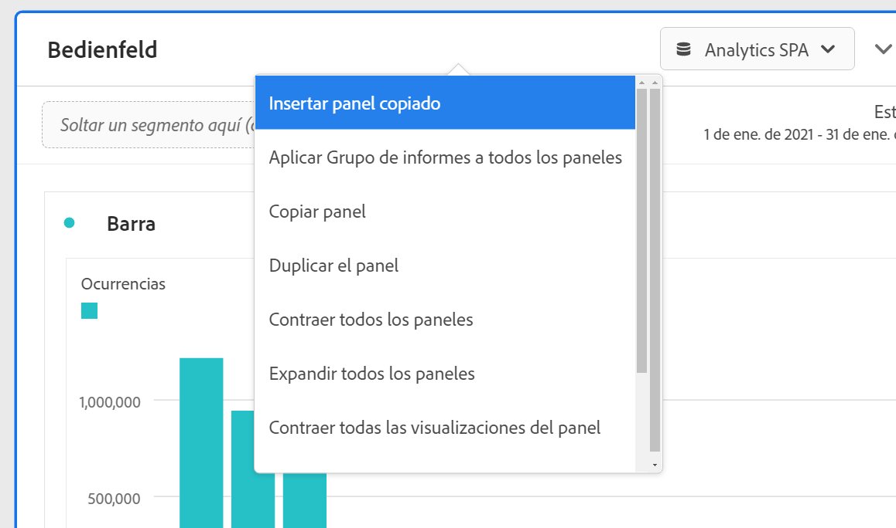

# Resumen de paneles

Un [!UICONTROL panel] es una colección de tablas y visualizaciones. Puede acceder a los paneles desde el icono de la parte superior izquierda de Workspace o desde un [panel en blanco](blank-panel.md). Los paneles son útiles cuando desea organizar sus proyectos según períodos de tiempo, grupos de informes o casos de uso de análisis. A continuación, se describen los tipos de paneles que están disponibles en Analysis Workspace:

| Nombre del panel | Descripción |
| --- | --- |
| [Panel en blanco](blank-panel.md) | Elija entre los paneles y las visualizaciones disponibles para iniciar el análisis. |
| [Panel de información rápida](quickinsight.md) | Cree rápidamente una tabla de forma libre y una visualización complementaria para analizar y descubrir información de manera más rápida. |
| [Panel de Analytics for Target](a4t-panel.md) | Analizar actividades y experiencias de Target en Analysis Workspace. |
| [Panel de Attribution](attribution.md) | Compare y visualice rápidamente los modelos de atribución utilizando cualquier dimensión y métrica de conversión. |
| [Panel de forma libre](freeform-panel.md) | Realice comparaciones y desgloses ilimitados y, a continuación, añada visualizaciones para contar una historia de datos enriquecida. |
| [Panel de visualizadores simultáneos de medios](media-concurrent-viewers.md) | Analice los visualizadores simultáneos a lo largo del tiempo, con detalles sobre la frecuencia máxima de acceso y la capacidad de desglosar datos y compararlos. |
| [panel de comparación de segmentos](c-segment-comparison/segment-comparison.md) | Compare rápidamente dos segmentos en todos los puntos de datos para encontrar automáticamente diferencias relevantes. |

Los paneles [!UICONTROL Información rápida], [!UICONTROL En blanco] y [!UICONTROL Forma libre] son excelentes puntos de partida para sus análisis, mientras que los paneles [!UICONTROL Analytics for Target], [!UICONTROL Attribution IQ], [!UICONTROL Visualizadores simultáneos de medios] y [!UICONTROL Comparación de segmentos] están pensados para análisis más avanzados. Hay un botón `"+"` disponible en los proyectos para que pueda agregar paneles en blanco en cualquier momento.

El panel inicial predeterminado es [!UICONTROL Forma libre], pero también puede convertir el [Panel en blanco](/help/analyze/analysis-workspace/c-panels/blank-panel.md) en el panel predeterminado.

## Grupo de informes {#report-suite}

Las tablas y visualizaciones de un panel derivan datos del [!UICONTROL grupo de informes] seleccionado en la parte superior derecha del panel. El grupo de informes también determina qué componentes están disponibles en el carril izquierdo. Dentro de un proyecto, puede utilizar uno o [varios grupos de informes](https://docs.adobe.com/content/help/es-ES/analytics/analyze/analysis-workspace/build-workspace-project/multiple-report-suites.html) en función de los casos de uso del análisis. Para aplicar un solo grupo de informes a todos los paneles de un proyecto, **haga clic con el botón derecho en el encabezado del panel > Aplicar grupo de informes a todos los paneles**.

La lista de los grupos de informes se ordena según la relevancia que Adobe define en función de la frecuencia y la antigüedad de utilización del grupo por parte del usuario, así como de la frecuencia con que se usa en la organización.

## Calendario {#calendar}

El calendario del panel controla el intervalo de la creación de informes de las tablas y visualizaciones de un panel.

Nota: Si se utiliza un componente de intervalo de fechas (púrpura) en una tabla, una visualización o en la zona desplegable de un panel, se anulará el calendario del panel.

## Zona de colocación {#dropzone}

La zona de colocación del panel permite aplicar filtros de segmentos y desplegables a todas las tablas y visualizaciones dentro de un panel. Puede aplicar uno o varios filtros a un panel. El título sobre cada filtro se puede modificar haciendo clic en el lápiz de edición, o bien puede hacer clic con el botón derecho para eliminarlo por completo.

### Filtros de segmentos

Arrastre y suelte cualquier segmento del carril izquierdo en la zona desplegable del panel para empezar a filtrar el panel.

### Filtros de segmentos específicos

Los componentes que no son segmentos también se pueden arrastrar directamente a la zona de colocación para crear segmentos específicos, lo que le ahorrará el tiempo y el tener que utilizar el Generador de segmentos. Los segmentos creados de esta manera se definen automáticamente como segmentos de nivel de visita individual. Puede modificar esta definición haciendo clic en el icono de información (i) junto al segmento, seleccionando el icono de edición con forma de lápiz y editándola en el Generador de segmentos.

Los segmentos específicos son locales del proyecto y no aparecerán en el carril izquierdo a menos que los haga públicos.

### Filtros desplegables {#dropdown-filter}

Además de los filtros de segmento, los filtros desplegables permiten interactuar con los datos de forma controlada. Por ejemplo, puede añadir un filtro desplegable para tipos de dispositivos móviles para poder segmentar el panel por dispositivos de tableta, teléfonos móviles o equipos de escritorio.

Los filtros desplegables también se pueden utilizar para consolidar muchos proyectos en uno. Por ejemplo, si tiene muchas versiones del mismo proyecto con diferentes segmentos de país aplicados, puede consolidar todas las versiones en un único proyecto y añadir un filtro desplegable de país.

Para crear filtros desplegables:

1. Para crear un filtro desplegable con [!UICONTROL Elementos de dimensión], como, por ejemplo, valores dentro de la dimensión [!UICONTROL Canal de marketing], haga clic en el icono de flecha derecha que se encuentra junto a la dimensión en el carril izquierdo. Esto mostrará todos los elementos disponibles. Seleccione uno o varios elementos de componente del carril izquierdo y suéltelos en la zona desplegable del panel **mientras mantiene pulsada la tecla Mayús**. De este modo, los componentes se convertirán en un filtro desplegable y no en un segmento único.
1. Para crear un filtro desplegable con otro componente, como, por ejemplo, métricas, segmentos o intervalos de fechas, seleccione un tipo de componente en el carril izquierdo y suéltelo en la zona desplegable del panel **mientras mantiene pulsada la tecla Mayús**.
1. Seleccione una de las opciones del menú desplegable para cambiar los datos del panel. También puede optar por no filtrar ninguno de los datos del panel seleccionando **[!UICONTROL Sin filtro]**.

[Vea el vídeo](https://docs.adobe.com/content/help/es-ES/analytics-learn/tutorials/analysis-workspace/using-panels/using-panels-to-organize-your-analysis-workspace-projects.html) para obtener más información sobre cómo añadir filtros desplegables al proyecto.

## Haga clic con el botón derecho en el menú {#right-click}

Para obtener más funcionalidades, haga clic con el botón derecho en el encabezado del panel.

Las configuraciones disponibles son las siguientes:

| Configuración | Descripción |
| --- | --- |
| Insertar panel copiado/visualización | Permite pegar (“insertar”) un panel copiado o una visualización en otro lugar del proyecto, o en otro proyecto diferente. |
| Copiar panel | Permite hacer clic con el botón derecho y copiar un panel para poder insertarlo en otro lugar del proyecto o en un proyecto completamente diferente. |
| Aplicar el grupo de informes a todos los paneles | Permite aplicar el grupo de informes del panel activo a todos los paneles del proyecto. |
| Duplicar panel | Crea un duplicado exacto del panel actual que podrá modificar a continuación. |
| Contraer/expandir todos los paneles | Contrae y expande todos los paneles del proyecto. |
| Contraer/expandir todas las visualizaciones del panel | Contrae y expande todas las visualizaciones del panel actual. |
| Editar descripción | Añade (o edita) una descripción de texto para el panel. |
| Obtener vínculo del panel | Le permite dirigir a los usuarios a un panel concreto de un proyecto. Al hacer clic en el vínculo, el destinatario deberá iniciar sesión antes de que se le dirija al panel exacto al que está vinculado. |
