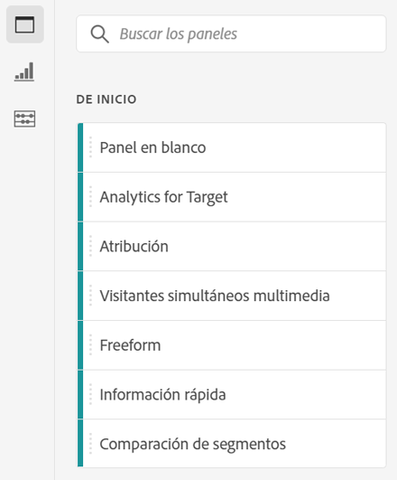
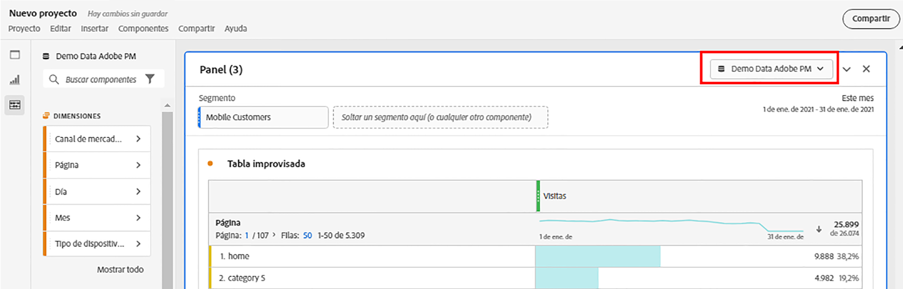
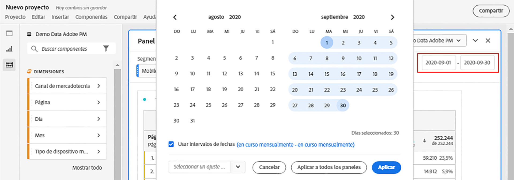
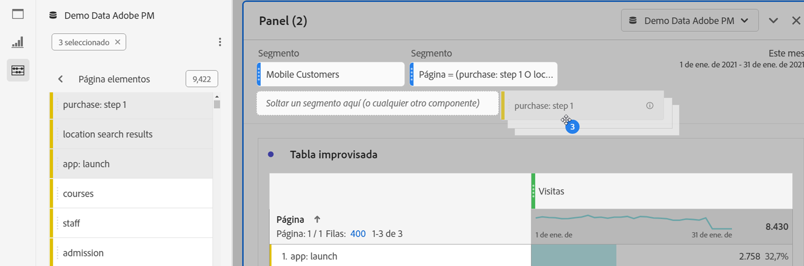
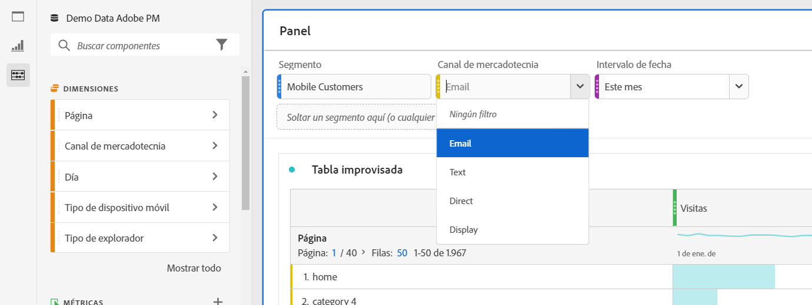
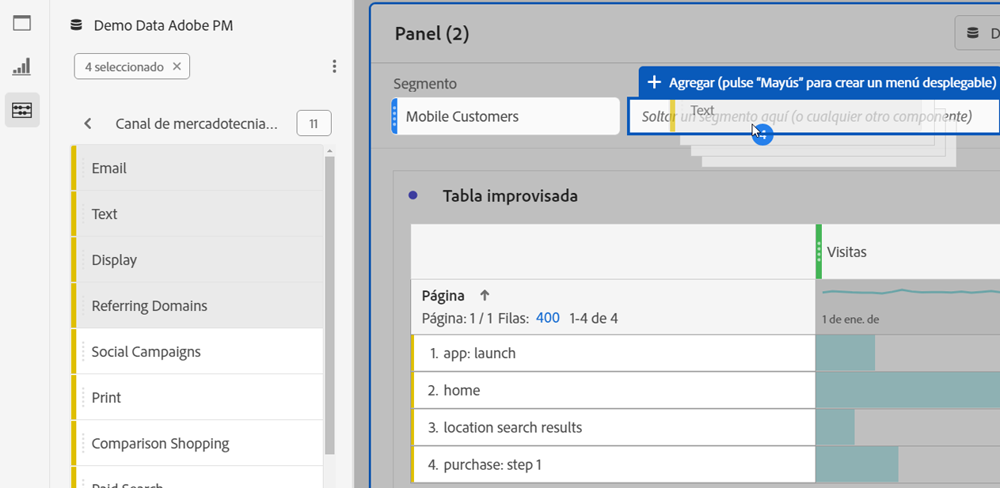

# Resumen de paneles

A [!UICONTROL panel] is a collection of tables and visualizations. Puede acceder a los paneles desde el icono que hay en la parte superior izquierda de Workspace. Los paneles son útiles cuando desea organizar sus proyectos según períodos de tiempo, grupos de informes o casos de uso de análisis. Los siguientes tipos de panel están disponibles en Analysis Workspace:

| Nombre del panel | Descripción |
|---|---|
| [Panel en blanco](blank-panel.md) | Elija entre los paneles y las visualizaciones disponibles para inicio de la análisis. |
| [Panel de información rápida](quickinsight.md) | Cree rápidamente una tabla de forma libre y una visualización complementaria para analizar y descubrir información de manera más rápida. |
| [Panel de Analytics for Target](a4t-panel.md) | Analizar actividades y experiencias de Target en Analysis Workspace. |
| [Panel de Attribution](attribution.md) | Compare y visualice rápidamente cualquier número de modelos de atribución mediante cualquier dimensión y métrica de conversión. |
| [Panel de forma libre](freeform-panel.md) | Realice comparaciones y desgloses ilimitados y, a continuación, agregue visualizaciones para contar una historia de datos enriquecida. |
| [Panel de visores simultáneos de medios](media-concurrent-viewers.md) | Analice los visualizadores simultáneos a lo largo del tiempo, con detalles sobre la frecuencia máxima de acceso y la capacidad de desglosar datos y compararlos. |
| [panel de comparación de segmentos](c-segment-comparison/segment-comparison.md) | Comparar rápidamente dos segmentos en todos los puntos de datos para encontrar automáticamente diferencias relevantes. |

[!UICONTROL Los paneles de perspectivas]rápidas, [!UICONTROL en blanco] y [!UICONTROL improvisados] son lugares buenos para realizar inicios en la análisis, mientras que [!UICONTROL Analytics para visores actuales de comparación de Destinatario], [!UICONTROL Attribution IQ]y   mediosy segmento de comparación de medios se prestan a análisis más avanzados. Hay un botón `"+"` disponible en los proyectos para que pueda agregar paneles en blanco en cualquier momento.

The default starting panel is the [!UICONTROL Freeform] panel, but you can make the [blank panel](/help/analyze/analysis-workspace/c-panels/blank-panel.md) your default as well.

## Grupo de informes del panel {#report-suite}

Las tablas y visualizaciones de un panel derivan datos del grupo [!UICONTROL de] informes seleccionado en la parte superior derecha del panel. El grupo de informes también determina qué componentes están disponibles en el carril izquierdo. Dentro de un proyecto, puede utilizar uno o [varios grupos](https://docs.adobe.com/content/help/es-ES/analytics/analyze/analysis-workspace/build-workspace-project/multiple-report-suites.html) de informes en función de los casos de uso de la análisis.

## Calendario del panel {#calendar}

El calendario del panel controla el intervalo de sistemas de informes de las tablas y visualizaciones dentro de un panel.

Nota: Si se utiliza un componente de intervalo de fechas (púrpura) dentro de una tabla, visualización o panel, se anulará el calendario del panel.

## Zona desplegable del panel {#dropzone}

La zona desplegable del panel le permite aplicar filtros de segmentos y desplegables a todas las tablas y visualizaciones dentro de un panel. Puede aplicar uno o varios filtros a un panel. El título sobre cada filtro se puede modificar haciendo clic en el lápiz de edición o puede hacer clic con el botón derecho para eliminarlo por completo.

### Filtros de segmentos

Arrastre y suelte cualquier segmento del carril izquierdo en la zona de colocación del panel para empezar a filtrar el panel.

### Filtros de segmentos específicos

Los componentes que no son segmentos también se pueden arrastrar directamente a la zona de colocación para crear segmentos **** ad-hoc, lo que le ahorra tiempo y esfuerzo al ir al Generador de segmentos. Los segmentos creados de esta manera se definen automáticamente como segmentos de nivel de visita individual. Esta definición se puede modificar haciendo clic en el icono de información (i) al lado del segmento, luego en el icono de edición con forma de lápiz y editándolo en el Generador de segmentos.

Los segmentos específicos son locales del proyecto y no aparecerán en el carril izquierdo a menos que los haga públicos.

### Filtros desplegables {#dropdown-filter}

Además de los filtros de segmento, los filtros **** desplegables permiten interactuar con los datos de forma controlada. Por ejemplo, puede agregar un filtro desplegable para los tipos de dispositivos móviles para poder segmentar el panel por Tablet, teléfono móvil o escritorio.

Los filtros desplegables también se pueden utilizar para consolidar muchos proyectos en uno. Por ejemplo, si tiene muchas versiones del mismo proyecto con diferentes segmentos de país aplicados, puede consolidar todas las versiones en un único proyecto y agregar un filtro desplegable de país.

**Crear y utilizar filtros desplegables:**

1. Para crear un filtro desplegable con elementos [!UICONTROL de]Dimension, como valores dentro de la dimensión [!UICONTROL de Canal] de marketing, haga clic en la flecha derecha junto a la dimensión en el carril izquierdo. Esto mostrará todos los elementos disponibles. Seleccione uno o varios elementos de componente en el carril izquierdo y suéltelos en la zona desplegable del panel **mientras mantiene pulsada la tecla** Mayús. Esto convertirá los componentes en un filtro desplegable, en lugar de en un solo segmento.
1. Para crear un filtro desplegable con otro componente, como métricas, segmentos o intervalos de fechas, seleccione un tipo de componente en el carril izquierdo y colóquelo en la zona desplegable del panel **mientras mantiene pulsada la tecla** Mayús.
1. Seleccione una de las opciones de la lista desplegable para cambiar los datos en el panel. You can also choose to not filter any of the panel data by selecting **[!UICONTROL No filter]**.

[Vea el vídeo](https://www.youtube.com/watch?v=vpJywtsFVPI) para obtener más información sobre cómo agregar filtros desplegables al proyecto.
