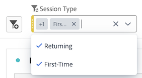

# Resumen de paneles

Un [!UICONTROL panel] es una colección de tablas y visualizaciones. Puede acceder a los paneles en el icono de la parte superior izquierda de Workspace o desde un [panel en blanco](blank-panel.md). Los paneles son útiles cuando desea organizar sus proyectos según períodos de tiempo, grupos de informes o casos de uso de análisis.

## Tipos de panel

A continuación, se describen los tipos de paneles que están disponibles en Analysis Workspace:

| Nombre del panel | Descripción |
| --- | --- |
| [Panel en blanco](blank-panel.md) | Elija entre los paneles y las visualizaciones disponibles para iniciar el análisis. |
| [Panel de información rápida](quickinsight.md) | Cree rápidamente una tabla de forma libre y una visualización complementaria para analizar y descubrir información de manera más rápida. |
| [Panel de Analytics for Target](a4t-panel.md) | Analizar actividades y experiencias de Target en Analysis Workspace. |
| [Panel de Attribution](attribution.md) | Compare y visualice rápidamente los modelos de atribución utilizando cualquier dimensión y métrica de conversión. |
| [Panel de forma libre](freeform-panel.md) | Realice comparaciones y desgloses ilimitados y, a continuación, añada visualizaciones para contar una historia de datos enriquecida. |
| [Panel de Audiencia promedio por minuto de medios](average-minute-audience-panel.md) | Analice la audiencia promedio por minuto a lo largo del tiempo, con detalles sobre los picos de visualizaciones y la capacidad de desglosar datos y compararlos. |
| [Panel de visualizadores simultáneos de medios](media-concurrent-viewers.md) | Analice los visualizadores simultáneos a lo largo del tiempo, con detalles sobre la frecuencia máxima de acceso y la capacidad de desglosar datos y compararlos. |
| [Panel Tiempo invertido en la reproducción de medios](/help/analyze/analysis-workspace/c-panels/media-playback-time-spent.md) | Analice los visualizadores simultáneos a lo largo del tiempo, con detalles sobre la frecuencia máxima de acceso y la capacidad de desglosar datos y compararlos. |
| [panel de comparación de segmentos](c-segment-comparison/segment-comparison.md) | Compare rápidamente dos segmentos en todos los puntos de datos para encontrar automáticamente diferencias relevantes. |

[!UICONTROL Información rápida], [!UICONTROL Vacío] y [!UICONTROL Improvisado] los paneles son lugares ideales para iniciar el análisis, mientras que [!UICONTROL Analytics for Target], [!UICONTROL Atribución], [!UICONTROL Espectadores simultáneos de medios] y [!UICONTROL Comparación de segmentos] se prestan a análisis más avanzados. Hay un botón `"+"` disponible en los proyectos para que pueda agregar paneles en blanco en cualquier momento.

El panel inicial predeterminado es [!UICONTROL Forma libre], pero también puede convertir el [Panel en blanco](/help/analyze/analysis-workspace/c-panels/blank-panel.md) en el panel predeterminado.

## Grupo de informes {#report-suite}

Las tablas y visualizaciones de un panel derivan datos del [!UICONTROL grupo de informes] seleccionado en la parte superior derecha del panel. El grupo de informes también determina qué componentes están disponibles en el carril izquierdo. Dentro de un proyecto, puede utilizar uno o [varios grupos de informes](https://experienceleague.adobe.com/docs/analytics/analyze/analysis-workspace/build-workspace-project/multiple-report-suites.html?lang=es) en función de los casos de uso del análisis. Para aplicar un solo grupo de informes a todos los paneles de un proyecto, **haga clic con el botón derecho en el encabezado del panel > Aplicar grupo de informes a todos los paneles**.

La lista de los grupos de informes se ordena según la relevancia que Adobe define en función de la frecuencia y la antigüedad de utilización del grupo por parte del usuario, así como de la frecuencia con que se usa en la organización.

## Calendario {#calendar}

El calendario del panel controla el intervalo de la creación de informes de las tablas y visualizaciones de un panel.

>[!NOTE]
>Si se utiliza un componente de intervalo de fecha (púrpura) en una tabla, una visualización o en la zona de colocación del panel, se anula el calendario del panel.

Puede aplicar un intervalo de fechas de nivel de minuto bajo la configuración avanzada del calendario del panel. Si realiza informes en un intervalo de fechas que abarca muchos días, la hora de inicio se aplica al primer día y la hora de finalización se aplica al último día del intervalo.

## Zona de colocación {#dropzone}

La zona de colocación del panel permite aplicar filtros de segmentos y desplegables a todas las tablas y visualizaciones dentro de un panel. Puede aplicar uno o varios filtros a un panel.

### Filtros de segmentos

Arrastre y suelte cualquier segmento del carril izquierdo en la zona desplegable del panel para empezar a filtrar el panel. Repita este proceso para agregar filtros adicionales al panel. Los filtros aparecen uno al lado del otro en la parte superior del panel.

### Filtros de segmentos ad hoc

Los componentes que no son segmentos también se pueden arrastrar directamente a la zona de colocación para crear segmentos específicos, lo que le ahorrará el tiempo y el tener que utilizar el Generador de segmentos. Los segmentos creados de esta manera se definen automáticamente como segmentos de nivel de visita individual. Puede modificar esta definición haciendo clic en el icono de información (i) junto al segmento, seleccionando el icono de edición con forma de lápiz y editándola en el Generador de segmentos.

Los segmentos ad hoc son un tipo de segmento rápido y son locales del proyecto. No aparecen en el carril izquierdo a menos que las haga públicas.

Para obtener más información, consulte [Segmentos rápidos](/help/analyze/analysis-workspace/components/segments/quick-segments.md).

### Segmentos desplegables estáticos

Los segmentos desplegables estáticos permiten interactuar con los datos de forma controlada. Por ejemplo, puede agregar un segmento desplegable para tipos de dispositivos móviles para poder segmentar el panel por dispositivos de tableta, teléfonos móviles o equipos de escritorio.

Los segmentos desplegables estáticos también se pueden utilizar para consolidar muchos proyectos en uno. Por ejemplo, si tiene muchas versiones del mismo proyecto con diferentes segmentos de país aplicados, puede consolidar todas las versiones en un único proyecto y añadir un segmento desplegable de país.

#### Creación de segmentos desplegables estáticos

* Para segmentos desplegables que utilizan elementos de dimensión, seleccione una sola dimensión del carril izquierdo y suéltela en la zona desplegable del panel **mientras sostiene`[Shift]`**. Esto crea un segmento desplegable con todos los elementos de dimensión asociados a esa dimensión.

  O bien, si desea que el segmento desplegable incluya solo elementos de dimensión específicos asociados a una dimensión, haga clic en el icono de flecha derecha situado junto a la dimensión deseada en el carril izquierdo. Esta acción expone todos los elementos de dimensión disponibles. Seleccionar varios elementos de dimensión de esta lista utilizando `[Shift + Click]` o `[Ctrl + Click]`, luego suéltelos en la zona desplegable del panel **mientras sostiene** `[Shift]`.

* Para segmentos desplegables que utilizan un solo tipo de componente (por ejemplo, solo dimensiones, o solo segmentos, o solo métricas), seleccione varios elementos del mismo tipo en el carril izquierdo mediante `[Shift + Click]` o `[Ctrl + Click]`, luego suéltelos en la zona desplegable del panel **mientras sostiene`[Shift]`**.

  Se crea un único segmento desplegable con los componentes seleccionados.

* Para segmentos desplegables que utilizan una combinación de tipos de componentes (como 2 métricas y 3 filtros), seleccione varios componentes mediante `[Shift + Click]` o `[Ctrl + Click]`. Coloque la selección en la zona desplegable del panel **mientras mantiene pulsado`[Shift]`**. En este contexto, todos los tipos de componentes se tratan como segmentos desplegables independientes. Por ejemplo, si incluye métricas y elementos de dimensión en la selección, se crean dos segmentos desplegables independientes: un segmento desplegable incluye elementos de dimensión y el otro métricas.

  

Al hacer clic con el botón derecho en un segmento desplegable, se proporcionan las siguientes opciones:

* **[!UICONTROL Eliminar lista desplegable]**: elimina el segmento desplegable del panel.
* **[!UICONTROL Eliminar etiqueta]**: elimine el texto situado encima de un segmento desplegable. Para modificar la etiqueta, seleccione el icono de lápiz.
* **[!UICONTROL Añadir etiqueta]**: Cuando se añade un segmento desplegable a un proyecto, se establece automáticamente una etiqueta al nombre del componente. Si elimina la etiqueta, puede añadirla de nuevo con esta opción.
* **[!UICONTROL Requerir selección]**: Requiere que haya un segmento definido en el panel.

[Vea el vídeo](https://experienceleague.adobe.com/docs/analytics-learn/tutorials/analysis-workspace/using-panels/using-panels-to-organize-your-analysis-workspace-projects.html?lang=es) para obtener más información sobre cómo añadir filtros desplegables al proyecto.

#### Uso de segmentos desplegables estáticos

Los usuarios pueden utilizar el menú desplegable de segmentos de cualquiera de las siguientes maneras para filtrar el panel:

* Aplique un solo segmento al panel seleccionando el segmento en el menú desplegable.

* Aplique varios segmentos al panel seleccionando más de un segmento en el menú desplegable. El panel se filtra para incluir cualquiera de los segmentos seleccionados.

  

### Segmentos desplegables dinámicos

Los segmentos desplegables dinámicos le permiten determinar los valores disponibles en función de los datos dentro del intervalo de informes del panel y los valores de otros segmentos desplegables. Por ejemplo, puede crear dos desplegables dinámicos utilizando [Países](/help/components/dimensions/countries.md) dimensión y [Ciudades](/help/components/dimensions/cities.md) dimensión. Cuando selecciona un país del [!UICONTROL Países] lista desplegable, la variable [!UICONTROL Ciudades] la lista desplegable se ajusta dinámicamente para mostrar solo las ciudades de ese país.

Este mismo concepto se aplica a todas las dimensiones; solo son visibles los elementos de dimensión que aparecen dentro del intervalo de fechas y los segmentos seleccionados del panel. Los elementos de Dimension seleccionados en segmentos desplegables estáticos afectan a los valores disponibles en los segmentos desplegables dinámicos. Sin embargo, lo contrario no es verdadero; los elementos de Dimension seleccionados en los segmentos desplegables dinámicos no afectan a los valores disponibles en los segmentos desplegables estáticos.

La selección manual de elementos de dimensión está disponible si prevé que se recopilará un determinado elemento de dimensión en el futuro. También puede borrar un segmento desplegable dinámico para que no contenga un valor, lo que permitirá que otros segmentos desplegables dinámicos contengan más valores. Seleccionar **[!UICONTROL Restablecer todo]** para borrar la selección de todos los segmentos desplegables de ese panel.

Para crear un segmento desplegable dinámico:

* Arrastre y suelte una sola dimensión en la zona desplegable del panel **mientras mantiene pulsado`[Shift]`**.
* Los segmentos desplegables dinámicos no están disponibles para métricas, segmentos o intervalos de fechas.
* Haga clic con el botón derecho en un segmento desplegable y seleccione **[!UICONTROL Lista desplegable Eliminar]** para eliminarlo.

Al hacer clic con el botón derecho en un filtro desplegable dinámico, se proporcionan las mismas opciones que en los filtros desplegables estáticos.

## Menú contextual {#right-click}

Para obtener más funcionalidades, haga clic con el botón derecho en el encabezado del panel.

Las configuraciones disponibles son las siguientes:

| Configuración | Descripción |
| --- | --- |
| Insertar panel copiado/visualización | Permite pegar (“insertar”) un panel copiado o una visualización en otro lugar del proyecto, o en otro proyecto diferente. |
| Copiar panel | Permite hacer clic con el botón derecho y copiar un panel para poder insertarlo en otro lugar del proyecto o en un proyecto completamente diferente. |
| Aplicar grupo de informes a todos los paneles | Permite aplicar el grupo de informes del panel activo a todos los paneles del proyecto. |
| Duplicar panel | Crea un duplicado exacto del panel actual que podrá modificar a continuación. |
| Contraer/expandir todos los paneles | Contrae y expande todos los paneles del proyecto. |
| Contraer/expandir todas las visualizaciones del panel | Contrae y expande todas las visualizaciones del panel actual. |
| Editar descripción | Añade (o edita) una descripción de texto para el panel. |
| Obtener vínculo del panel | Le permite dirigir a los usuarios a un panel concreto de un proyecto. Al hacer clic en el vínculo, el destinatario deberá iniciar sesión antes de que se le dirija al panel exacto al que está vinculado. |
