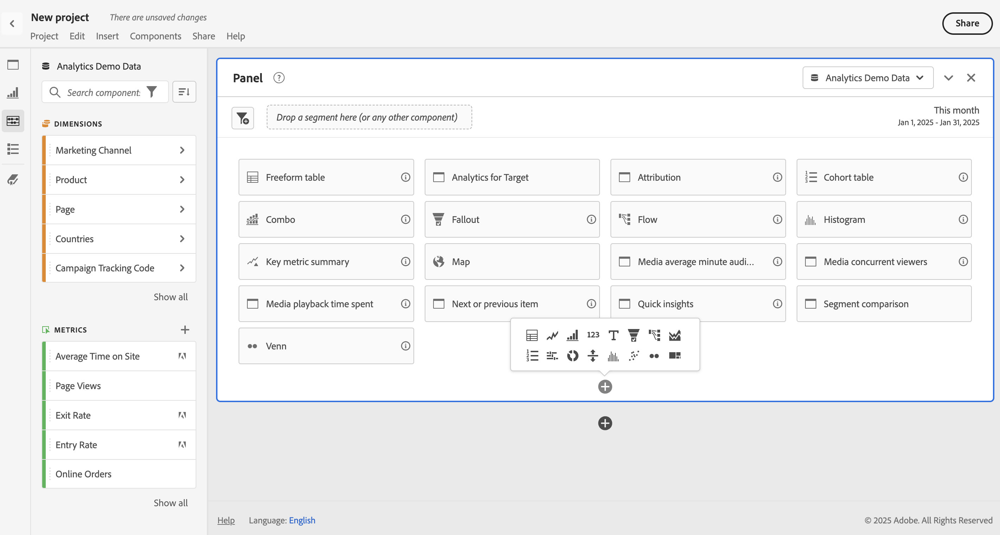

# Resumen de paneles

Un [!UICONTROL panel] es una colección de tablas y visualizaciones. Puede acceder a los paneles en el icono de la parte superior izquierda de Workspace o desde un [panel en blanco](/help/analyze/analysis-workspace/c-panels/blank-panel.md). Los paneles son útiles cuando desea organizar sus proyectos según períodos de tiempo, grupos de informes o casos de uso de análisis.

## Tipos de panel

Los siguientes tipos de paneles están disponibles en Analysis Workspace para [!UICONTROL Adobe Analytics]:

| Nombre del panel | Descripción |
| --- | --- |
| [Panel en blanco](/help/analyze/analysis-workspace/c-panels/blank-panel.md) | Elija entre los paneles y las visualizaciones disponibles para iniciar el análisis. |
| [Atribución](attribution.md) | Compare y visualice rápidamente los modelos de atribución utilizando cualquier dimensión y métrica de conversión. |
| [Analytics for Target](a4t-panel.md) | Analizar actividades y experiencias de Target en Analysis Workspace. |
| [Freeform](freeform-panel.md) | Realice comparaciones y desgloses ilimitados y, a continuación, añada visualizaciones para contar una historia de datos enriquecida. |
| [Audiencia media por minuto de medios](average-minute-audience-panel.md) | Analizar audiencia media por minuto para un fragmento de contenido específico o durante un período de tiempo personalizado. |
| [Espectadores simultáneos de medios ](media-concurrent-viewers.md) | Analice los visualizadores simultáneos a lo largo del tiempo, con detalles sobre la frecuencia máxima de acceso y la capacidad de desglosar datos y compararlos. |
| [Tiempo invertido en la reproducción de contenido](/help/analyze/analysis-workspace/c-panels/media-playback-time-spent.md) | Analiza el tiempo invertido en la reproducción para comprender dónde se produjo el pico de concurrencia o dónde se produjeron los descensos. |
| [Elemento siguiente o anterior](next-previous.md) | Mostrar las páginas siguientes o anteriores a las que se dirigen los usuarios. |
| [Información rápida](quickinsight.md) | Crea rápidamente una tabla de forma libre y una visualización complementaria para analizar y descubrir información de manera más rápida. |
| [Resumen de la página](page-summary.md) | Explore estadísticas clave sobre páginas específicas. |
| [Comparación de segmentos](/help/analyze/analysis-workspace/c-panels/c-segment-comparison/segment-comparison.md) | Compare rápidamente dos segmentos en todos los puntos de datos para encontrar automáticamente diferencias relevantes. |

Los paneles [!UICONTROL Información rápida], [!UICONTROL En blanco] y [!UICONTROL Forma libre] son buenos lugares para iniciar el análisis, mientras que[!UICONTROL Atribución] se presta para análisis más avanzados. Hay un  disponible en la parte inferior del lienzo, para que puedas agregar paneles en blanco en cualquier momento.

El panel inicial predeterminado es [!UICONTROL Forma libre], pero también puede convertir el [Panel en blanco](/help/analyze/analysis-workspace/c-panels/blank-panel.md) o en [Información rápida](/help/analyze/analysis-workspace/c-panels/quickinsight.md) predeterminado. Ver [preferencias de proyectos y análisis](/help/analyze/analysis-workspace/user-preferences.md#projects--analyses-preferences).

## Crear un panel

Para crear un panel:

* Arrastra y suelta un panel del panel izquierdo **[!UICONTROL Paneles]** al lienzo.
* Selecciona un panel del [panel en blanco](blank-panel.md).
* Usa el menú **[!UICONTROL Insertar]** en Workspace y selecciona el panel. También puedes usar cualquiera de los [métodos abreviados](../build-workspace-project/fa-shortcut-keys.md) para insertar un panel.

  

Puede realizar lo siguiente:

* Selecciona  **en** cualquier panel para agregar otra visualización. Aparece una ventana emergente que te permite seleccionar una visualización.

  

  | Seleccionar… | Para crear un filtro: |
  |---|---|
  |  | [Tabla de forma libre](/help/analyze/analysis-workspace/visualizations/freeform-table/freeform-table.md) |
  |  | [Línea](/help/analyze/analysis-workspace/visualizations/line.md) |
  |  | [Barra](/help//analyze/analysis-workspace/visualizations/bar.md) |
  |  | [Número de resumen](/help/analyze/analysis-workspace/visualizations/summary-number-change.md) |
  |  | [Texto](/help/analyze/analysis-workspace/visualizations/text.md) |
  |  | [Visita en orden previsto](/help/analyze/analysis-workspace/visualizations/fallout/fallout-flow.md) |
  |  | [Flujo](/help/analyze/analysis-workspace/visualizations/c-flow/flow.md) |
  |  | [Area stacked](/help/analyze/analysis-workspace/visualizations/area.md) |
  |  | [Tabla de cohorte](/help/analyze/analysis-workspace/visualizations/cohort-table/t-cohort.md) |
  |  | [Bullet](/help/analyze/analysis-workspace/visualizations/bullet-graph.md) |
  |  | [Anillo](/help/analyze/analysis-workspace/visualizations/donut.md) |
  |  | [Cambio de resumen](/help/analyze/analysis-workspace/visualizations/summary-number-change.md) |
  |  | [Histograma](/help/analyze/analysis-workspace/visualizations/histogram.md) |
  |  | [Dispersión](/help/analyze/analysis-workspace/visualizations/scatterplot.md) |
  |  | [Venn](/help/analyze/analysis-workspace/visualizations/venn.md) |
  |  | [Gráfico de rectángulos](/help/analyze/analysis-workspace/visualizations/treemap.md) |

* Selecciona  **fuera** del último panel del área de trabajo para agregar otro [panel en blanco](blank-panel.md).

## Grupo de informes

Cada panel está asociado a un [grupo de informes](/help/admin/admin/c-manage-report-suites/report-suites-admin.md), identificado por  de los **[!UICONTROL *Datos *]**&#x200B;en el menú desplegable de la parte superior derecha del panel.

Al crear un panel nuevo, el grupo de informes predeterminado se basa en el grupo de informes del último panel en el que trabajó en el proyecto Analysis Workspace.

Dentro de un proyecto, puede utilizar uno o [múltiples grupos de informes](https://experienceleague.adobe.com/docs/analytics/analyze/analysis-workspace/build-workspace-project/multiple-report-suites.html?lang=es) en función de los casos de uso de sus análisis.

La lista de los grupos de informes se ordena según la relevancia que Adobe define en función de la frecuencia y la antigüedad de utilización del grupo por parte del usuario, así como de la frecuencia con que se usa en la organización.

>[!IMPORTANT]
>
>El grupo de informes seleccionado determina qué dimensiones, métricas y segmentos están disponibles para construir visualizaciones en un panel.
>
>
>Cuando cambie el grupo de informes de un panel, es posible que algunos de los componentes no estén disponibles en el nuevo grupo de informes. Este cambio puede provocar que la visualización no se represente correctamente. Puedes ver advertencias como las siguientes:
>
>* Este panel contiene componentes que no están habilitados en el grupo de informes seleccionado. Cambie el grupo de informes o habilite los componentes necesarios en el grupo de informes.
>* No se puede procesar la visualización: comprueba las columnas y filas para asegurarte de que contienen componentes válidos.
>

## Calendario

El calendario del panel controla el intervalo de la creación de informes de las tablas y visualizaciones de un panel.

>[!NOTE]
>
>Si se utiliza un componente de intervalo de fechas  dentro de una visualización o panel (por ejemplo, como segmento), el componente de intervalo de fechas anula el calendario del panel.
>

1. Selecciona un intervalo de fechas seleccionando primero la fecha de inicio y, a continuación, la fecha de finalización.
También puede seleccionar un **[!UICONTROL ajuste preestablecido]** en el menú desplegable [!UICONTROL *Seleccionar un ajuste preestablecido*].

1. De manera opcional, selecciona **[!UICONTROL Mostrar configuración avanzada]** para:

   * Especifica **[!UICONTROL Hora de inicio]** y **[!UICONTROL Hora de finalización]** distintas de las `12:00 AM` (`0:00`) y `11:59 PM` (`23:59`) predeterminadas. Los tiempos de finalización siempre incluyen 59 segundos. Para un intervalo de fechas que abarca muchos días, la hora de inicio se aplica al primer día del intervalo de fechas y la hora de finalización se aplica al último día del intervalo de fechas. Usa **[!UICONTROL (Restablecer valores de tiempo)]** para restablecer los valores predeterminados de las horas de inicio y finalización.
   * **[!UICONTROL Hacer que los componentes del intervalo de fecha sean relativos al calendario del panel]**. Si está desactivado, los componentes de intervalo de fechas utilizados en el panel son relativos a la hora actual. Si está habilitado, los componentes de intervalo de fechas utilizados en el panel están relacionados con el calendario del panel.
   * **[!UICONTROL Usar fechas móviles]**. Si se habilita, los intervalos de fechas preestablecidos como **[!UICONTROL últimos 7 días completos]** se actualizarán dinámicamente como progreso de fecha y hora actual. Si está desactivado, estos ajustes preestablecidos no se actualizan una vez aplicados.

     

     Puedes seleccionar el texto entre corchetes (por ejemplo **[!UICONTROL inicio fijo - desplazamiento diario]**) para ampliar el panel y especificar detalles para **[!UICONTROL Inicio]** y **[!UICONTROL Fin]**.

      1. Selecciona **[!UICONTROL Inicio de]**, **[!UICONTROL Fin de]** o **[!UICONTROL Día fijo]**.
      1. Cuando hayas seleccionado **[!UICONTROL Inicio de]** o **[!UICONTROL Final de]**, puedes generar una expresión completa. Por ejemplo: **[!UICONTROL Fin de]** **[!UICONTROL año actual]** **[!UICONTROL más]** `1` **[!UICONTROL día]**. Elige el valor apropiado para cada parte individual de la expresión.
         * Selecciona valor para actual. Por ejemplo, **[!UICONTROL año actual]**.
         * Selecciona un valor para realizar cálculos adicionales. Por ejemplo, **[!UICONTROL plus]**.
         * Cuando hayas especificado un cálculo adicional, especifica un valor. Por ejemplo `1`.
         * Cuando hayas especificado un cálculo adicional, selecciona el período de tiempo que deseas utilizar para el cálculo. Por ejemplo, **[!UICONTROL día]**.

     Selecciona **[!UICONTROL Ocultar detalles]** para ocultar los detalles del cálculo de fechas móviles.

1. Selecciona **[!UICONTROL Aplicar]** para aplicar el intervalo de fechas al panel desde el que se invocó el calendario.
Selecciona **[!UICONTROL Aplicar a todos los paneles]** para aplicar el intervalo de fechas a todos los paneles del proyecto de Workspace.

## Zona de colocación {#dropzone}

La zona de colocación del panel permite aplicar segmentos y segmentos desplegables a todas las tablas y visualizaciones de un panel. Puede aplicar uno o varios segmentos a un panel.

### Segmentos

Arrastre y suelte cualquier segmento del panel izquierdo en la zona de colocación del panel para empezar a segmentar el panel. Repita este proceso para añadir segmentos adicionales al panel. Los segmentos aparecen uno al lado del otro en la parte superior del panel.

#### Segmentos rápidos

Los componentes que no son segmentos también pueden arrastrarse directamente a la zona de colocación para crear segmentos rápidos, lo que le ahorrará el tiempo y el esfuerzo de ir al [Generador de segmentos](/help/components/segmentation/segmentation-workflow/seg-build.md). Los segmentos creados de este modo se definen automáticamente como segmentos de nivel de evento. Esta definición puede modificarse rápidamente seleccionando  junto al nombre del segmento.

<!-- For more information, see [Quick segments](/help/components/segmentation/). -->

### Segmentos desplegables

>[!BEGINSHADEBOX]

Consulte  [Segmentos desplegables](https://video.tv.adobe.com/v/23877?quality=12&learn=on){target="_blank"} para ver un vídeo de demostración.

>[!ENDSHADEBOX]

#### Segmentos desplegables estáticos

Los segmentos desplegables estáticos permiten interactuar con los datos de forma controlada. Por ejemplo, puede añadir un segmento desplegable para Tipos de dispositivos móviles, de modo que pueda segmentar el panel por tabletas, teléfonos móviles o equipos de escritorio.

Los segmentos desplegables estáticos también pueden utilizarse para consolidar muchos proyectos en uno solo. Por ejemplo, si tiene muchas versiones del mismo proyecto con diferentes segmentos de país aplicados, puede consolidar todas las versiones en un único proyecto y añadir un segmento desplegable de país.

##### Creación de segmentos desplegables dinámicos

* Para los segmentos desplegables que utilizan elementos de dimensión, selecciona una sola dimensión del panel izquierdo y suéltala en la zona desplegable del panel mientras mantiene pulsado ⇧ (*mayús*).  Esta acción crea un segmento desplegable con todos los elementos de dimensión que están asociados con esa dimensión.

  O bien, si desea que el segmento desplegable incluya solo elementos de dimensión específicos asociados a una dimensión, haga clic en el icono de flecha derecha situado junto a la dimensión deseada en el panel izquierdo. Esta acción expone todos los elementos de dimensión disponibles. Selecciona varios elementos de dimensión de esta lista usando ⇧+ (*shift* + *select*) o ^+ (*control* + *select*) y, a continuación, suéltalos en la zona de colocación del panel **mientras mantienes presionado** ⇧.

* Para los segmentos desplegables que utilizan un único tipo de componente (por ejemplo, solo dimensiones, o solo segmentos, o solo métricas), seleccione varios elementos del mismo tipo en el panel izquierdo mediante ⇧+ o ^+. A continuación, suelte los elementos en la zona de colocación del panel **mientras mantiene** ⇧.

  Se crea un único segmento desplegable con los componentes seleccionados.

* Para los segmentos desplegables que utilizan una mezcla de tipos de componentes (como 2 métricas y 3 segmentos), seleccione varios componentes utilizando ⇧+ o ^+. Coloque la selección en la zona desplegable del panel **mientras mantiene pulsado** ⇧. En este contexto, todos los tipos de componentes se tratan como segmentos desplegables independientes. Por ejemplo, si incluye tanto elementos de métrica como de dimensión en su selección, se crearán dos segmentos desplegables separados: un segmento desplegable incluirá elementos de dimensión y el otro incluirá métricas.

Un segmento desplegable proporciona las siguientes opciones de menú contextual:

* **[!UICONTROL Eliminar desplegable]**: Elimina el segmento desplegable del panel.
* **[!UICONTROL Eliminar etiqueta]**: Elimina el texto que aparece sobre un segmento desplegable. Para modificar la etiqueta, desplácese sobre ella y seleccione .
* **[!UICONTROL Añadir etiqueta]**: Cuando añade un segmento desplegable a un proyecto, se establece automáticamente una etiqueta con el nombre del componente. Si elimina la etiqueta, puede añadirla de nuevo con esta opción.
* **[!UICONTROL Requiere selección]**: Requiere que se fije un segmento en el panel.

##### Utilizar segmentos desplegables estáticos

Los usuarios pueden utilizar el menú desplegable de segmentos de cualquiera de las siguientes formas para segmentar el panel:

* Aplique un único segmento al panel seleccionando el segmento en el segmento desplegable.

* Aplique varios segmentos al panel seleccionando más de uno en el segmento desplegable. El panel se segmenta para incluir cualquiera de los segmentos seleccionados.

#### Segmentos desplegables dinámicos

Los segmentos desplegables dinámicos le permiten determinar los valores disponibles en función de los datos dentro del intervalo de informes del panel y los valores de otros segmentos desplegables. Por ejemplo, puede crear dos desplegables dinámicos utilizando las dimensiones Países y Ciudades. Al seleccionar un país en la lista desplegable **[!UICONTROL Países]**, la lista desplegable **[!UICONTROL Ciudades]** se ajusta dinámicamente para mostrar solo las ciudades de ese país.

Este mismo concepto se aplica a todas las dimensiones; solo son visibles los elementos de dimensión que aparecen dentro del intervalo de fechas y los segmentos seleccionados del panel. Los elementos de dimensión seleccionados en los segmentos desplegables estáticos afectan a los valores disponibles en los segmentos desplegables dinámicos. Sin embargo, lo contrario no es verdadero; los elementos de dimensión seleccionados en los segmentos desplegables dinámicos no afectan a los valores disponibles en los segmentos desplegables estáticos.

La selección manual de elementos de dimensión está disponible si prevé que se recopilará un determinado elemento de dimensión en el futuro. También puede borrar un segmento desplegable dinámico para que no contenga un valor, lo que permitirá que otros segmentos desplegables dinámicos contengan más valores. Seleccione **[!UICONTROL Restablecer todo]** para borrar la selección de todos los segmentos desplegables de ese panel.

Para crear un segmento desplegable dinámico, haga lo siguiente:

* Arrastre y suelte una sola dimensión en la zona desplegable del panel **mientras mantiene pulsado** ⇧.

Tenga en cuenta que los segmentos desplegables dinámicos no están disponibles para métricas, segmentos o intervalos de fechas.

Al hacer clic con el botón derecho en un segmento desplegable dinámico, se proporcionan las mismas opciones que en los segmentos desplegables estáticos.

## Menú contextual

Para obtener más funcionalidades, haz clic con el botón derecho en el encabezado del panel.

Las opciones disponibles son las siguientes:

| Opción | Descripción |
| --- | --- |
| **[!UICONTROL Insertar panel copiado]** | Permite pegar un panel copiado en otro lugar del proyecto o en otro proyecto. |
| **[!UICONTROL Insertar visualización copiada]** | Pega una visualización copiada en otro lugar dentro del panel, proyecto o en un proyecto diferente. |
| **[!UICONTROL Aplicar el grupo de informes a todos los paneles]** | Aplica el grupo de informes de este panel a todos los demás paneles del proyecto. |
| **[!UICONTROL Copiar panel]** | Copia un panel para poder insertarlo en otro lugar del proyecto o en un proyecto completamente diferente. |
| **[!UICONTROL Duplicar panel]** | Crea un duplicado exacto del panel actual que podrá modificar a continuación. |
| **[!UICONTROL Contraer todos los paneles]** | Contraer todos los paneles del proyecto. |
| **[!UICONTROL Ampliar todos los paneles]** | Ampliar todos los paneles del proyecto. |
| **[!UICONTROL Contraer todas las visualizaciones del panel]** | Contraer todas las visualizaciones del panel actual. |
| **[!UICONTROL Ampliar todas las visualizaciones del panel]** | Ampliar todas las visualizaciones del panel actual. |
| **[!UICONTROL Editar descripción]** | Añade (o edita) una descripción de texto para el panel. |
| **[!UICONTROL Obtener vínculo del panel]** | Dirigir a los usuarios a un panel concreto de un proyecto. Al hacer clic en el vínculo, el destinatario deberá iniciar sesión antes de que se le dirija al panel exacto al que está vinculado. |

## Configuración

Algunos paneles (como [!UICONTROL Atribución], [!UICONTROL Experimentación], [!UICONTROL Audiencia media por minuto de medios] y otros) tienen un cuadro de diálogo de configuración para ayudarte a crear la visualización. Usa  en la parte superior del panel para acceder y cambiar la configuración.

<!--
## Panel types

The following panel types are available in Analysis Workspace:

| Panel name | Description |
| --- | --- |
| [Blank panel](blank-panel.md) | Choose from available panels and visualizations to start your analysis. |
| [Quick Insights panel](quickinsight.md) | Quickly build a freeform table and an accompanying visualization in order to analyze and uncover insights faster. |
| [Analytics for Target panel](a4t-panel.md) | Analyze Target activities and experiences in Analysis Workspace. |
| [Attribution panel](attribution.md) | Quickly compare and visualize any number of attribution models using any dimension and conversion metric. |
| [Freeform panel](freeform-panel.md) | Perform unlimited comparisons and breakdowns, then add visualizations to tell a rich data story. |
| [Media Average Minute Audience panel](average-minute-audience-panel.md) | Analyze average minute audience over time, with details on peak views and the ability to break down and compare. |
| [Media Concurrent Viewers panel](media-concurrent-viewers.md) | Analyze concurrent viewers over time, with details on peak concurrency and the ability to break down and compare. |
| [Media Playback Timespent panel](/help/analyze/analysis-workspace/c-panels/media-playback-time-spent.md) | Analyze concurrent viewers over time, with details on peak concurrency and the ability to break down and compare. |
| [Segment Comparison panel](c-segment-comparison/segment-comparison.md) | Quickly compare two segments across all data points to automatically find relevant differences. |

[!UICONTROL Quick Insights], [!UICONTROL Blank] and [!UICONTROL Freeform] panels are great places to start your analysis, while [!UICONTROL Analytics for Target], [!UICONTROL Attribution], [!UICONTROL Media Concurrent Viewers] and [!UICONTROL Segment Comparison] lend themselves to more advanced analyses. A `"+"` button is available in projects so you can add blank panels at any time.

The default starting panel is the [!UICONTROL Freeform] panel, but you can make the [blank panel](/help/analyze/analysis-workspace/c-panels/blank-panel.md) your default as well.

## Report suite {#report-suite}

Tables and visualizations within a panel derive data from the [!UICONTROL report suite] selected in the top right of the panel. The report suite also determines what components are available in the left rail. Within a project, you can use one or [many report suites](https://experienceleague.adobe.com/docs/analytics/analyze/analysis-workspace/build-workspace-project/multiple-report-suites.html?lang=es) depending on your analysis use cases. To apply a single report suite to all panels in a project, **right-click panel header > Apply report suite to all panels**.

The list of report suites is sorted on relevancy, which Adobe defines based on how recently and frequently the suite has been used by the current user, and how frequently the suite is used within the organization.

## Calendar {#calendar}

The panel calendar controls the reporting range for tables and visualizations within a panel.

>[!NOTE]
>If a (purple) date range component is used within a table, visualization or panel drop zone, it overrides the panel calendar.

You can apply a minute-level date range under the advanced settings of your panel calendar. If you are reporting on a date range that spans many days, start time applies to the first day and end time applies to the last day in your range.

## Drop zone {#dropzone}

The panel drop zone enables you to apply segment and drop-down filters to all tables and visualizations within a panel. You can apply one or many filters to a panel. 

### Segment filters

Drag and drop any segments from the left rail into the panel drop zone to begin filtering your panel. Repeat this process to add additional filters to the panel. Filters appear side by side at the top of the panel.

### Ad hoc segment filters

Non-segment components can also be dragged directly into the drop zone to create ad hoc segments, saving you the time and effort of going to the Segment Builder. Segments created in this way are automatically defined as hit-level segments. This definition can be modified by clicking the information icon (i) next to the segment, then the pencil-shaped edit icon and editing it in the Segment Builder.

Ad hoc segments are a type of quick segment, and are local to the project. They do not show up in the left rail unless you make them public.

For more information, see [Quick segments](/help/analyze/analysis-workspace/components/segments/quick-segments.md).

### Static drop-down segments

Static drop-down segments enable you to interact with the data in a controlled way. For example, you can add a drop-down segment for Mobile Device Types so that you can segment the panel by Tablet, Mobile Phone, or Desktop.

Static drop-down segments can also be used to consolidate many projects into one. For example, if you have many versions of the same project with different Country segments applied, you can consolidate all versions into a single project and add a Country drop-down segment.

#### Create static drop-down segments

* For drop-down segments using dimension items, select a single dimension from the left rail and drop it into the panel dropzone **while holding `[Shift]`**. This creates a drop-down segment with all the dimension items that are associated with that dimension. 

  Or, if you want the drop-down segment to include only specific dimension items that are associated with a dimension, click the right arrow icon next to the desired dimension in the left rail. This action exposes all available dimension items. Select multiple dimension items from this list using `[Shift + Click]` or `[Ctrl + Click]`, then drop them into the panel dropzone **while holding** `[Shift]`.

* For drop-down segments using a single component type (for example, only dimensions, or only segments, or only metrics), select multiple items of the same type in the left rail using `[Shift + Click]` or `[Ctrl + Click]`, then drop them into the panel dropzone **while holding `[Shift]`**.

  A single drop-down segment is created with components that you selected.

* For drop-down segments using a mix of component types (such as 2 metrics and 3 filters), select multiple components using `[Shift + Click]` or `[Ctrl + Click]`. Drop the selection into the panel dropzone **while holding `[Shift]`**. In this context, all component types are treated as separate drop-down segments. For example, if you include both metrics and dimension items in your selection, two separate drop-down segments are created: one drop-down segments includes dimension items, and the other includes metrics.

  

Right-clicking a drop-down segment provides the following options:

* **[!UICONTROL Delete drop-down]**: Removes the drop-down segment from the panel. 
* **[!UICONTROL Delete label]**: Remove the text above a drop-down segment. To modify the label, select the pencil icon.
* **[!UICONTROL Add label]**: When you add a drop-down segment to a project, a label is automatically set to the component name. If you delete the label, you can add it again with this option.
* **[!UICONTROL Require selection]**: Requires that a segment is set on the panel. 

[Watch the video](https://experienceleague.adobe.com/docs/analytics-learn/tutorials/analysis-workspace/using-panels/using-panels-to-organize-your-analysis-workspace-projects.html?lang=es) to learn more about how to add drop-down filters to your project.

#### Use static drop-down segments

Use the drop-down segments menu in any of the following ways in order to filter the panel:
     
* Apply a single segment to the panel by selecting the segment from the drop-down menu.

* Apply multiple segments to the panel by selecting more than one segment from the drop-down menu. The panel is filtered to include any of the selected segments. 

  To remove a segment from the list, select it again in the drop-down menu.

  

### Dynamic drop-down segments

Dynamic drop-down segments allow you to determine available values based on data within the panel's reporting range and values in other drop-down segments. For example, you can create two dynamic drop-downs using the [Countries](/help/components/dimensions/countries.md) dimension and [Cities](/help/components/dimensions/cities.md) dimension. When you select a country from the [!UICONTROL Countries] drop-down list, the [!UICONTROL Cities] drop-down list dynamically adjusts to only show cities within that country.

This same concept applies to all dimensions; only dimension items that appear within the panel's date range and selected segments are visible. Dimension items selected in static drop-down segments affect available values in dynamic drop-down segments. However, the inverse is not true; Dimension items selected in dynamic drop-down segments do not affect available values in static drop-down segments.

Manual selection of dimension items is available if you anticipate a certain dimension item to be collected in the future. You can also clear a dynamic drop-down segment so that it does not contain a value, allowing other dynamic drop-down segments to contain more values. Select **[!UICONTROL Reset all]** to clear the selection from all drop-down segments for that panel.

To create a dynamic drop-down segment:

* Drag and drop a single dimension into the panel dropzone **while holding `[Shift]`**.
* Dynamic drop-down segments are not available for metrics, segments, or date ranges.
* Right-click a drop-down segment and select **[!UICONTROL Delete dropdown]** to delete it.

Right-clicking a dynamic drop-down filter provides the same options as static drop-down filters.

## Right-click menu {#right-click}

Additional functionality for a panel is available by right-clicking on the panel header.

The following settings are available:

| Setting | Description |
| --- | --- |
| Insert Copied Panel/Visualization|Lets you paste ("insert") a copied panel or visualization to another place within the project, or into a different project.|
| Copy Panel | Lets you right-click and copy a panel, so that you can insert it to another place within the project, or into a different project.|
| Apply Report Suite to all panels | Lets you apply the active panel report suite to all panels in the project.|
| Duplicate Panel | Makes an exact duplicate of the current panel, which you can then modify. |
| Collapse/Expand all Panels | Collapses and expands all project panels. |
| Collapse/Expand all Visualizations in Panel | Collapses and expands all visualizations in the current panel. |
| Edit Description | Add (or edit) a text description for the panel. |
| Get Panel Link | Lets you direct someone to a specific panel within a project. When the link is clicked, the recipient will be required to login before being directed to the exact panel linked to. |

-->
