# Panel Información rápida {#quick-insights-panel}

<!-- markdownlint-disable MD034 -->

>[!CONTEXTUALHELP]
>id="workspace_quickinsights_button"
>title="Acceso rápido a información"
>abstract="Crea un panel para crear rápidamente una tabla de forma libre y una visualización adjunta para analizar y descubrir información de manera más rápida."

<!-- markdownlint-enable MD034 -->

>[!BEGINSHADEBOX]

*Este artículo documenta el panel Quick Insights en **Adobe Analytics**. Consulte [Panel de información rápida](https://experienceleague.adobe.com/en/docs/analytics/analyze/analysis-workspace/panels/quickinsight) para ver la versión de **Customer Journey Analytics**de este artículo.*

>[!ENDSHADEBOX]

[!UICONTROL Información rápida] proporciona una guía a los no analistas y a los nuevos usuarios de [!UICONTROL Analysis Workspace] para aprender a responder preguntas comerciales de forma rápida y sencilla. También es una buena herramienta para usuarios avanzados que desean responder a una pregunta simple rápidamente sin tener que crear una tabla ellos mismos.

La primera vez que empieces a usar este [!UICONTROL Analysis Workspace], es posible que te preguntes:

* qué visualizaciones serían más útiles,
* qué dimensiones y métricas pueden facilitar las perspectivas,
* dónde arrastrar y soltar elementos,
* dónde crear un filtro,
* y más

Para ayudarte con estas preguntas,[!UICONTROL Quick Insights] aprovecha un algoritmo que te presenta las dimensiones, métricas, segmentos e intervalos de fechas más populares que usa tu compañía. Este algoritmo se basa en el uso que hace tu propia compañía de los componentes de datos en [!UICONTROL Analysis Workspace]. De hecho, verá dimensiones, métricas y segmentos etiquetados con [!UICONTROL POPULAR] en la lista desplegable, como se muestra a continuación:

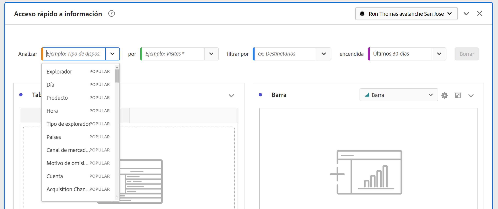

[!UICONTROL Información rápida] le ayudará a lo siguiente:

* Crear correctamente una tabla de datos y una visualización adjunta en [!UICONTROL Analysis Workspace].
* Conocer la terminología y el vocabulario para componentes básicos y partes de [!UICONTROL Analysis Workspace].
* Realizar desgloses simples de dimensiones, agregar varias métricas o comparar segmentos fácilmente dentro de una [!UICONTROL tabla de forma libre].
* Cambiar o probar varios tipos de visualización para encontrar la herramienta de búsqueda para su análisis de forma rápida e intuitiva.

## Terminología clave básica

A continuación se incluyen algunos de los términos básicos que debes conocer. Cada tabla de datos consta de dos o más bloques de creación (componentes) que se utilizan para crear la historia de tus datos.

| Bloque de creación (componente) | Definición |
|---|---|
| **[!UICONTROL Dimensión]** | Las dimensiones son descripciones o características de datos de métricas que se pueden visualizar, desglosar y comparar en un proyecto. Son valores no numéricos y fechas que se desglosan en elementos de dimensión. Por ejemplo, *explorador* o *página* es una dimensión. |
| **[!UICONTROL Elemento de dimensión]** | Los elementos de dimensión son valores individuales para una dimensión. Por ejemplo, los elementos de dimensión para la dimensión del navegador serían *Chrome*, *Firefox*, *Edge*, u otros. |
| **[!UICONTROL Métrica]** | Las métricas constituyen información cuantitativa sobre la actividad de la persona, tales como vistas, pulsaciones, recargas, tiempo promedio invertido, unidades, pedidos, ingresos, etc. |
| **[!UICONTROL Visualización]** | Workspace ofrece [varias visualizaciones](/help/analyze/analysis-workspace/visualizations/freeform-analysis-visualizations.md) para generar representaciones visuales de tus datos. Como gráficos de barras, gráficos circulares, histogramas, gráficos de líneas, mapas, gráficos de dispersión, etc. |
| **[!UICONTROL Desglose de dimensiones]** | Un desglose de dimensión es una forma de desglosar literalmente una dimensión por otras dimensiones. Por ejemplo, puedes desglosar los estados de EE. UU. por dispositivos móviles para obtener las visitas de los dispositivos móviles por estado. O puedes desglosar Dispositivos móviles por Tipos de dispositivos móviles, por Regiones, por Campañas internas y más. |
| **[!UICONTROL Segmentos]** | Los segmentos le permiten identificar subconjuntos de personas en función de sus características o de las interacciones con el sitio web. Por ejemplo, puede generar [!UICONTROL Visitante] segmentos basados en <li>atributos: tipo de explorador, dispositivo, número de visitas, país, sexo o</li><li>interacciones: campañas, búsqueda de palabras clave, motor de búsqueda o</li><li>salidas y entradas: visitantes de Facebook, una página de aterrizaje definida, un dominio de referencia o</li><li> variables personalizadas: campo de formulario, categorías definidas o ID de cliente. |

## Utiliza

Para usar un panel de **[!UICONTROL Información rápida]**:

1. Crear un panel de **[!UICONTROL Información rápida]**. Para obtener información sobre cómo crear un panel, consulta [Crear un panel](panels.md#create-a-panel).

1. La primera vez que uses un panel de **[!UICONTROL Información rápida]**, quizá quieras ver el breve [!UICONTROL tutorial de introducción] que te enseña algunos de los conceptos básicos. Selecciona  junto al título del panel Quick Insights y selecciona **[!UICONTROL Tutorial introductorio]** en la ventana emergente.

1. Especifica la [entrada](#panel-input) para el panel.

1. Observa la [salida](#panel-output) del panel.

### Entrada de panel

Selecciona tus bloques de creación

* **[!UICONTROL Analizar]**: especifica una dimensión (naranja)
* **[!UICONTROL por]**: especifica una métrica (verde)
* **[!UICONTROL filtrar por]** - especificar un segmento (azul)
* **[!UICONTROL en]**: especifica un intervalo de fechas (púrpura).

Debes seleccionar al menos una dimensión y una métrica para que la visualización funcione correctamente.

Puedes especificar los bloques de creación de tres formas:

* Arrastra y suelta los componentes desde el panel izquierdo.
* Empieza a escribir en uno de los campos de bloque de creación. Cuando se encuentra la entrada, el campo de bloque de creación se rellena automáticamente con los valores posibles.
* Especifica una lista desplegable de bloque de creación (por ejemplo, `Country` en **[!UICONTROL Analizar]**) y busca el valor que deseas usar en la lista de valores posibles (con ) (por ejemplo, **[!UICONTROL Código de país]**).

Selecciona **[!UICONTROL Borrar]** para borrar todos los campos de entrada.

### Salida de panel

1. Cuando haya agregado al menos una dimensión y una métrica, podrás ver los resultados.

   

   * Una tabla de forma libre con la dimensión ([!UICONTROL Sitio del país]) y métrica ([!UICONTROL Visitas]), segmentada por [!UICONTROL Visitas] de [!UICONTROL Motores de búsqueda] durante los [!UICONTROL últimos 12 meses].

   * Una visualización adjunta, en este caso un [gráfico de barras](/help/analyze/analysis-workspace/visualizations/bar.md). La visualización que se genera se basa en el tipo de datos agregados a la tabla. Cualquier dato basado en el tiempo (como [!UICONTROL Visitas] por día/mes) tiene un [!UICONTROL gráfico de líneas] predeterminado. Cualquier dato no basado en el tiempo (como [!UICONTROL Visitas] por [!UICONTROL dispositivo]) tiene el valor predeterminado de un [!UICONTROL gráfico de barras]. Puede cambiar el tipo de visualización haciendo clic en la flecha desplegable situada junto al tipo de visualización.

1. Agrega más ajustes tal y como se describe a continuación en [Más sugerencias](#more-tips).

1. Es posible que desees guardar el proyecto usando **[!UICONTROL Proyecto > Guardar]**.

## Más sugerencias

En [!UICONTROL Quick Insights Builder], aparecerán otras sugerencias útiles, algunas de ellas en función de la última acción.

* En primer lugar, quizá desees completar el tutorial **[!UICONTROL Más sugerencias]**. Este tutorial se muestra 24 horas después de crear un proyecto con al menos una dimensión y una métrica. Selecciona  junto al título del panel Quick Insights y selecciona **[!UICONTROL Más sugerencias]** en la ventana emergente.

  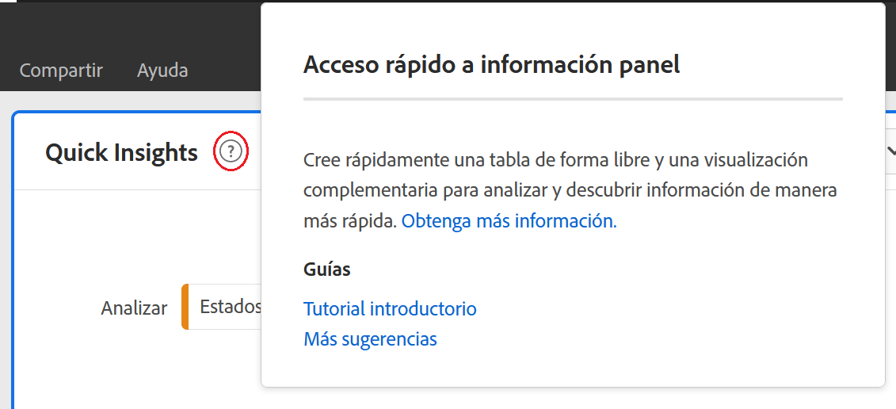

* Puede analizar varias dimensiones y métricas, combinar o comparar segmentos, y especificar un intervalo de fechas:

  

   * **[!UICONTROL Analizar]** dimensión **[!UICONTROL Desglosar por]**: puedes utilizar hasta tres niveles de desgloses en las dimensiones para profundizar en los datos que realmente necesita. Consulta ➊, ➋ y ➌.

   * Agregar más métricas **[!UICONTROL por]**: puedes agregar hasta dos métricas más. Consulta ➍ y ➎.

   * **[!UICONTROL filtrar por]**: Puede agregar hasta dos segmentos más. Por ejemplo, agregue Reservas como un segmento y combínelo con los segmentos de Reservas frecuentes y Ofertas por primera vez que compare. Consulta ➏, ➐ y ➑.

   * activado: puede especificar el rango de fechas. Consulta ➒.

## Limitaciones conocidas

Si intentas editar directamente dentro de la tabla, el panel de [!UICONTROL Quick Insights] no estará sincronizado. Selecciona **[!UICONTROL Resincronizar generador]** en la parte superior derecha del panel para restaurarlo a la configuración anterior de [!UICONTROL Quick Insights].

Recibirás una advertencia antes de agregar cualquier cosa directamente a la tabla:

De lo contrario, la creación directa hará que la tabla ahora se comporte como una tabla de forma libre tradicional, sin las funciones útiles para los nuevos usuarios.

>[!MORELIKETHIS]
>
>[Crear un panel](/help/analyze/analysis-workspace/c-panels/panels.md#create-a-panel)
>
<!--
# Quick Insights panel

[!UICONTROL Quick Insights] provides guidance for non-analysts and new users of [!UICONTROL Analysis Workspace] to learn how to answer business questions quickly and easily. It is also a great tool for advanced users who want to answer a simple question quickly without having to build a table themselves.

When you first start using this [!UICONTROL Analysis Workspace], you might wonder what visualizations would be most useful, which dimensions and metrics might facilitate insights, where to drag and drop items, where to create a segment, etc. 

To help with this, and based on your own company's usage of data components in [!UICONTROL Analysis Workspace], [!UICONTROL Quick Insights] leverages an algorithm that will present you with the most popular dimensions, metrics, segments, and date ranges your company uses. In fact, you will see dimensions, metrics, and segments tagged as [!UICONTROL Popular] in the drop-down list, as shown here:

[!UICONTROL Quick Insights] helps you

* Properly build a data table and an accompanying visualization in [!UICONTROL Analysis Workspace].
* Learn the terminology and vocabulary for basic components and pieces of [!UICONTROL Analysis Workspace].
* Do simple breakdowns of dimensions, add multiple metrics, or compare segments easily within a [!UICONTROL Freeform table].
* Change or try out various visualization types to find the find tool for your analysis quickly and intuitively.

Here is a video overview of the [!UICONTROL Quick Insights] panel:

>[!VIDEO](https://video.tv.adobe.com/v/37248/?quality=12)

## Basic key terminology

Following are some of the basic terms you need to be familiar with. Each data table consists of 2 or more building blocks (components) that you utilize to tell your data story.

|Building block (Component)|Definition|
|---|---|
|[!UICONTROL Dimension]|Dimensions are descriptions or characteristics of metric data that can be viewed, broken down, and compared in a project. They are non-numeric values and dates that break down into dimension items. For example, "browser", or "page" are dimensions.|
|[!UICONTROL Dimension item]|Dimension items are individual values for a dimension. For example, dimension items for the browser dimension would be "Chrome", "Firefox", "Edge", etc.|
|[!UICONTROL Metric]|Metrics are quantitative information about visitor activity, such as views, click-throughs, reloads, average time spent, units, orders, revenue, and so on.|
|[!UICONTROL Visualization]|Workspace offers [a number of visualizations](/help/analyze/analysis-workspace/visualizations/freeform-analysis-visualizations.md) to build visual representations of your data, such as bar charts, donut charts, histograms, line charts, maps, scatterplots, and others.|
|[!UICONTROL Dimension Breakdown]|A dimension breakdown is a way to literally break down a dimension by other dimensions. In our example, you could break down US States by Mobile Devices to get the mobile device visits per state, or you could break Mobile Devices down by Mobile Device types, by Regions, by Internal Campaigns, etc..|
|[!UICONTROL Segment]|Segments let you identify subsets of visitors based on characteristics or website interactions. For example, you can build [!UICONTROL Visitor] segments based on attributes: browser type, device, number of visits, country, gender, or based on interactions: campaigns, keyword search, search engine, or based on exits and entries: visitors from Facebook, a defined landing page, referring domain, or based on custom variables: form field, defined categories, customer ID.  |

## Get started with Quick Insights

1. Log in to Adobe Analytics using the credentials you have been provided with.
1. Go to [!UICONTROL Workspace] and click **[!UICONTROL Create New Project]** and then click **[!UICONTROL Quick Insights]**. (You can also access this panel from the **[!UICONTROL Panel]** menu in the left rail.)

    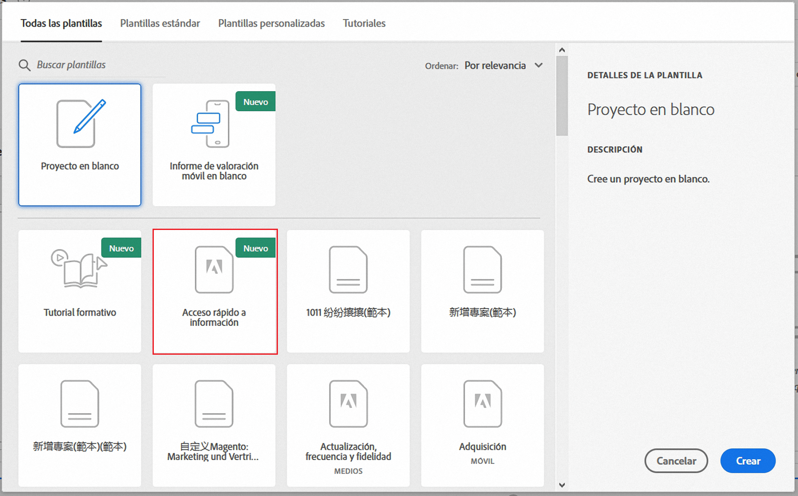

    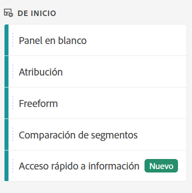

1. When you first start out, go through the short tutorial that teaches you some of the [!UICONTROL Quick Insights panel] basics. Or, click to **[!UICONTROL Skip Tutorial]**.
1. Select your building blocks (also known as components): dimensions (orange), metrics (green), segments (blue), or date ranges (purple) You have to select at least one dimension and one metric for a table to be built automatically. 

    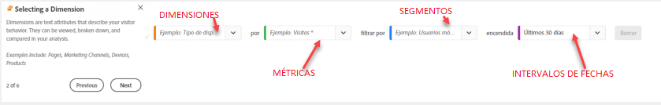

    You have three ways of selecting the building blocks:
    * Drag and drop them from the left rail.
    * If you know what you are looking for: Start typing and [!UICONTROL Quick Insights] will fill in the blanks for you.
    * Click on the drop-down and search the list.

1. When you have added at least one dimension and one metric, the following will be created for you:

    * A Freeform table with the dimension (here, US States) vertically and the metric (here, Visits) horizontally at the top. Check out this table: 

    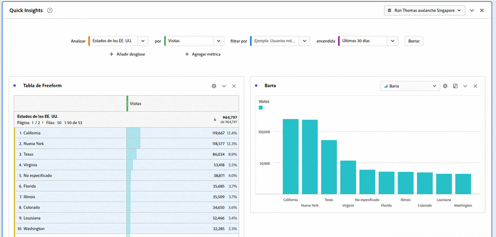

    * An accompanying visualization, in this case a [bar chart](/help/analyze/analysis-workspace/visualizations/bar.md). The visualization that is generated is based on the type of data you added to the table. Any time-based data (such as [!UICONTROL Visits] per Day/Month) defaults to a [!UICONTROL Line] chart. Any non-time-based data (such as [!UICONTROL Visits] per [!UICONTROL Device]) defaults to a [!UICONTROL Bar] chart. You can change the type of visualization by clicking on the drop-down arrow next to the visualization type.

1. (Optional) Drill down on dimensions and see dimension items by clicking the > right-arrow next to the dimension.

1. Try adding some more refinements as described below under "More tips."

1. Save your project by clicking **[!UICONTROL Project > Save]**.

## More tips

Other useful hints will pop up in the [!UICONTROL Quick Insights Builder], some of them depending on your last action.

* First, complete the **[!UICONTROL More tips]** tutorial: Access it via the Help (?) icon next to the [!UICONTROL Quick Insights] title. This tutorial shows up 24 hours after you have created a project with at least one dimension and one metric.

    

* **Breakdown by**: You can use up to 3 levels of breakdowns on dimensions to drill down to the data you really need.

    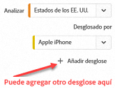

* **Add more metrics**: You can add up to 2 more metrics by using the AND operator to add them the table.

    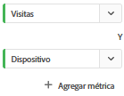

* **Add more segments**: You can add up to 2 more segments by using the AND or OR operators to add them the table. Look at what happens to the table when you add Mobile Users OR Loyal Visitors. They are next to each other, above the metrics. If you added Mobile Users AND Loyal Visitors, you would see results from both segments together, and they would be stacked on top of each other in the table.

    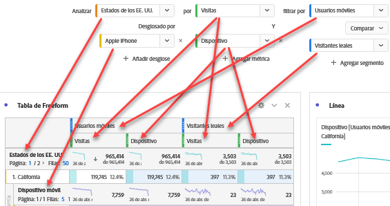

## Known limitations

If you try to edit directly within the table, it will cause the [!UICONTROL Quick Insights] panel to become out of sync. You can restore it to the previous [!UICONTROL Quick Insights] settings by clicking **[!UICONTROL Resync Builder]** at the top right of the panel.

 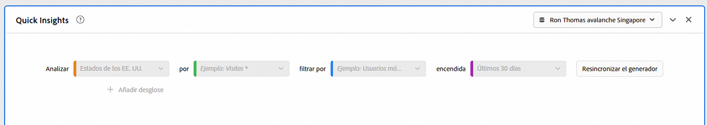

You will get a warning before adding anything directly to the table:

 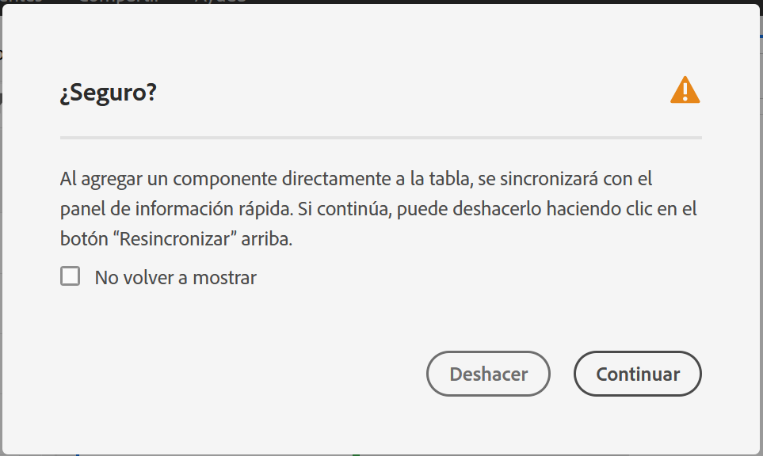

Otherwise, building directly will cause the table to now behave as a traditional Freeform table, without the helpful features for new users.

-->