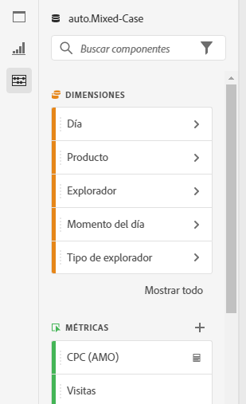
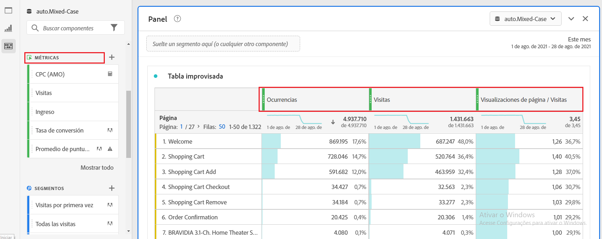
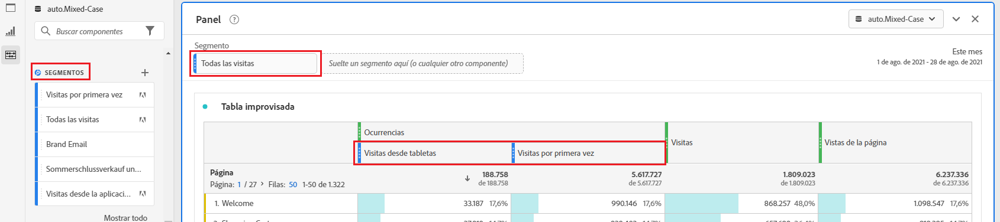
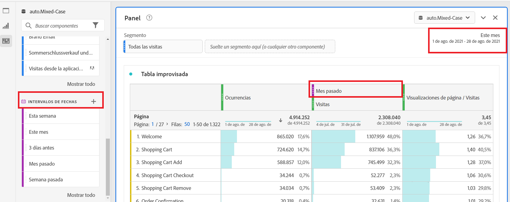
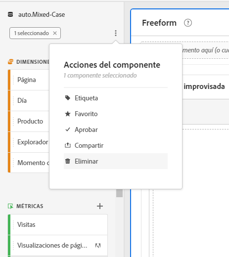

# Resumen de componentes

Los componentes de Analysis Workspace constan de dimensiones, métricas, segmentos e intervalos de fechas que se pueden arrastrar y soltar en un proyecto.

To access the Components menu, click the **[!UICONTROL Components]** icon in the left rail. Puede cambiar entre [paneles](https://docs.adobe.com/content/help/en/analytics/analyze/analysis-workspace/panels/panels.html), [visualizaciones](https://docs.adobe.com/content/help/es-ES/analytics/analyze/analysis-workspace/visualizations/freeform-analysis-visualizations.html)y componentes desde los iconos del carril izquierdo o mediante [teclas de acceso directo](/help/analyze/analysis-workspace/build-workspace-project/fa-shortcut-keys.md).

También puede ajustar la configuración [de densidad de](https://docs.adobe.com/content/help/es-ES/analytics/analyze/analysis-workspace/build-workspace-project/view-density.html) Vista del proyecto para ver más valores en el carril izquierdo a la vez. Para ello, vaya a **[!UICONTROL Proyecto > Información y configuración del proyecto > Densidad]** de Vista.

## Dimensiones {#dimensions}

[**Los Dimension**](https://docs.adobe.com/content/help/en/analytics/components/dimensions/overview.html) son atributos de texto que describen el comportamiento del visitante y se pueden ver, desglosar y comparar en la análisis. Se pueden encontrar en el carril del componente izquierdo (sección naranja) y se suelen aplicar como filas de una tabla.

Algunos ejemplos de dimensiones son Nombre [!UICONTROL de]página, Canales de marketing, Tipo [!UICONTROL de]dispositivo y [!UICONTROL Productos]. Los Dimension son proporcionados por Adobe y se capturan mediante su implementación personalizada (eVar, Props, clasificaciones, etc.).

Cada dimensión también contiene elementos **de** dimensión. Los elementos de Dimension se pueden encontrar en el carril izquierdo del componente haciendo clic en la flecha derecha junto al nombre de cualquier dimensión (los elementos son amarillos).

Algunos ejemplos de elementos de dimensión incluyen [!UICONTROL Página principal] (dentro de la dimensión [!UICONTROL Página] ), Búsqueda  paga (dentro de la dimensión [!UICONTROL Marketing Canal] ), [!UICONTROL Tablet]  (dentro de la dimensión Tipo de dispositivo móvil), etc.

## Métricas {#metrics}

[**Las métricas**](https://docs.adobe.com/content/help/en/analytics/components/metrics/overview.html) son medidas cuantitativas sobre el comportamiento del visitante. Se pueden encontrar en el carril del componente izquierdo (sección verde) y se suelen aplicar como columnas de una tabla.

Algunos ejemplos de métricas son: [!UICONTROL vistas de página, [!UICONTROL Visitas], [!UICONTROL Pedidos], Tiempo [!UICONTROL promedio empleado]e [!UICONTROL Ingresos/Pedido]. Las métricas se proporcionan por Adobe, o se capturan a través de la implementación personalizada (eventos[!UICONTROL de]éxito) o se crean mediante el creador [de métricas](https://docs.adobe.com/content/help/es-ES/analytics/components/calculated-metrics/calcmetric-workflow/cm-build-metrics.html)calculadas.

## Segmentos {#segments}

[**Los segmentos**](https://docs.adobe.com/content/help/es-ES/analytics/analyze/analysis-workspace/components/t-freeform-project-segment.html) son filtros de audiencia que se aplican a la análisis. Se pueden encontrar en el carril del componente izquierdo (sección azul) y se suelen aplicar en la parte superior de un panel o en las columnas de métricas de una tabla.

Algunos ejemplos de segmentos incluyen Visitantes [!UICONTROL de dispositivos]móviles, [!UICONTROL visitas desde correo electrónico]y visitas [!UICONTROL autenticadas]. Los segmentos son proporcionados por Adobe, creados en la zona desplegable [del](https://docs.adobe.com/content/help/en/analytics/analyze/analysis-workspace/panels/panels.html)panel o creados con el [Generador](https://docs.adobe.com/content/help/es-ES/analytics/components/segmentation/segmentation-workflow/seg-build.html)de segmentos.

## Intervalos de fechas {#date-ranges}

[**Los intervalos**](https://docs.adobe.com/content/help/es-ES/analytics/analyze/analysis-workspace/components/calendar-date-ranges/calendar.html) de fechas son el intervalo de fechas en el que se lleva a cabo la análisis. Se pueden encontrar en el carril del componente izquierdo (sección púrpura) y se suelen aplicar en el calendario de cada panel.

Algunos ejemplos de intervalos de fechas son julio de 2019, [!UICONTROL últimas 4 semanas]y [!UICONTROL este mes]. Los intervalos de fechas se proporcionan por Adobe, se aplican en el calendario [del](https://docs.adobe.com/content/help/en/analytics/analyze/analysis-workspace/panels/panels.html)panel o se crean mediante el generador [de intervalos de](https://docs.adobe.com/content/help/en/analytics/analyze/analysis-workspace/components/calendar-date-ranges/custom-date-ranges.html)fechas.

## Acciones de componente {#actions}

Puede administrar componentes (individualmente o seleccionando más de uno) directamente en el carril izquierdo. Haga clic con el botón secundario en un componente o haga clic en el icono Punto de acción en la parte superior de la lista del componente.

| Acción de componente | Descripción |
|--- |--- |
| Etiqueta | Organizar o administrar componentes aplicándoles etiquetas. Luego puede buscar por etiqueta en el carril izquierdo haciendo clic en el filtro o escribiendo #. Las etiquetas también actúan como filtros en los administradores de componentes. |
| Favorito | Añadir el componente a la lista de favoritos. Al igual que las etiquetas, puede buscar por Favoritos en el carril izquierdo y filtrar por ellos en los administradores de componentes. |
| Aprobar | Marque los componentes como Aprobados para indicar a los usuarios que el componente está aprobado por la organización. Al igual que las etiquetas, puede buscar por Aprobado en el carril izquierdo y filtrar por ellas en los administradores de componentes. |
| Compartir | Comparta componentes con usuarios de su organización. Esta opción solo está disponible para componentes personalizados, como segmentos o métricas calculadas. |
| Eliminar | Elimine los componentes que ya no necesite. Esta opción solo está disponible para componentes personalizados, como segmentos o métricas calculadas. |

Los componentes personalizados también se pueden administrar a través de sus respectivos administradores de componentes. Por ejemplo, el Administrador [de segmentos](/help/components/segmentation/segmentation-workflow/seg-manage.md).
