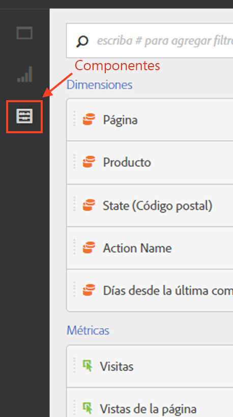

# Información general sobre componentes

Los componentes de Analysis Workspace están formados por métricas, dimensiones, segmentos y granularidades de tiempo que puede arrastrar y soltar en un proyecto. Los componentes personalizados que crea se añaden a estos paneles como, por ejemplo, los intervalos de fecha personalizados.

Para acceder al panel Componentes, haga clic en el icono **[!UICONTROL Componentes]en el carril izquierdo.** You can switch among Panels (Blank panel, [Freeform panel](../../../analyze/analysis-workspace/visualizations/freeform-table.md#concept_0D2E24FCCBAF4194AA941448860E422F), or [Segment Comparison](../../../analyze/analysis-workspace/c-panels/c-segment-comparison/segment-comparison.md#concept_74FAC1C6D0204F9190A110B0D9005793) panel), [Visualizations](../../../analyze/analysis-workspace/visualizations/freeform-analysis-visualizations.md#concept_09242627629147A88A68F1506954C276), and Components using the left-rail icons or by using [hotkeys](../../../analyze/analysis-workspace/build-workspace-project/fa-shortcut-keys.md#concept_9A6356084DBC4D468E265E7A65B3E051).

See [Create a freeform analysis project](../../../analyze/analysis-workspace/build-workspace-project/t-freeform-project.md#task_C2C698ACC7954062A28E4784911E6CF2) for information about using Components in a project.

## Acciones de componente {#section_B7BB29B89AE04297874CDE2C52EAD516}

Puede administrar componentes (de uno en uno o seleccionando más de uno) de diferentes formas. Haga clic con el botón derecho en un componente o haga clic en **[!UICONTROL Acciones]en la parte superior de la lista de componentes.**

>[!NOTE]
>
>Estas acciones no se aplican a componentes de Tiempo.

| Acción de componente | Descripción |
|--- |--- |
| Etiqueta | Organizar o administrar componentes aplicándoles etiquetas. A continuación, el componente se muestra en el administrador de componentes pertinente, como Analytics &gt; Componentes &gt; Segmentos o Analytics &gt; Componentes &gt; Proyectos. |
| Favorito | Añadir el componente a la lista de favoritos. A continuación, se muestra en el administrador de componentes pertinente, como Analytics &gt; Componentes &gt; Segmentos o Analytics &gt; Componentes &gt; Proyectos. |
| Aprobar | Aprobar el componente para hacerlo canónico. A continuación, el componente se muestra en el administrador de componentes pertinente, como Analytics &gt; Componentes &gt; Segmentos o Analytics &gt; Componentes &gt; Proyectos. |
| Compartir | Solo se aplica a los segmentos. |
| Eliminar | Solo se aplica a los segmentos. |

[Creación de métricas, segmentos y fechas en YouTube](https://www.youtube.com/watch?v=XXJuNAte8E8&index=25&list=PL2tCx83mn7GuNnQdYGOtlyCu0V5mEZ8sS) (2:51)