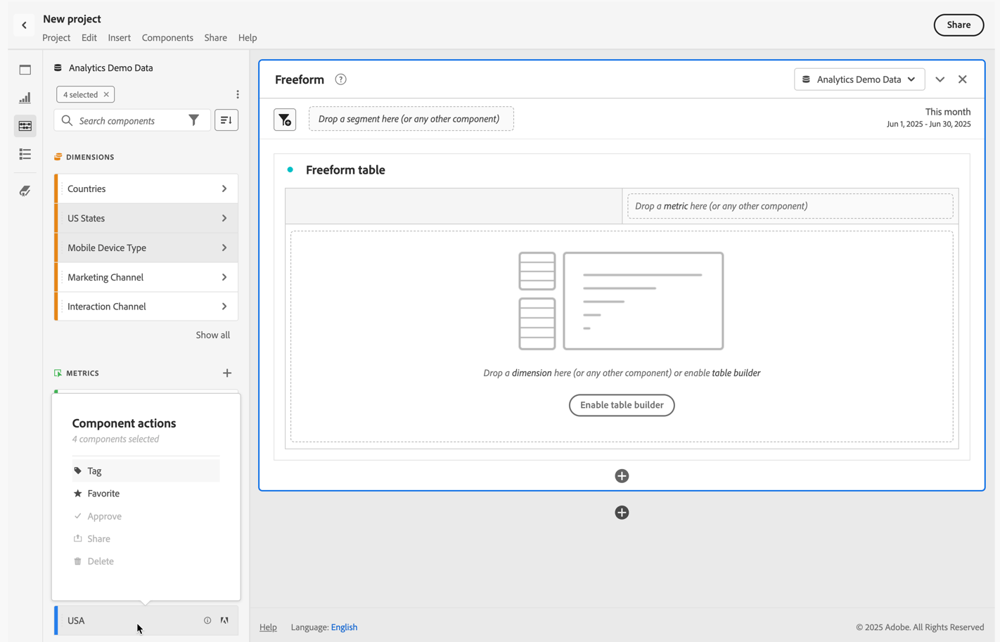

# Información general de componentes

Los componentes son funciones de Adobe Analytics que se pueden utilizar en visualizaciones (como la tabla de forma libre) o para complementar las funciones de creación de informes.

Para administrar componentes desde la interfaz principal de Adobe Analytics:

1. Seleccione **[!UICONTROL Credenciales]** en la barra superior.
1. Seleccione **[!UICONTROL Componentes]** para ver una descripción general de los componentes que puede administrar o seleccionar directamente el componente que desea administrar en el menú.

Puede administrar los siguientes componentes:

* [Segmentos](/help/components/segmentation/seg-home.md): cree, gestione, comparta y aplique segmentos de público potentes y específicos a sus informes. Los segmentos le permiten identificar subconjuntos de personas basándose en sus características o en las interacciones.
* [Métricas calculadas:](/help/components/c-calcmetrics/cm-overview.md) usar las métricas y fórmulas como componentes nuevos para utilizarlas en sistemas de informes
* [Intervalos de fechas:](calendar-date-ranges/custom-date-ranges.md) personalice y especifique las ofertas de Analysis Workspace en los intervalos de fechas.
* [Proyectos programados](../curate-share/t-schedule-report.md): administre sus proyectos programados.
* [Ubicaciones](../../../components/locations/locations-manager.md): administre las ubicaciones a las que exportar los proyectos.
* [Alertas](/help/components/c-alerts/intellligent-alerts.md): permiten que se le notifique en función de los porcentajes modificados o de puntos de datos específicos.
* [Anotaciones](annotations/overview.md): comunicar matices y perspectivas de datos contextuales a su organización.
* [Preferencias](/help/analyze/analysis-workspace/user-preferences.md): administre las preferencias de Analysis Workspace.

## Componentes de Analysis Workspace

Los componentes de Analysis Workspace están formados por métricas, dimensiones, segmentos y granularidades de tiempo que puedes arrastrar y soltar en un proyecto del espacio de trabajo. Los componentes personalizados que creas se añaden a estos paneles como, por ejemplo, la métrica calculada o los intervalos de fecha personalizados.

Para acceder al panel Componentes, selecciona  **[!UICONTROL Componentes]** en el panel Botón.

Consulta [Crear un proyecto](/help/analyze/analysis-workspace/home.md) para obtener información sobre el uso de Componentes en un proyecto.

## Administrar componentes {#actions}

Puedes crear rápidamente un nuevo componente con el menú **[!UICONTROL Componentes]** de Analysis Workspace. Consulta el [menú de Analysis Workspace](/help/analyze/analysis-workspace/home.md#menu) para obtener más información.

Puedes administrar componentes (de forma individual o seleccionando más de uno).

1. Selecciona uno o más componentes.

1. En el menú contextual o en el botón de acciones del componente  (en la parte superior de Componentes), selecciona una de las siguientes acciones.

   >[!TIP]
   >
   >Para seleccionar varios componentes, mantén pulsada **[!UICONTROL Mayús]**, o manteniendo pulsado **[!UICONTROL Comando]** (en macOS) o **[!UICONTROL Ctrl]** (en Windows).

   

   | Acción de componente | Descripción |
   |--- |--- |
   |  [!UICONTROL **Etiqueta**] | Organizar o administrar componentes aplicándoles etiquetas. A continuación, puedes buscar por etiqueta en el panel izquierdo haciendo clic en  o escribiendo `#`. Las etiquetas también actúan como filtros en los administradores de componentes. |
   |  [!UICONTROL **Favorito**] | Añadir el componente a la lista de favoritos. Al igual que las etiquetas, puedes buscar por Favoritos en el panel izquierdo y filtrar con este criterio en los administradores de componentes. |
   |  **[!UICONTROL No favorito]** | Eliminar el componente de la lista de favoritos. |
   |  [!UICONTROL **Aprobar**] | Marque los componentes como aprobados para indicar a los usuarios que el componente lo ha aprobado la organización. Al igual que las etiquetas, puedes buscar y filtrar por Aprobado en el panel izquierdo. Una  identifica los componentes aprobados. |
   |  [!UICONTROL **Compartir**] | Comparta componentes con usuarios de su organización. Esta opción solo está disponible para componentes personalizados, como segmentos o métricas calculadas. |
   |  [!UICONTROL **Eliminar**] | Elimine los componentes que ya no necesite. Esta opción solo está disponible para componentes personalizados, como segmentos o métricas calculadas. |

Los componentes personalizados también se pueden administrar a través de sus respectivos administradores de componentes. Por ejemplo, consulte [Administrar segmentos](/help/components/segmentation/segmentation-workflow/seg-manage.md).

## Administrar la lista de componentes

Puedes buscar, filtrar y ordenar la lista de componentes en el panel izquierdo de Analysis Workspace para localizar rápidamente un componente en particular.

### Buscar

1. Selecciona **Componentes**  en el panel izquierdo.

2. En el campo de búsqueda, empiece a escribir el nombre del componente que desea utilizar en el proyecto.

   Un color y el icono identifican el tipo de componente. Las **dimensiones**  son de color naranja, los **segmentos**  son azules, los **intervalos de fechas**  son morados y las **métricas**  son verdes. El icono de Adobe  indica una plantilla de métrica calculada o una plantilla de segmento. El icono de la calculadora  indica una métrica calculada que ha creado un administrador de tu organización.

3. Seleccione el componente en el menú desplegable.

### Filtro

1. Selecciona el icono de **Componentes**  en el panel izquierdo.

2. Selecciona el **Filtro**  o escribe `#` en el campo de búsqueda.

3. Seleccione cualquiera de las siguientes opciones de filtro para filtrar la lista de componentes:

   | Icono | Opción de filtro | Descripción |
   |---------|---|----------|
   |  | **[!UICONTROL Aprobado]** | Mostrar solo los componentes marcados como Aprobado por un administrador. |
   |  | **[!UICONTROL Favoritos]** | Mostrar solo los componentes que se encuentran en la lista de Favoritos.  Para obtener información sobre cómo añadir componentes a la lista de favoritos, consulta[Información general sobre componentes](#manage-components). |
   |  | **[!UICONTROL Dimensiones]** | Mostrar solo los componentes que son dimensiones. |
   |  | **[!UICONTROL Métricas]** | Mostrar solo los componentes que son métricas. |
   |  | **[!UICONTROL Segmentos]** | Mostrar solo los componentes que son segmentos.  |
   |  | **[!UICONTROL Intervalos de fechas]** | Mostrar solo los componentes que son intervalos de fechas.  |
   |  | **[!UICONTROL *Nombre de etiqueta *]** | Mostrar solo los componentes con las etiquetas seleccionadas específicas. Hay disponible una etiqueta específica para la plantilla de Adobe, que son las [métricas calculadas predeterminadas](/help/components/c-calcmetrics/cm-reference/default-calcmetrics.md) de Adobe. |

   Selecciona  en un filtro para quitar el filtro.

4. Si lo deseas, puedes ordenar la lista de componentes, tal como se describe en [Ordenar la lista de componentes](#sort-the-component-list).

### Ordenar

<!-- {{release-limited-testing-section}}-->

1. (Opcional) Aplique cualquier filtro a la lista de componentes, tal como se describe en [Filtrado de la lista de componentes](#filter-the-component-list).

2. Selecciona el icono de **Componentes**  en el panel izquierdo.

3. Selecciona el icono de **Ordenar** , y a continuación, selecciona cualquiera de las siguientes opciones de filtro para ordenar la lista de componentes.

Las opciones de clasificación disponibles son las siguientes:

{{components-sort-options}}

## Acceder a permisos

En Analysis Workspace, los administradores pueden[depurar](/help/analyze/analysis-workspace/curate-share/curate.md) qué componentes se exponen a los usuarios en la creación de informes.

<!--
# Components overview

Components in Analysis Workspace consist of dimensions, metrics, segments, and date ranges that you can drag-and-drop onto a project. 

To access the Components menu, click the **[!UICONTROL Components]** icon in the left rail. You can switch among [panels](https://experienceleague.adobe.com/docs/analytics/analyze/analysis-workspace/panels/panels.html?lang=es), [visualizations](https://experienceleague.adobe.com/docs/analytics/analyze/analysis-workspace/visualizations/freeform-analysis-visualizations.html?lang=es), and components from the left rail icons or by using [hotkeys](/help/analyze/analysis-workspace/build-workspace-project/fa-shortcut-keys.md).

You can also adjust the [View density settings](https://experienceleague.adobe.com/docs/analytics/analyze/analysis-workspace/build-workspace-project/view-density.html?lang=es) for the project to see more values in the left rail at once by going to **[!UICONTROL Project > Project Info & Settings > View Density]**.

## Dimensions {#dimensions}

[**Dimensions**](https://experienceleague.adobe.com/docs/analytics/components/dimensions/overview.html?lang=es) are text attributes that describe your visitor behavior and can be viewed, broken down, and compared in your analysis. They can be found in the left Component rail (orange section) and are typically applied as rows of a table. 

Examples of dimensions include [!UICONTROL Page Name], [!UICONTROL Marketing Channels], [!UICONTROL Device Type], and [!UICONTROL Products]. Dimensions are provided by Adobe and are captured through your custom implementation (eVar, Props, classifications, etc).

Each dimension also contains **dimension items** within it. Dimension items can be found in the left Component rail by clicking the right-arrow next to any dimension name (items are yellow).

Examples of dimension items include [!UICONTROL Homepage] (within the [!UICONTROL Page] dimension), [!UICONTROL Paid Search] (within the [!UICONTROL Marketing Channel] dimension), [!UICONTROL Tablet] (within the [!UICONTROL Mobile Device Type] dimension), and so on.

## Metrics {#metrics}

[**Metrics**](https://experienceleague.adobe.com/docs/analytics/components/metrics/overview.html?lang=es) are quantitative measures about visitor behavior. They can be found in the left Component rail (green section) and are typically applied as columns of a table.

Examples of metrics include [!UICONTROL Page views], [!UICONTROL Visits], [!UICONTROL Orders], [!UICONTROL Average Time spent], and [!UICONTROL Revenue/Order]. Metrics are provided by Adobe, or captured through your custom implementation ([!UICONTROL Success events]), or created using the [Calculated metric builder](https://experienceleague.adobe.com/docs/analytics/components/calculated-metrics/calcmetric-workflow/cm-build-metrics.html?lang=es).

## Segments {#segments}

[**Segments**](https://experienceleague.adobe.com/docs/analytics/analyze/analysis-workspace/components/segments/t-freeform-project-segment.html?lang=es) are audience filters that are applied to your analysis. They can be found in the left Component rail (blue section) and are typically applied at the top of a panel or above metric columns in a table. 

Examples of segments include [!UICONTROL Mobile Device Visitors], [!UICONTROL Visits from Email], and [!UICONTROL Authenticated Hits]. Segments are provided by Adobe, or created in the [panel dropzone](https://experienceleague.adobe.com/docs/analytics/analyze/analysis-workspace/panels/panels.html?lang=es), or created using the [Segment builder](https://experienceleague.adobe.com/docs/analytics/components/segmentation/segmentation-workflow/seg-build.html?lang=es).

## Date Ranges {#date-ranges}

[**Date Ranges**](https://experienceleague.adobe.com/docs/analytics/analyze/analysis-workspace/components/calendar-date-ranges/calendar.html?lang=es) are the range of dates you conduct your analysis across. They can be found in the left Component rail (purple section) and are typically applied in the calendar of each panel.

You can make the date range components relative to the panel calendar. For additional information, see [About relative panel date ranges](/help/analyze/analysis-workspace/components/calendar-date-ranges/calendar.md#relative-panel-dates).

Examples of date ranges include July 2019, [!UICONTROL Last 4 weeks], and [!UICONTROL This month]. Date ranges are provided by Adobe, applied in the [panel calendar](https://experienceleague.adobe.com/docs/analytics/analyze/analysis-workspace/panels/panels.html?lang=es), or created using the [Date range builder](https://experienceleague.adobe.com/docs/analytics/analyze/analysis-workspace/components/calendar-date-ranges/custom-date-ranges.html?lang=es).

## Manage components {#actions}

You can manage components directly in the left rail. 

1. Right-click a component.

   Or
   
   Select a component, then select the **Action** (3-dot) icon at the top of the component list.

   >[!TIP]
   >
   >   You can select multiple components by holding Shift, or by holding Command (on Mac) or Ctrl (on Windows).

   

   | Component action | Description |
   |--- |--- |
   | [!UICONTROL **Tag**] | Organize or manage components by applying tags to them. You can then search by tag in the left rail by clicking the filter or typing #. Tags also act as filters in the component managers. |
   | [!UICONTROL **Favorite**] | Add the component to your list of favorites. Like tags, you can search by Favorites in the left rail and filter by them in the component managers. |
   | [!UICONTROL **Approve**] | Mark components as Approved to signal to your users that the component is organization-approved. Like tags, you can search by Approved in the left rail and filter by them in the component managers. |
   | [!UICONTROL **Share**] | Share components to users in your organization. This option is available for custom components only, such as segments or calculated metrics. |
   | [!UICONTROL **Delete**] | Delete components that you no longer need. This option is available for custom components only, such as segments or calculated metrics. |

Custom components can also be managed through their respective Component managers. For example, the [Segment Manager](/help/components/segmentation/segmentation-workflow/seg-manage.md).

## Search, filter, and sort the component list

You can search, filter, and sort the component list in the left rail of Analysis Workspace to quickly locate a particular component. 

### Search the component list

1. Select the **Components** icon  in the left rail.

2. In the search field, begin typing the name of the component you want to use in your project.

   The type of component can be identified by both color and icon. **Dimensions**  are orange, **Segments**  are blue, **Date ranges**  are purple, and **Metrics**  are green. The Adobe icon indicates either a calculated metric template or a segment template, and the calculator icon  indicated a calculated metric that was created by an Analytics administrator in your organization. 

3. Select the component when it appears in the drop-down list.

### Filter the component list

1. Select the **Components** icon  in the left rail.

2. Select the **Filter** icon .

   Or

   Type the pound sign (#) in the search field.

3. Select any of the following filter options to filter the list of components:

   |Option | Function |
   |---------|----------|
   | [!UICONTROL **Approved**] | Show only components that are marked as Approved by an administrator. |
   | [!UICONTROL **Favorites**] | Show only components that are in your list of Favorites. For information about adding components to your list of favorites, see [Components overview](/help/analyze/analysis-workspace/components/analysis-workspace-components.md). |
   | [!UICONTROL **Dimensions**] | Show only components that are Dimensions. |
   | [!UICONTROL **Metrics**] | Show only components that are Metrics. |
   | [!UICONTROL **Segments**] | Show only components that are Segments.  |
   | [!UICONTROL **Date ranges**] | Show only components that are Date Ranges. |
   | [!UICONTROL **Show all**] | Show all components. This option is available only for administrators. |
   | [!UICONTROL **Unapproved**] | Show only components that are not yet marked as Approved by an administrator. As an administrator, this is helpful when identifying components that require your review and approval. This option is available only for administrators. |

4. (Optional) To further hone the list, you can sort the component list, as described in [Sort the component list](#sort-the-component-list).

### Sort the component list

1. (Optional) Apply any filters to the component list, as described in [Filter the component list](#filter-the-component-list).

2. Select the **Components** icon  in the left rail.

3. Select the **Sort** icon , then select any of the following filter options to sort the list of components:

   {{components-sort-options}}

-->