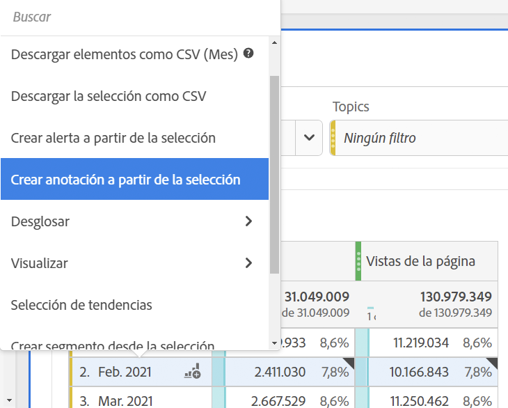
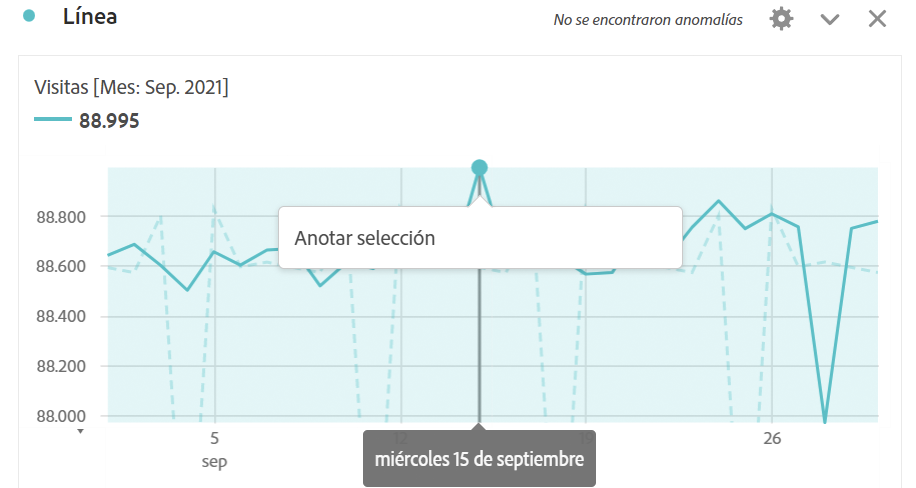
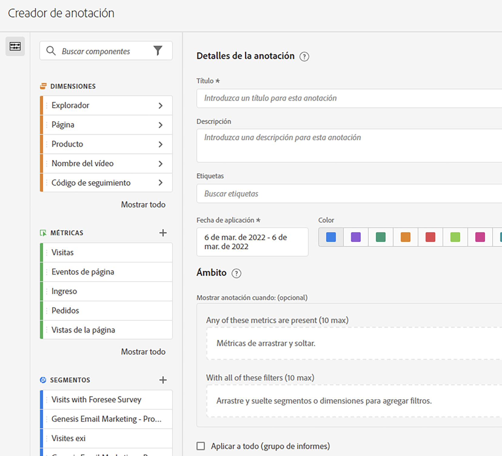

# Crear anotaciones

>[!NOTE]
>
>Actualmente, esta función está en prueba limitada.

1. Para crear anotaciones, tiene varias formas de empezar:

| Método de creación | Detalles |
| --- | --- |
| **Vaya a [!UICONTROL Analytics] > [!UICONTROL Componentes] > [!UICONTROL Anotación].** | Se abre la página Administrador de anotaciones . Haga clic en [!UICONTROL Crear nueva anotación] y [!UICONTROL Generador de anotaciones] se abre. |
| **Haga clic con el botón derecho en un punto de una tabla.** | [!UICONTROL El generador de anotaciones] se abre. Tenga en cuenta que, de forma predeterminada, las anotaciones creadas de esta forma solo son visibles en el proyecto en el que se crearon. Pero puede ponerlos a disposición de todos los proyectos. Tenga en cuenta también que las fechas y cualquier métrica, etc., ya se han rellenado.
 |
| **Haga clic con el botón derecho en un punto de una [!UICONTROL Línea] gráfico.** | La variable [!UICONTROL Generador de anotaciones] se abre. Tenga en cuenta que, de forma predeterminada, las anotaciones creadas de esta forma solo son visibles en el proyecto en el que se crearon. Pero puede ponerlos a disposición de todos los proyectos. Tenga en cuenta también que las fechas y cualquier métrica, etc., ya se han rellenado.
 |
| **En Workspace, vaya a [!UICONTROL Componentes] > [!UICONTROL Crear anotación].** | La variable [!UICONTROL Generador de anotaciones] se abre. |
| **Utilice esta tecla de acceso directo** para abrir el Generador de anotaciones: (PC) `ctrl` `shift` + o, (Mac) `shift` + `command` + o | Tenga en cuenta que al utilizar la tecla de acceso directo para crear una anotación, se crea una anotación de un solo día para la fecha actual, sin ningún ámbito preseleccionado (métricas o dimensiones). |

1. Complete la variable [!UICONTROL Generador de anotaciones] elementos.

   

   | Elemento | Descripción |
   | --- | --- |
   | [!UICONTROL Título] | Asigne un nombre a la anotación, por ejemplo: &quot;Día de la memoria&quot; |
   | [!UICONTROL Descripción] | (Opcional) Proporcione una descripción para la anotación, por ejemplo: &quot;Fiesta pública observada en Estados Unidos&quot;. |
   | [!UICONTROL Etiquetas] | (Opcional) Organice las anotaciones creando o aplicando una etiqueta. |
   | [!UICONTROL Fecha de aplicación] | Seleccione la fecha o el intervalo de fechas que debe estar presente para que la anotación sea visible. |
   | [!UICONTROL Color] | Aplicar un color a la anotación. La anotación aparece en el proyecto con el color seleccionado. El color se puede utilizar para categorizar anotaciones, como festivos, eventos externos, problemas de seguimiento, etc. |
   | [!UICONTROL Ámbito] | (Opcional) Arrastre y suelte las métricas de déclencheur de la anotación. A continuación, arrastre y suelte las dimensiones o segmentos que actúen como filtros (es decir, con los que la anotación será visible). Si no especifica un ámbito, la anotación se aplicará a todos los datos.<ul><li>**[!UICONTROL Cualquiera de estas métricas está presente]**: Arrastre y suelte hasta 10 métricas que almacenarán en déclencheur la anotación para mostrar.</li><li>**[!UICONTROL Con todos estos filtros]**: Arrastre y suelte hasta 10 dimensiones o segmentos que filtrarán cuando se muestre la anotación.</li></ul>
Casos de uso: Un eVar ha dejado de recopilar datos para un intervalo de fechas específico. Arrastre el eVar a la **[!UICONTROL Cualquiera de estas métricas está presente]** diálogo. O [!UICONTROL Visitas] no genera informes de ningún dato; siga el mismo proceso.
**Nota:** Cualquier anotación aplicada a un componente que luego se utiliza como parte de una métrica calculada o definición de segmento NO hereda automáticamente la anotación. La métrica calculada deseada también debe agregarse a la sección de ámbito para mostrar la anotación. Sin embargo, se debe crear una nueva anotación para cualquier segmento que desee anotar con la misma información.
Ejemplo: Aplica una anotación a [!UICONTROL Pedidos] en un día específico. A continuación, utilice [!UICONTROL Pedidos] en una métrica calculada para el mismo intervalo de fechas. La nueva métrica calculada no mostrará automáticamente la anotación de los pedidos; la métrica calculada también debe agregarse a la sección ámbito para que se muestre la anotación. |
   | [!UICONTROL Aplicar a todos los conjuntos de informes] | De forma predeterminada, la anotación se aplica al grupo de informes de origen. Al marcar esta casilla, puede hacer que la anotación se aplique a todos los grupos de informes de la empresa. |
   | [!UICONTROL Aplicar a todos los proyectos] | De forma predeterminada, la anotación se aplica al proyecto actual. Al marcar esta casilla, puede hacer que la anotación se aplique a todos los proyectos que posea. Tenga en cuenta que esta casilla de verificación solo aparece al iniciar el Generador de anotaciones desde el Creador de anotaciones? |

1. Haga clic en **[!UICONTROL Guardar]**.
