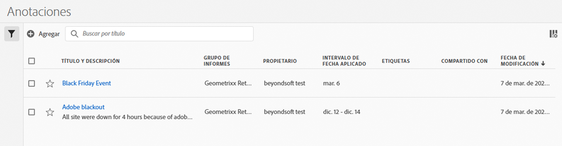

# Administración de anotaciones

El [!UICONTROL Administrador de anotaciones] le muestra todas las anotaciones que posee o que han compartido con usted. Las anotaciones específicas del proyecto no aparecen aquí. Puede utilizar esta interfaz para compartir, filtrar, etiquetar, copiar, eliminar y marcar como favoritas sus anotaciones. Los administradores pueden administrar y aprobar anotaciones.

**[!UICONTROL Componentes]** > **[!UICONTROL Anotaciones]**

## Interfaz de usuario del Administrador de anotaciones

| Elemento de la IU | Descripción |
| --- | --- | 
| [!UICONTROL Título y descripción] | Aparecen en el Generador de anotaciones. Para editar el título y la descripción, haga clic en el vínculo del título. Se le redirigirá al Generador de anotaciones. |
| [!UICONTROL Grupo de informes] | Los grupos de informes a los que se aplica esta anotación. |
| [!UICONTROL Propietario] | Indica a quién pertenece la anotación. Si no es el administrador, solo podrá ver las anotaciones que le pertenecen o que se han compartido con usted. |
| [!UICONTROL Intervalo de fecha aplicado] | La fecha o el intervalo de fechas al que se aplica esta anotación. |
| [!UICONTROL Compartido con] | Indica cuántos individuos o grupos han compartido la anotación. Haga clic para ver más detalles. |
| [!UICONTROL Fecha de modificación] | Muestra la fecha y la hora de la última modificación de la anotación. |

{style="table-layout:auto"}

## Edición de anotaciones

Editar una anotación significa que puede ajustar intervalos de fechas, colores, ámbito o si se aplica a todos los grupos de informes o proyectos. Puede editar las anotaciones de dos formas:

* En un gráfico de líneas, pase el ratón sobre la anotación y haga clic en el icono de lápiz dentro de la ventana emergente.
* En el [!UICONTROL Administrador de anotaciones], haga clic en el título de la anotación.

Ambas opciones le permiten volver a acceder al [!UICONTROL Generador de anotaciones]. Aquí puede realizar los ajustes necesarios y guardar la nueva versión.

## Compartir anotaciones

Cuando comparta anotaciones o trabaje con anotaciones que se compartieron con usted, tenga esto en cuenta:

* Si crea un proyecto con anotaciones solo de proyecto y luego lo comparte con otro usuario, nadie con el que comparta el proyecto podrá editar o eliminar las anotaciones.
* Si guarda una anotación y la comparte directamente con un usuario, solo podrá editarla o eliminarla si tiene derechos de administrador.
* Si un proyecto se comparte con usted con una anotación solo de proyecto, solo se muestra en ese proyecto. Si la anotación se comparte directamente con usted, aparecerá en todos los proyectos en los que se pueda mostrar.

## Anotaciones y zonas horarias

Todas las anotaciones se crean con una marca de tiempo, pero no con información de horas ni de zona horaria. En el momento del informe, siempre se aplica la zona horaria del grupo de informes del panel. Por ejemplo, una anotación creada para Navidad se produce el 25 de diciembre, independientemente de la zona horaria del grupo de informes en la que se encuentre.

## Otras tareas de anotación

El Administrador de anotaciones permite a los administradores editar, añadir, etiquetar, eliminar, cambiar el nombre, aprobar, copiar, exportar y filtrar anotaciones. No es visible para los usuarios que no son administradores.

Hay opciones adicionales disponibles al seleccionar al menos una anotación:

| Tarea | Descripción |
| --- | --- |
| [!UICONTROL Agregue] | Le lleva al Generador de anotaciones, donde puede crear anotaciones. |
| [!UICONTROL Etiqueta] | Todos los usuarios pueden crear etiquetas para las anotaciones y aplicar una o más a una anotación. Sin embargo, solo verá las etiquetas de las anotaciones que sean suyas. |
| [!UICONTROL Eliminar] | Al eliminar una anotación, esta se elimina de cualquier proyecto de su organización. |
| [!UICONTROL Cambiar el nombre] | Al cambiar el nombre de una anotación, se le cambia el nombre en todos los proyectos a los que se ha aplicado. |
| [!UICONTROL Copiar] | Crea una copia distinta con su nuevo ID de anotación, pero con el mismo nombre y definición. |
| [!UICONTROL Exportar a CSV] | Exporte la definición de la anotación a un archivo .csv. |
| [!UICONTROL Filtro] (carril izquierdo) | Filtre por etiquetas, grupo de informes, propietarios y otros filtros (Míos, Aprobados, Favoritos, Compartidos conmigo y Mostrar todo). |

{style="table-layout:auto"}
