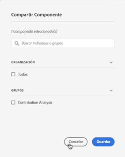

# Administrar anotaciones

>[!NOTE]
>
>Actualmente, esta función está en prueba limitada.

La variable [!UICONTROL Componentes] > [!UICONTROL Anotaciones] manager ofrece muchas maneras de administrar anotaciones, como compartir, filtrar, etiquetar, aprobar, copiar, eliminar y marcar como favoritos.

La variable [!UICONTROL Anotaciones] el administrador le muestra todas las anotaciones que posee que se han abarcado en todos sus proyectos y que se han compartido con usted.

>[!NOTE]
>
>[!UICONTROL Anotaciones] que haya creado únicamente para un proyecto específico no aparecen en el administrador.

## Interfaz de usuario del Administrador de anotaciones

| Elemento IU | Descripción |
| --- | --- | 
| [!UICONTROL Título y descripción] | Aparecen en el Generador de anotaciones. Para editar el título y la descripción, haga clic en el vínculo del título. Se le redirigirá al Generador de anotaciones. |
| [!UICONTROL Grupo de informes] | Los grupos de informes a los que se aplica esta anotación. |
| [!UICONTROL Propietario] | Indica a quién pertenece la anotación. Si no es el administrador, solo podrá ver las anotaciones que le pertenecen o que compartieron con usted. |
| [!UICONTROL Intervalo de fechas aplicado] | La fecha o el intervalo de fechas al que se aplica esta anotación. |
| [!UICONTROL Compartido con] | Indica cuántos individuos o grupos han compartido la anotación. Haga clic en para obtener más información. |
| [!UICONTROL Fecha de modificación] | Muestra la fecha y la hora de la última modificación de la anotación. |

## Editar anotaciones

Editar una anotación significa que puede ajustar intervalos de fechas, colores, ámbito o si se aplica o no a todos los grupos de informes o proyectos. Las anotaciones se pueden editar de dos formas:

* En un gráfico de líneas, pase el ratón sobre la anotación y haga clic en el icono de lápiz dentro de la ventana emergente.

* En el [!UICONTROL Administrador de anotaciones], haga clic en el título de la anotación.

Ambas opciones le permiten volver a acceder al Generador de anotaciones. Aquí puede realizar los ajustes necesarios y guardar la nueva versión.

## Compartir anotaciones

1. Seleccione las anotaciones que desee compartir y haga clic en [!UICONTROL Compartir].

1. En el [!UICONTROL Compartir componente] , busque las personas o los grupos con los que desea compartir las anotaciones.

1. En [!UICONTROL Organización], ....

1. Haga clic en [!UICONTROL Guardar].

## Anotaciones de etiqueta

A continuación

