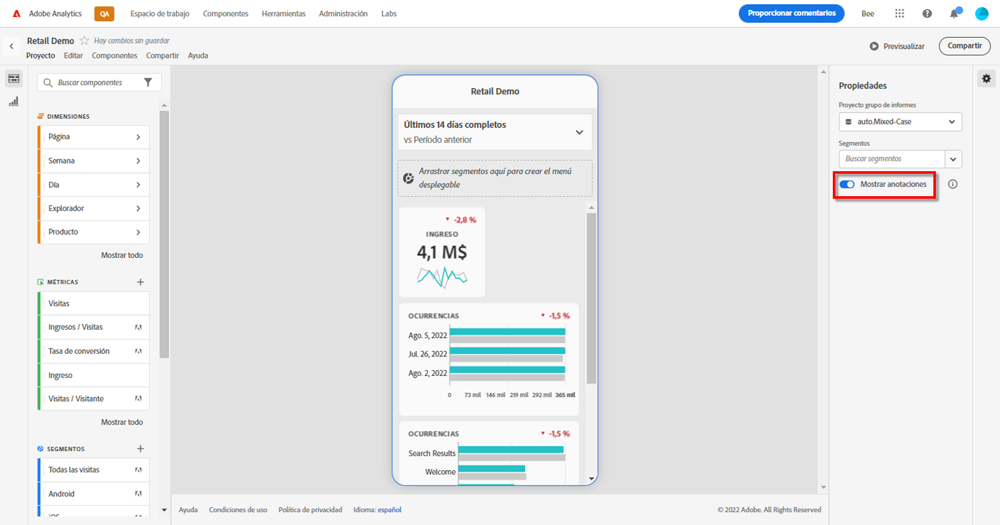
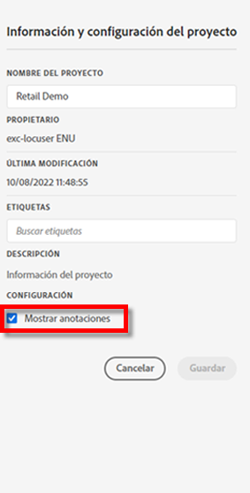

# Compartir anotaciones en cuadros de resultados móviles

Puedes mostrar anotaciones creadas en Workspace en los cuadros de resultados móviles. Las anotaciones en los cuadros de resultados móviles permiten compartir matices de datos contextuales y perspectivas sobre su organización y campañas.

## Mostrar anotaciones en cuadros de resultados móviles

Para que aparezcan anotaciones en cuadros de resultados móviles, primero cree la anotación desde proyectos de Workspace o desde el menú de componentes.

Para obtener información sobre la creación de anotaciones, consulta [Crear anotaciones](create-annotations.md). Las anotaciones están desactivadas en los cuadros de resultados móviles de forma predeterminada y deben habilitarse para cada cuadro de resultados que desee que aparezca en los cuadros de resultados móviles.

1. Activar anotaciones. Para activar las anotaciones, consulte [Activar o desactivar anotaciones](overview.md#turn-annotations-on-or-off).

1. Cree una anotación y asegúrese de que se comparta con todos sus proyectos. Consulta [Crear anotaciones](create-annotations.md) para obtener más información.

1. Seleccione **[!UICONTROL Mostrar anotaciones]** para mostrar la anotación en los cuadros de resultados móviles.

   

   Opcionalmente, puedes confirmar que **[!UICONTROL Mostrar anotaciones]** está seleccionado en **[!UICONTROL Proyecto]** > **[!UICONTROL Información y configuración del proyecto]**

## Ver anotaciones en cuadros de resultados móviles

Cuando las anotaciones están activadas, los iconos de anotación se pueden ver en el Generador de cuadros de resultados. Las anotaciones solo aparecen en los gráficos y tablas de la vista detallada. Las anotaciones no están visibles desde la vista de mosaico principal del cuadro de resultados.

Cuando los iconos de anotación están visibles, no se puede ver ni interactuar con las anotaciones en el lienzo del generador. Utiliza la **[!UICONTROL previsualización]** de para ver e interactuar con las anotaciones tal y como aparecen en la aplicación.

Los colores de anotación se seleccionan cuando la anotación se crea en Workspace. Las anotaciones grises indicaban la presencia de más de una anotación. 

## Previsualizar anotaciones

Puedes obtener una vista previa de la anotación mediante la Vista previa de . Selecciona una anotación para abrir los detalles de la anotación.

Si hay más anotaciones disponibles, verá varios puntos (●) en la parte inferior de la anotación. Desliza hacia izquierda o derecha para cambiar entre anotaciones.

<!--
# Share Annotations in Mobile Scorecards

You can display annotations that are created in Workspace in Mobile Scorecards. This allows you to share contextual data nuances and insights about your organization and campaigns directly within Mobile Scorecard projects, viewable in the Analytics dashboards mobile app.

## Surface Annotations in Mobile Scorecards

To surface annotations in mobile scorecards, create the annotation first from Workspace projects or from the components menu.

For information on creating annotations, see [Create Annotations](create-annotations.md). Annotations are turned off in mobile scorecards by default and must be enabled for each scorecard that you want to surface in mobile scorecards.

1. Turn on annotations. To turn annotations on, see [Turn annotations on or off](overview.md#annotations-on-off).

1. Create an annotation and make sure it is shared to all your projects. To create an annotation in Workspace,  see [Create Annotations](create-annotations.md).

1. Select **Show annotations** to display the annotation in Mobile Scorecards.

   

1. Confirm that show annotations is selected, go to **Project** > **Project info and settings**.

   

## View annotations in Mobile Scorecards

When annotations are enabled, annotation icons are visible in the Scorecard Builder. Annotations appear only on charts and tables in the detailed view. Annotations are not visible from the main tile view of the scorecard.

 

When annotation icons are visible, you can't fully view or interact with annotations in the builder canvas. Use the Preview mode to view and interact with annotations as they appear in the app  **Preview**.

Annotation colors are selected when the annotation is created in workspace. Gray annotations indicated the presence of more than one annotation.

## View chart annotations

| Date | Appearance |
| --- | --- |
| **Single day** |     |
| **Date range** |  |
| **Overlapping annotations** |   To view annotation details in the Analytics dashboards app, tap an annotation icon.   When viewing an annotation in a chart, you can swipe left and right to navigate all annotations present in the chart. When viewing an annotation in the table, swipe left and right to navigate all annotations associated with that row item in the table.      In charts that do not have a time-based *x axis*, such as the donut or horizontal bar charts, annotations that apply to the chart can be viewed by tapping the icon located in the lower right-hand corner.   |
-->