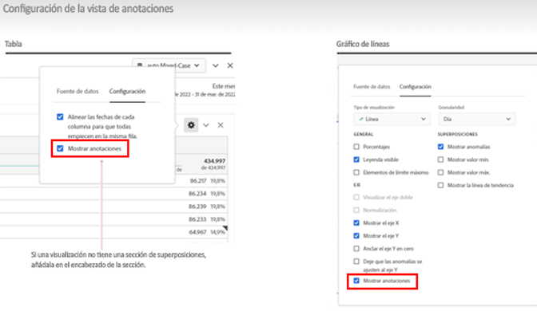
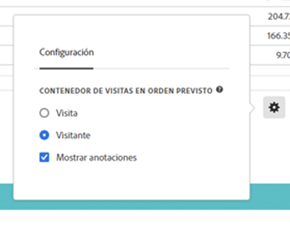

# Descripción general de anotaciones

Las anotaciones le permiten comunicar de forma eficaz los matices y perspectivas de datos contextuales a su organización. Las anotaciones le permiten enlazar los eventos de calendario con dimensiones y métricas específicas. Puede anotar una fecha o un intervalo de fechas con problemas de datos conocidos, días festivos, lanzamientos de campañas, etc. A continuación, puede mostrar gráficamente los eventos y ver si las campañas u otros eventos han afectado al tráfico del sitio, al uso de aplicaciones móviles, a los ingresos o a alguna otra métrica.

Por ejemplo, supongamos que comparte proyectos con su organización. Si hubiera experimentado una disminución notable en el número de visitantes únicos, podría crear una anotación **Disminución de visitantes** y aplicarla a todo el grupo de informes. Cuando los usuarios ven cualquier grupo de informes que incluya esa fecha, ven la anotación dentro de sus proyectos, junto con sus datos.

Las anotaciones se pueden aplicar a:

* Una sola fecha o un intervalo de fechas.

* Todo el conjunto de datos o métricas, dimensiones o segmentos específicos.

* Proyecto en el que se crean las anotaciones (predeterminado) para todos los proyectos.

* La vista de datos en la que se crean las anotaciones (predeterminada) o todas las vistas de datos.

Consulte [Crear anotaciones](create-annotations.md) para ver las distintas opciones disponibles para crear anotaciones. A continuación, puede generar, modificar y guardar anotaciones en [Generador de anotaciones](create-annotations.md#annotation-builder).

Utilice [Administrador de anotaciones](manage-annotations.md) para administrar anotaciones.

## Activación o desactivación de anotaciones

Las anotaciones se pueden activar o desactivar en varios niveles:

| Nivel | Cómo... |
|---|---|
| **Visualización** | Habilitar o deshabilitar  > **[!UICONTROL Configuración]** > **[!UICONTROL Mostrar anotaciones]**.  |
| **Proyecto** | En el menú de un proyecto de Workspace, seleccione **[!UICONTROL Proyecto]** > **[!UICONTROL Información y configuración del proyecto]** y habilite o deshabilite **[!UICONTROL Mostrar anotaciones]**.  |
| **Usuario** | En la pestaña **[!UICONTROL Componentes]**, seleccione **[!UICONTROL Preferencias]** o, en el menú de un proyecto de Workspace, seleccione **[!UICONTROL Proyecto]** > **[!UICONTROL Preferencias de usuario]**.  En **[!UICONTROL Preferencias]**, seleccione **[!UICONTROL Proyectos y análisis]**. En la barra de pestaña de la izquierda, seleccione **[!UICONTROL Datos]**. En la parte inferior, habilite o deshabilite **[!UICONTROL Mostrar anotaciones]** debajo del encabezado de **[!UICONTROL Tabla de forma libre]**.  |

<!--
# Annotations overview

Annotations in Workspace enable you to effectively communicate contextual data nuances and insights to your organization. They let you tie calendar events to specific dimensions/metrics. You can annotate a date or date range with known data issues, public holidays, campaign launches, etc. You can then graphically display events and see whether campaigns or other events have affected your site traffic, revenue, or any other metric.

For example, let's say you are sharing projects with your organization. If you had a major spike in traffic due to a marketing campaign, you could create a "Campaign launch date" annotation and scope it for your whole report suite. When your users view any data sets that included that date, they see the annotation within their projects, alongside their data.

Keep this in mind:

* Annotations can be tied to a single date or to a date range.

* They can apply to your entire data set or to specified metrics, dimensions, or segments.

* They can apply to the project in which they were created (default) or to all projects.

* They can apply to the report suite in which they were created (default) or to all report suites.

## Permissions {#permissions}

By default, only Admins can create annotations. Users have rights to view annotations like they do with other other Analytics components (such as segments, calculated metrics, etc.).

However, Admins can give the [!UICONTROL Annotation Creation] permission (Analytics Tools) to users via the [Adobe Admin Console](/help/admin/admin-console/permissions/analytics-tools.md).

## Turn annotations on or off {#annotations-on-off}

Annotations can be turned on or off at several levels:

* At the Visualization level: [!UICONTROL Visualization] settings > [!UICONTROL Show annotations]

* At the Project level: [!UICONTROL Project info & settings] > [!UICONTROL Show annotations]

* At the User level: [!UICONTROL Components] > [!UICONTROL User preferences] > [!UICONTROL Data] > [!UICONTROL Show annotations]

-->