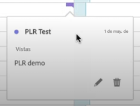
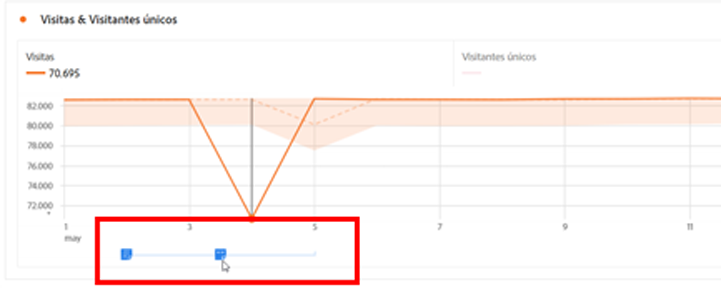
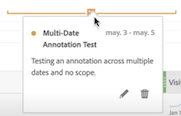
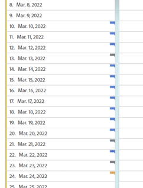
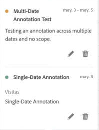
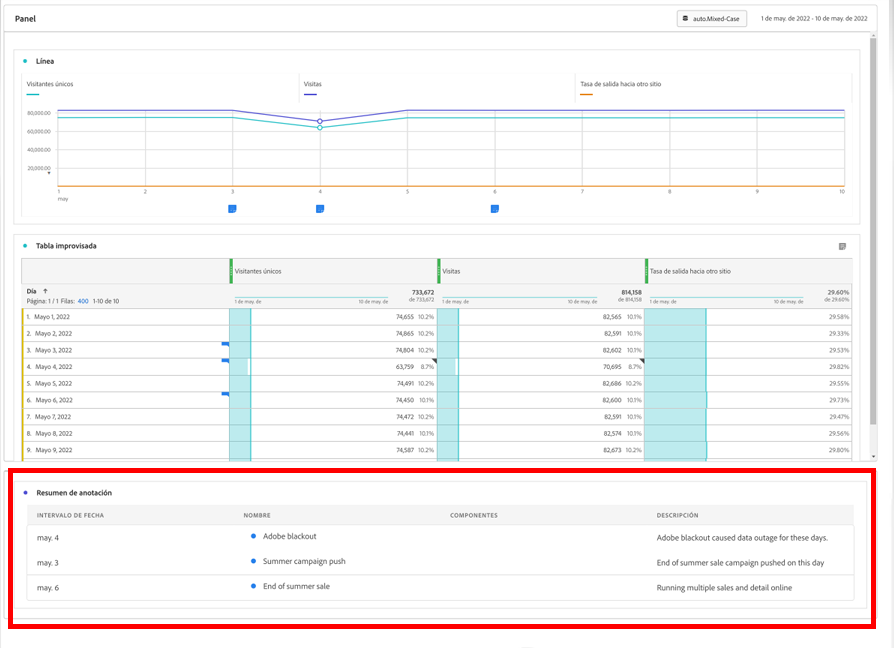

# Visualización de anotaciones

Las anotaciones se manifiestan de forma ligeramente diferente, según dónde aparezcan y si abarcan un solo día o un intervalo de fechas.

## Visualización de anotaciones en Workspace

| Tipo de  visualización | Descripción |
| --- | --- |
| **Línea &#x200B;** **Un solo día** | Cuando seleccionas  en una visualización de líneas, verás una ventana emergente con los detalles de la anotación.  Para editar y editar la anotación en el [Creador de anotaciones](create-annotations.md#annotation-builder), selecciona . Para eliminar la anotación, selecciona . |
| **Línea &#x200B;** **Intervalo de fecha** | Al seleccionar , verás una ventana emergente con los detalles de la anotación y una línea en la parte inferior que indica el intervalo de fechas. Para editar la anotación en el [Generador de anotaciones](create-annotations.md#annotation-builder), selecciona . Para eliminar la anotación, selecciona . |
| **Tabla de forma libre** | En una tabla de forma libre, puedes acceder a todas las anotaciones desde el botón anotaciones en la parte superior derecha de la visualización. Selecciona  para ver una (lista de desplazamiento) de todas las anotaciones.  Para cada anotación, puedes seleccionar  para editar la anotación en el [Generador de anotaciones](create-annotations.md#annotation-builder) y  para eliminar la anotación. |

{style="table-layout:auto"}

## Visualización de anotaciones en un archivo PDF

Cuando se descarga el proyecto como PDF o se envía el proyecto como PDF, las anotaciones se resumen en PDF en la sección Resumen de anotaciones.

<!--
# View annotations

Annotations manifest slightly differently, depending on whether they span a single day or a date range.

## View annotations in Line charts or Tables

| Date | Appearance |
| --- | --- |
| **Single day** |   
When you hover over the annotation, you can see its details, you can edit it by selecting the pen icon, or you can delete it:
  |
| **Date range** |  The icon changes and when you hover over it, the date range appears.

When you select it in the line chart, the annotation metadata appear, and you can edit or delete it:
In a table, an icon appears on every date in the date range.
|
| **Overlapping annotations** | On days that have more than one annotation tied to them, the icon appears in a grey color.

When you hover over the grey icon, all overlapping annotations appear:
 |

{style="table-layout:auto"}

## View annotations in a .pdf file

Since you cannot hover over icons in a .pdf file, this file (after export) provides notes of explanations at the bottom of a panel. Here is an example:

## View annotations with non-trended data

Sometimes annotation are shown with non-trended data, but tied to a specific dimension. In that case, they appear only in a summary annotation in the bottom right corner. Here is an example:

The summary chart appears in all visualization types in the corner, not just in non-trended freeform tables and summary numbers. It also appears in visualizations like [!UICONTROL Donut], [!UICONTROL Flow],[!UICONTROL Fallout],[!UICONTROL Cohort], and so on.

-->