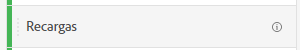
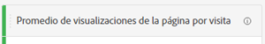
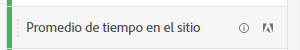
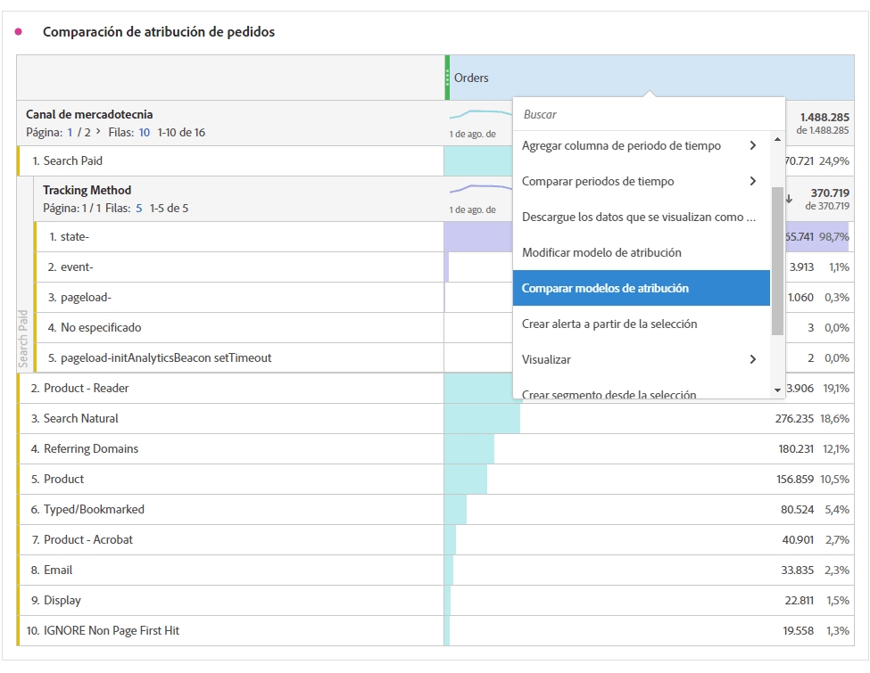

# Métricas

Las métricas permiten cuantificar los puntos de datos en Analysis Workspace. Normalmente se utilizan como columnas en una visualización y están vinculadas a las dimensiones.

## Tipos de métricas

Adobe ofrece varios tipos de métricas para usar en Analysis Workspace:

* **Métricas estándar**: la mayoría de las métricas que se utilizan en los proyectos son estándar. Algunos ejemplos son [Vistas de páginas](/help/components/metrics/page-views.md), [Ingresos](/help/components/metrics/revenue.md) o [Eventos personalizados](/help/components/metrics/custom-events.md). Consulte la [Información general sobre las métricas](/help/components/metrics/overview.md) en la guía del usuario Componentes para obtener más información.

  

* **Métricas calculadas**: métricas definidas por el usuario que se basan en métricas estándar, números estáticos o funciones algorítmicas. Las métricas calculadas definidas por el usuario muestran un icono de calculadora en la lista de componentes disponibles. Consulte [Información general sobre las métricas](/help/components/c-calcmetrics/cm-overview.md) en la guía del usuario Componentes para obtener más información.

  

* **Plantillas de métricas calculadas**: métricas definidas por Adobe que se comportan de manera similar a las calculadas. Puede utilizarlas tal cual en los proyectos de Workspace o guardar una copia para personalizar su lógica. Las plantillas de métricas calculadas muestran un icono de Adobe en la lista de componentes disponibles.

  

## Uso de métricas en Analysis Workspace

Las métricas se pueden utilizar de varias formas dentro de Analysis Workspace. Para obtener información acerca de cómo agregar métricas y otros tipos de componentes a Analysis Workspace, vea [Usar componentes en Analysis Workspace](/help/analyze/analysis-workspace/components/use-components-in-workspace.md).

>[!BEGINSHADEBOX]

Vea  [Usar métricas](https://video.tv.adobe.com/v/40817?quality=12&learn=on){target="_blank"} para ver un vídeo de demostración.

>[!ENDSHADEBOX]

## Crear métricas calculadas

Las métricas calculadas permiten ver fácilmente cómo se relacionan entre sí las métricas mediante operadores simples o funciones estadísticas.

Existen varias formas de crear métricas calculadas. El método que elija determina si la métrica calculada está disponible en la lista de componentes de todos los proyectos o solo en el proyecto en el que se creó.

### Crear métricas calculadas para todos los proyectos

Puede usar el creador de métricas calculadas para crear métricas calculadas. Cuando se crean de esta manera, las métricas calculadas están disponibles en la lista de componentes y, a continuación, se pueden utilizar en proyectos de toda la organización.

Para obtener información sobre cómo acceder al creador de métricas calculadas, consulte [Generar métricas](/help/components/c-calcmetrics/c-workflow/cm-workflow/c-build-metrics/cm-build-metrics.md).

### Crear métricas calculadas para un solo proyecto

Puede crear métricas calculadas rápidas que solo estén disponibles para el proyecto en el que se crearon.

Para crear una métrica calculada para un solo proyecto:

1. En Analysis Workspace, abra el proyecto en el que desea crear la métrica calculada.

1. En una tabla de forma libre, haga clic con el botón secundario en una o más celdas de columna de encabezado y seleccione **[!UICONTROL Crear métrica a partir de la selección]**

   

1. Para crear una métrica calculada solo para este proyecto, elija entre las siguientes opciones:

   * [!UICONTROL **Dividir**]

   * [!UICONTROL **Restar**]

   * [!UICONTROL **Agregue**]

   * [!UICONTROL **Multiplicar**]

   O bien, para abrir el creador de métricas calculadas y crear la métrica calculada para todos los proyectos, seleccione [!UICONTROL **Abrir en el creador de métricas calculadas**] y luego continúe con [Generar métricas](/help/components/c-calcmetrics/c-workflow/cm-workflow/c-build-metrics/cm-build-metrics.md).

[Métricas calculadas: métricas sin implementación](https://experienceleague.adobe.com/docs/analytics-learn/tutorials/components/calculated-metrics/calculated-metrics-implementationless-metrics.html?lang=es) (3:42)

## Comparar métricas con diferentes modelos de atribución

Si quiere comparar rápida y fácilmente un modelo de atribución con otro, haga clic con el botón secundario en una métrica y seleccione **[!UICONTROL Comparar modelo de atribución]**:

Este método abreviado permite comparar rápida y fácilmente un modelo de atribución con otro sin tener que arrastrar una métrica y configurarla dos veces.

## Uso de la función [!UICONTROL media acumulativa] para aplicar el suavizado de métricas

A continuación, se muestra un vídeo sobre este tema:

>[!BEGINSHADEBOX]

Consulte  [Promedio acumulado](https://video.tv.adobe.com/v/27068?quality=12&learn=on){target="_blank"} para ver un vídeo de demostración.

>[!ENDSHADEBOX]

