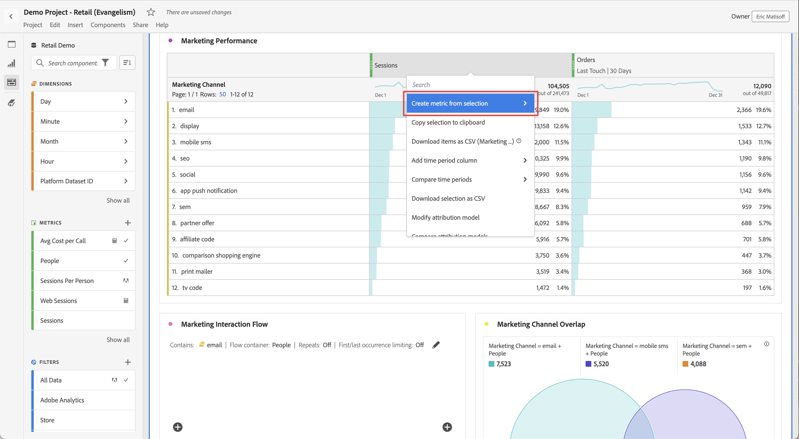

# Métricas

Las métricas permiten cuantificar los puntos de datos en Analysis Workspace. Normalmente se utilizan como columnas en una visualización y están vinculadas a las dimensiones.

## Uso de métricas en Analysis Workspace

Las métricas son flexibles en su uso dentro de Analysis Workspace. Arrastre una métrica a una tabla de forma libre vacía para ver las tendencias de esa métrica durante el período de fecha del proyecto. También puede arrastrar una métrica cuando una dimensión esté presente para ver cómo se compara esa métrica con cada elemento de dimensión. Al arrastrar una métrica sobre un encabezado de métrica existente, se reemplaza y al arrastrar una métrica junto a un encabezado, puede ver ambas métricas en paralelo.

Para obtener información acerca de cómo agregar métricas y otros tipos de componentes a Analysis Workspace, vea [Usar componentes en Analysis Workspace](use-components-in-workspace.md).

## Tipos de métricas

Adobe ofrece varios tipos de métricas para usar en Analysis Workspace:

* **Métricas estándar**: la mayoría de las métricas que se utilizan en los proyectos son estándar. Algunos ejemplos son [Vistas de páginas](/help/components/metrics/page-views.md), [Ingresos](/help/components/metrics/revenue.md) o [Eventos personalizados](/help/components/metrics/custom-events.md). Consulte la [Información general sobre las métricas](/help/components/metrics/overview.md) en la guía del usuario Componentes para obtener más información.

* **Métricas calculadas** : Métricas definidas por el usuario que se basan en métricas estándar, números estáticos o funciones algorítmicas. Las métricas calculadas definidas por el usuario muestran un icono de calculadora en la lista de componentes disponibles. Consulte [Información general sobre las métricas](/help/components/calculated-metrics/cm-overview.md) en la guía del usuario Componentes para obtener más información.

* **Plantillas de métricas calculadas** : Métricas definidas por Adobe que se comportan de manera similar a las métricas calculadas. Puede utilizarlas tal cual en los proyectos de Workspace o guardar una copia para personalizar su lógica. Las plantillas de métricas calculadas muestran un icono de Adobe en la lista de componentes disponibles.

Puede ver si una métrica está aprobada  o no. Si desea obtener más detalles sobre una métrica, pase el ratón sobre ella y seleccione . Consulte [Información del componente](use-components-in-workspace.md#component-info) para obtener más información.

## Uso de métricas en Analysis Workspace

Las métricas se pueden utilizar de varias formas dentro de Analysis Workspace. Para obtener información acerca de cómo agregar métricas y otros tipos de componentes a Analysis Workspace, vea [Usar componentes en Analysis Workspace](/help/analyze/analysis-workspace/components/use-components-in-workspace.md).

>[!BEGINSHADEBOX]

Vea  [Usar métricas](https://video.tv.adobe.com/v/328571?quality=12&learn=on&captions=spa){target="_blank"} para ver un vídeo de demostración.

>[!ENDSHADEBOX]

## Crear métricas calculadas

Las métricas calculadas permiten ver cómo se relacionan entre sí las métricas, mediante operadores simples o funciones estadísticas.

Existen varias formas de crear métricas calculadas. El método que elija determina si la métrica calculada está disponible en la lista de componentes de todos los proyectos o solo en el proyecto en el que se creó.

### Crear métricas calculadas para todos los proyectos

Puede usar el [generador de métricas calculadas](/help/components/calculated-metrics/workflow/c-build-metrics/cm-build-metrics.md) para [crear métricas calculadas](/help/components/calculated-metrics/workflow/cm-workflow.md). Cuando se crean de esta manera, las métricas calculadas están disponibles en la lista de componentes y se pueden utilizar en proyectos de toda la organización.

### Crear métricas calculadas para un solo proyecto

Puede crear rápidamente una métrica calculada que solo esté disponible para el proyecto en el que se creó.

Para crear una métrica calculada para un solo proyecto:

1. En Analysis Workspace, abra el proyecto en el que desea crear la métrica calculada.

1. En una tabla de forma libre, haga clic con el botón secundario en el encabezado de columna de una sola columna.

   O bien

   Seleccione dos columnas mientras mantiene pulsada la tecla Mayús y, a continuación, haga clic con el botón derecho en una de las columnas seleccionadas.

1. Seleccionar **[!UICONTROL Crear métrica a partir de la selección]**

   

1. Para crear una métrica calculada solo para este proyecto, elija entre las opciones disponibles.

   Cuando se selecciona una sola columna, están disponibles las siguientes opciones:

   * [!UICONTROL **Media**]: crea una nueva columna que muestra el valor medio en el conjunto de elementos de dimensión de la columna. Los valores de columna utilizan la función [Mean](/help/components/calculated-metrics/cm-reference/cm-functions.md#mean).

   * [!UICONTROL **Mediana**]: crea una nueva columna que muestra el valor de mediana en el conjunto de elementos de dimensión de la columna. Los valores de columna utilizan la función [Median](/help/components/calculated-metrics/cm-reference/cm-functions.md#median).

   * [!UICONTROL **Máximo de columna**]: Crea una nueva columna que muestra el valor más alto del conjunto de elementos de dimensión de la columna. Los valores de columna utilizan la función [Máximo de columna](/help/components/calculated-metrics/cm-reference/cm-functions.md#column-maximum).

   * [!UICONTROL **Columna mín.**]: crea una nueva columna que muestra el valor más pequeño del conjunto de elementos de dimensión para la columna. Los valores de columna utilizan la función [Mínimo de columna](/help/components/calculated-metrics/cm-reference/cm-functions.md#column-minimum).

   * [!UICONTROL **Suma de columna**]: Crea una nueva columna que agrega todos los valores numéricos de una métrica dentro de una columna (en los elementos de una dimensión). Los valores de columna utilizan la función [Suma de columna](/help/components/calculated-metrics/cm-reference/cm-functions.md#column-sum).

   Cuando se seleccionan dos columnas, están disponibles las siguientes opciones:

   * [!UICONTROL **Dividir**]: crea una nueva columna que divide los valores de las dos columnas seleccionadas.

   * [!UICONTROL **Restar**]: crea una nueva columna que resta los valores de las dos columnas seleccionadas.

   * [!UICONTROL **Agregar**]: crea una nueva columna que agrega los valores de las dos columnas seleccionadas.

   * [!UICONTROL **Multiplicar**]: crea una nueva columna que multiplica los valores de las dos columnas seleccionadas.

   * [!UICONTROL **Cambio porcentual**]: crea una nueva columna que muestra el cambio porcentual entre las dos columnas seleccionadas.

[Métricas calculadas: métricas sin implementación](https://experienceleague.adobe.com/es/docs/analytics-learn/tutorials/components/calculated-metrics/calculated-metrics-implementationless-metrics) (3:42)

## Comparar métricas con diferentes modelos de atribución

Para comparar rápidamente un modelo de atribución con otro, haga clic con el botón derecho en una métrica y seleccione **[!UICONTROL Comparar modelos de atribución]**:

Este método abreviado permite comparar un modelo de atribución con otro sin tener que arrastrar una métrica y configurarla dos veces.

## Uso de la función [!UICONTROL media acumulativa] para aplicar el suavizado de métricas

A continuación, se muestra un vídeo sobre este tema:

>[!BEGINSHADEBOX]

Consulte  [Promedio acumulado](https://video.tv.adobe.com/v/35008?quality=12&learn=on&captions=spa){target="_blank"} para ver un vídeo de demostración.

>[!ENDSHADEBOX]

