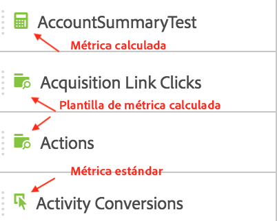

# Métricas

Hay dos modos de utilizar métricas en Analysis Workspace.

Puede arrastrar una métrica estándar, una métrica calculada o una plantilla de métrica calculada desde el menú [!UICONTROL Componentes] a la tabla:

> [!NOTE] Aunque esto parece simple, el uso de métricas es bastante versátil. Puede agregar métricas a un informe arrastrando la métrica adecuada a la sección de métricas de una tabla. También puede desglosar las dimensiones por métricas, lo que le proporciona un control preciso sobre la vista de tabla. Además, puede insertar una métrica como dimensión y una dimensión como métrica para crear un informe de tiempo extra. Juegue con los distintos componentes y vea lo que puede hacer. Las posibilidades son infinitas.

O puede hacer clic en **[!UICONTROL Componentes]** &gt; **[!UICONTROL Nueva métrica]**. Esto le llevará al [Creador de métricas calculadas](https://marketing.adobe.com/resources/help/es_ES/analytics/calcmetrics/), donde puede generar métricas personalizadas a partir de las existentes.

Con el fin de facilitar la creación rápida de métricas calculadas, se ha añadido la opción **[!UICONTROL Crear métrica a partir de selección]** al menú de columna que se abre al hacer clic con el botón derecho en las tablas improvisadas. Esta opción se muestra cuando se selecciona al menos una celda de columna de encabezado.

[Uso de métricas de participación en YouTube](https://www.youtube.com/watch?v=ngmJHcg65o8&amp;list=PL2tCx83mn7GuNnQdYGOtlyCu0V5mEZ8sS&amp;index=32) (4:16)
