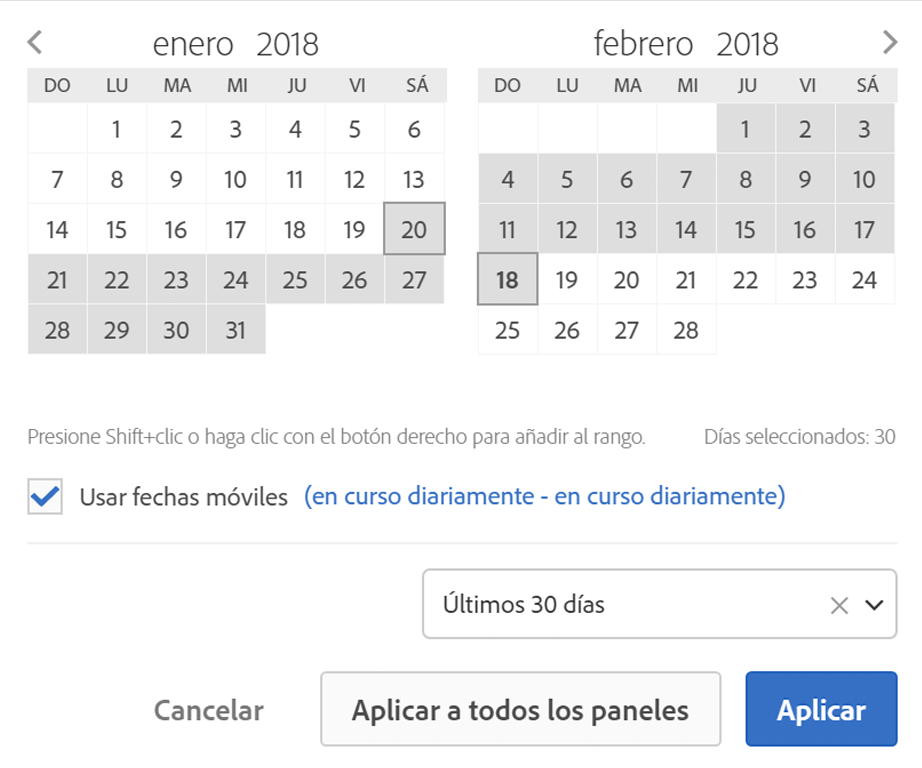

# Información general sobre los intervalos de fecha y calendario

En el calendario, se pueden indicar fechas e intervalos de fechas o seleccionar ajustes preestablecidos.

Las selecciones de calendario se aplican a nivel de panel, pero tiene la opción de aplicarlas a todos los paneles. De forma predeterminada, en el calendario del espacio de trabajo se muestran el mes actual y el anterior.

Con el primer clic se inicia la selección de un intervalo de fechas. A continuación, resalte el intervalo en cualquier dirección y vuelva a hacer clic para determinar el final del intervalo de fechas. If the `Shift` key is held down (or right-click is used) while clicking the first date, it will append to the range.

También puede arrastrar fechas (y dimensiones temporales) a un proyecto de Workspace. Se pueden seleccionar fechas, semanas, meses o años concretos, o bien fechas móviles.

[Uso de intervalos de fechas y calendario en Analysis Workspace en YouTube](https://www.youtube.com/watch?v=L4FSrxr3SDA&list=PL2tCx83mn7GuNnQdYGOtlyCu0V5mEZ8sS&index=28) (4:07)

| Configuración | Descripción |
|--- |--- |
| Días seleccionados | Días/semanas/meses/años seleccionados. |
| Usar fechas móviles | Las fechas móviles le permiten generar un informe dinámico que observa un periodo de tiempo anterior o posterior basándose en el momento en el que ejecuta el informe. Por ejemplo, si desea un informe sobre todos los pedidos realizados el “último mes” (basándose en el campo Fecha de creación) y se ejecuta dicho informe en diciembre, verá los pedidos realizados en noviembre. Si ejecutara ese mismo informe en enero, vería los pedidos realizados en diciembre.  Vista previa de fecha: indica qué periodo de tiempo incluye el calendario móvil.  Inicio: puede elegir entre el día, la semana, el mes, el trimestre o el año actuales.  Fin: puede elegir entre el día, la semana, el mes, el trimestre o el año actuales.  For an example, go [here](/help/analyze/analysis-workspace/components/calendar-date-ranges/custom-date-ranges.md). |
| Intervalo de fechas | Le permite seleccionar un rango de fechas preestablecido. La opción predeterminada es los últimos 30 días. |
| Aplicar a todos los paneles | No solo le permite cambiar el intervalo de fechas seleccionado para el panel actual, sino también para todos los demás paneles dentro del proyecto. |
| Aplicar | Aplica el rango de fechas únicamente a este panel. |
