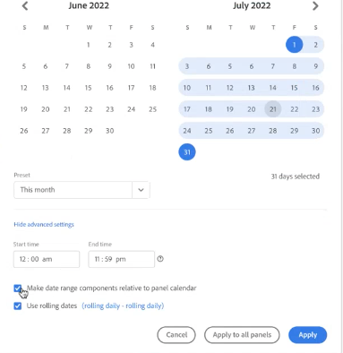

# Resumen de calendario e intervalos de fechas

En el calendario, se pueden indicar fechas e intervalos de fechas o seleccionar ajustes preestablecidos.

Aquí tiene un vídeo sobre el uso de intervalos de fechas y calendarios en Analysis Workspace:

>[!VIDEO](https://video.tv.adobe.com/v/23973/?quality=12)

Las selecciones de calendario se aplican a nivel de panel, pero tiene la opción de aplicarlas a todos los paneles. Al hacer clic en un intervalo de fechas en Workspace, la interfaz muestra el mes natural actual y el mes natural anterior. Puede ajustar estos dos calendarios haciendo clic en las flechas derecha e izquierda de cada esquina superior respectiva.

El primer clic en un calendario inicia una selección de intervalo de fechas. El segundo clic completa una selección de intervalo de fechas, que se resalta. Si la tecla `Shift` se mantiene pulsada (o se utiliza el clic derecho), se anexa al rango seleccionado actualmente.

También puede arrastrar fechas (y dimensiones temporales) a un proyecto de Workspace. Se pueden seleccionar fechas, semanas, meses o años concretos, o bien fechas móviles.

[Uso de intervalos de fechas y calendarios en Analysis Workspace](https://experienceleague.adobe.com/docs/analytics-learn/tutorials/analysis-workspace/calendar-and-date-ranges/using-dates-in-analysis-workspace.html?lang=es) (4:07)

| Configuración | Descripción |
|--- |--- |
| Días seleccionados | Días/semanas/meses/años seleccionados. |
| Hacer que los componentes del intervalo de fecha sean relativos al calendario del panel | Mantenga la coherencia en las fechas basadas en el intervalo de fechas del panel. |
| Usar fechas móviles | Las fechas móviles le permiten generar un informe dinámico que observa un periodo de tiempo anterior o posterior basándose en el momento en el que ejecuta el informe. Por ejemplo, si desea un informe sobre todos los pedidos realizados el “último mes” (basándose en el campo Fecha de creación) y se ejecuta dicho informe en diciembre, verá los pedidos realizados en noviembre. Si ejecutara ese mismo informe en enero, vería los pedidos realizados en diciembre.<ul><li>**[!UICONTROL Vista previa de fecha]**: indica qué periodo de tiempo incluye el calendario móvil.</li><li>**[!UICONTROL Inicio]**: puede elegir entre el día, la semana, el mes, el trimestre o el año actuales.</li><li>**[!UICONTROL Fin]**: puede elegir entre el día, la semana, el mes, el trimestre o el año actuales.</li></ul>Para ver un ejemplo, consulte [Intervalos de fechas personalizados](/help/analyze/analysis-workspace/components/calendar-date-ranges/custom-date-ranges.md).  Seleccionado de forma predeterminada. |
| Intervalo de fechas | Le permite seleccionar un rango de fechas preestablecido. La opción predeterminada es los últimos 30 días. **[!UICONTROL Esta semana, mes, trimestre o año (excluido hoy)]** le permite elegir entre intervalos de fechas que no incluyen datos de día parcial de hoy. |
| Aplicar a todos los paneles | No solo le permite cambiar el intervalo de fechas seleccionado para el panel actual, sino también para todos los demás paneles dentro del proyecto. |
| Aplicar | Aplica el rango de fechas únicamente a este panel. |

## Acerca de los intervalos de fechas del panel relativo {#relative-panel-dates}

Si está trabajando en Workspace, puede hacer que los componentes del intervalo de fechas sean relativos al calendario del panel, de modo que los datos previsualizados en el carril izquierdo (o en los componentes) se basen en el intervalo de fechas del panel. Tres casos de uso habituales en los que las fechas relativas del panel surten efecto son los gráficos combinados, el resumen de métricas clave y los intervalos de fechas de la tabla improvisada.

Usar intervalos de fechas del panel relativo

1. Seleccione el **Espacio de trabajo** pestaña .
1. Select **Proyecto en blanco**.
1. Agregue dimensiones, métricas y segmentos desde el carril izquierdo.
1. Haga clic en el campo Intervalo de fechas del panel para alternar el valor del intervalo de fechas del panel relativo.
1. Seleccionar o anular la selección **Conversión de componentes de intervalo de fechas en relación con el calendario del panel**.
   * Seleccione la opción para que los componentes del intervalo de fechas sean relativos al calendario del panel.
   * Al anular la selección de esta opción, los intervalos de fechas dentro del panel (Resumen de métricas clave, Gráficos combinados o Púrpura de fecha) no se actualizarán si se cambia el intervalo de fechas del panel. Este es el predeterminado.

   

1. Haga clic en **Aplicar**.
Las fechas relativas se muestran en la esquina superior derecha.

   