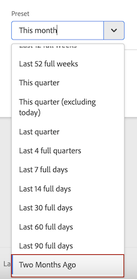

# Crear intervalos de fechas

Cree intervalos de fechas personalizados en Analysis Workspace y guárdelos como componentes de tiempo.

**[!UICONTROL Componentes]** > **[!UICONTROL Nuevo intervalo de fechas]**

Se aplica un intervalo de fechas en el panel. Para agregar un intervalo de fechas al proyecto, haga clic en **Paneles** > *`<select panel>`* y especifique el nuevo intervalo.

## Intervalo de fechas para “Dos meses atrás” {#section_C4109C57CB444BB2A79CC8082BD67294}

El siguiente intervalo de fechas personalizado muestra un intervalo de fechas para “dos meses atrás”, con una visualización de cambio de resumen que muestra el cambio direccional.

El intervalo de fechas personalizado se muestra en la parte superior del panel de componente [!UICONTROL Intervalo de fechas] del proyecto:

Puede arrastrar este intervalo de fechas personalizado en un columna a lo largo de un intervalo de fechas móvil mensual mediante el valor preestablecido Último mes para ver una comparación. Agregue una visualización de cambio de resumen y seleccione los totales de cada columna para mostrar un cambio direccional:

## Usar un intervalo de fechas móvil de 7 días {#section_7EF63B2E9FF54D2E9144C4F76956A8DD}

Se aplica un intervalo de fechas al nivel de panel. Para agregar un intervalo de fechas al proyecto, haga clic en **Acciones** > **Agregar panel**, y especifique el nuevo intervalo de fechas.

En el Generador de intervalos de fechas, puede crear un intervalo de fechas personalizado que se muestra en el panel Componentes con otros intervalos de fechas.

Por ejemplo, puede crear un intervalo de fechas que especifica una ventana móvil de 7 días y que termina una semana atrás:

Utilice *`rolling daily`*.

* La configuración de inicio sería *`current day minus 14 days`*.

* La configuración de fin sería *`current day minus 7 days`*.

Este intervalo de fechas puede ser un componente que arrastre en cualquier tabla improvisada.
