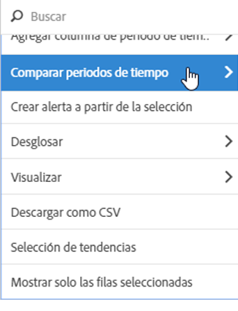
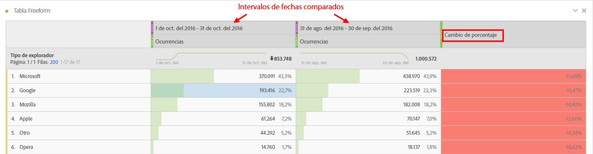
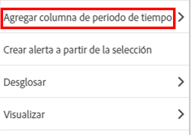
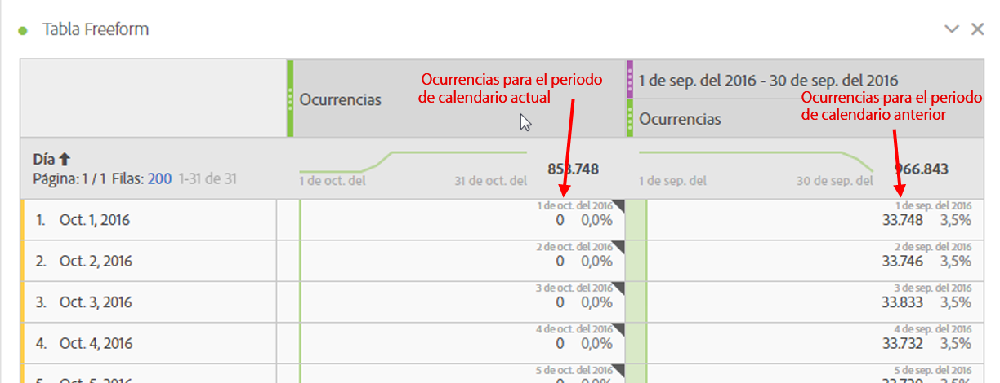
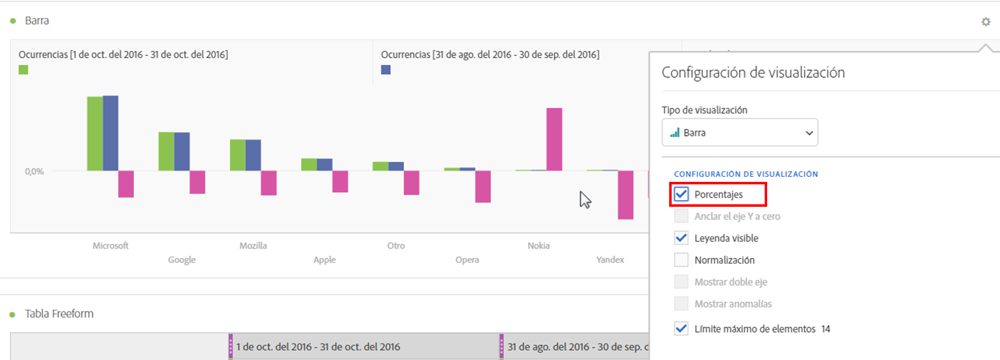
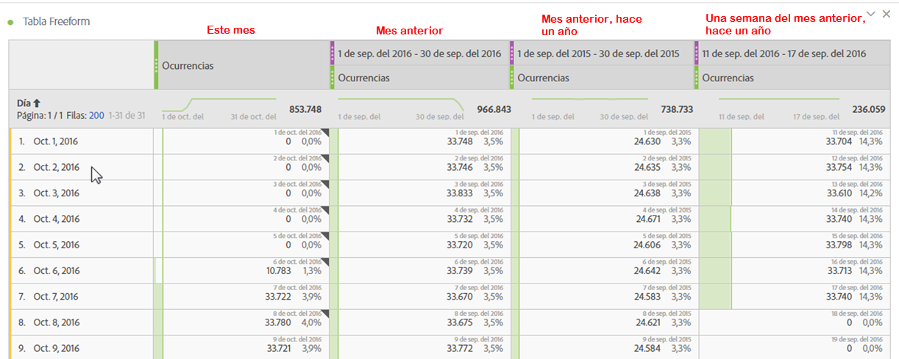
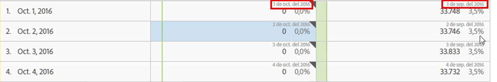
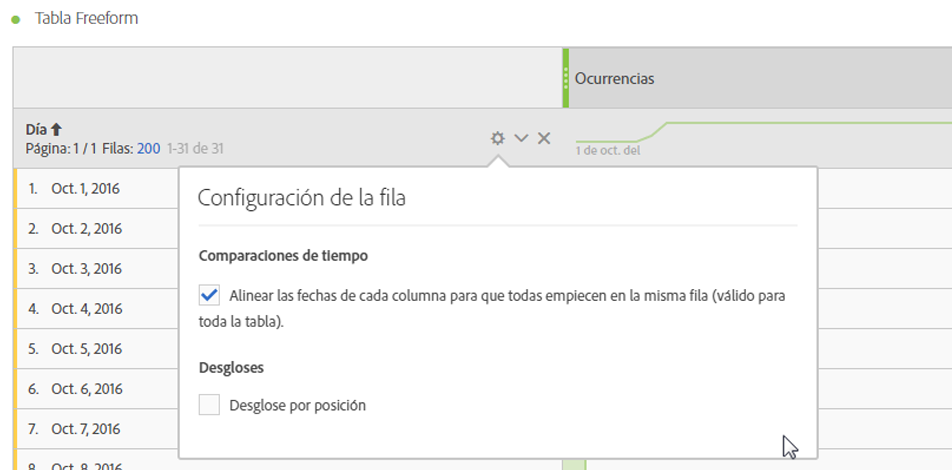

# Comparación de fechas

La comparación de fechas de Analysis Workspace le permite tomar cualquier columna que contenga un intervalo de fechas y crear una comparación de fechas comunes, por ejemplo, año tras año, trimestre tras trimestre, mes tras mes, etc.

## Comparar períodos de tiempo

El análisis requiere contexto, y este lo proporciona a menudo un período de tiempo previo. Por ejemplo, la pregunta *¿Cuánto mejor o peor estás haciendo ahora en comparación con esta época del año pasado?* es fundamental para comprender su negocio. La comparación de fechas incluye automáticamente una columna *difference* que muestra el porcentaje de cambio en comparación con un período de tiempo especificado.

1. Cree una [tabla de forma libre](/help/analyze/analysis-workspace/visualizations/freeform-table/freeform-table.md), con cualquier dimensión y métrica que quiera comparar en un período de tiempo.
1. Abra el menú contextual de una fila de tabla y seleccione **[!UICONTROL Comparar periodos de tiempo]**.

   

   >[!NOTE]
   >
   >Esta opción del menú contextual está deshabilitada para filas de métricas, filas de intervalos de fechas y filas de dimensiones de tiempo.

1. Dependiendo de cómo haya establecido el intervalo de fechas de la tabla, dispone de estas opciones para la comparación:

   | Opción | Descripción |
   |---|---|
   | **[!UICONTROL Semanas/meses/trimestres/años anteriores a este intervalo de fechas *x*]** | Compare con el intervalo de fechas seleccionado inmediatamente antes de este intervalo de fechas. |
   | **[!UICONTROL Estas x semanas / meses / trimestres / años del año pasado a este intervalo de fechas]** | Compare con el mismo intervalo de fechas hace un año. |
   | **[!UICONTROL Intervalo de fechas personalizado hasta este intervalo de fechas]** | Permite definir un intervalo de fechas personalizado. |

   >[!NOTE]
   >
   >Cuando seleccione un número de días personalizado, por ejemplo del 7 al 20 de octubre (un intervalo de 14 días), solo obtendrá dos opciones: **[!UICONTROL los 14 días anteriores a este intervalo de fechas]** y un **[!UICONTROL Intervalo de fechas personalizado hasta este intervalo de fechas]**.

1. La comparación resultante tiene este aspecto:

   

   Las filas de la columna Cambio porcentual aparecen en rojo para los valores negativos y en verde para los positivos.

## Agregar una columna Periodo de tiempo para comparar

Ahora puede agregar un período de tiempo a cada columna en una tabla, lo que le permite agregar un período de tiempo diferente del período en el que está establecido el calendario.

1. Haga clic con el botón secundario en una columna de la tabla y seleccione **[!UICONTROL Añadir columna de periodo de tiempo]**.

   

1. Dependiendo de cómo haya establecido el intervalo de fechas de la tabla, dispone de estas opciones para la comparación:

   | Opción | Descripción |
   |---|---|
   | **[!UICONTROL Semanas/meses/trimestres/años anteriores a este intervalo de fechas *x*]** | Añada una columna con la semana, el mes, etc. inmediatamente anterior a este intervalo de fechas. |
   | **[!UICONTROL Estas *x* semanas / meses / trimestres / años del año pasado a este intervalo de fechas]** | Agregue el mismo intervalo de fechas hace un año. |
   | **[!UICONTROL Intervalo de fechas personalizado hasta este intervalo de fechas]** | Permite crear un intervalo de fechas personalizado. |

   >[!NOTE]
   >
   >Cuando seleccione un número de días personalizado, por ejemplo del 7 al 20 de octubre (un intervalo de 14 días), solo obtendrá dos opciones: **[!UICONTROL los 14 días anteriores a este intervalo de fechas]** y un **[!UICONTROL Intervalo de fechas personalizado hasta este intervalo de fechas]**.

1. El periodo de tiempo se inserta encima de la columna seleccionada:

   

1. Puede agregar todas las columnas de tiempo que desee, así como combinar a voluntad distintos intervalos de fechas:

1. Además, puede ordenar cada columna, lo que cambia el orden de los días según la columna por la que esté ordenando.

## Alinear fechas de columnas para que comiencen en la misma fila

Puede alinear fechas de cada columna con todas a partir de la misma fila.

Por ejemplo, se realiza una comparación día tras día de la última semana (que termina el 5 de octubre de 2024) y de la semana anterior. De forma predeterminada, la columna izquierda comenzará el 22 de septiembre y la columna derecha comenzará el 29 de septiembre.

Puede habilitar **[!UICONTROL Alinear fechas de cada columna para que todas empiecen en la misma fila]** en [Configuración](/help/analyze/analysis-workspace/visualizations/freeform-table/freeform-table.md#settings-1) para la visualización de tabla de forma libre a fin de alinear las fechas de las columnas para que comiencen en la misma fila.

Tenga en cuenta lo siguiente al utilizar esta opción:

* Esta configuración está habilitada de forma predeterminada para todos los proyectos nuevos.

* Esta configuración se aplica a toda la tabla. Por ejemplo, si cambia esta configuración para un desglose dentro de la tabla, la configuración se aplica a toda la tabla.

<!--
# Date comparison

Date comparison in Analysis Workspace lets you take any column containing a date range and create a common date comparison, such as: year-over-year, quarter-over-quarter, month-over-month, etc.

>[!BEGINSHADEBOX]

See  [Date comparison](https://video.tv.adobe.com/v/33836?quality=12&learn=on&captions=spa){target="_blank"} for a demo video.

>[!ENDSHADEBOX]

## Compare time periods {#section_C4E36BFE0F5C4378A74E705747C9DEE4}

>[!NOTE]
>[!UICONTROL Compare Time Periods] leverages advanced Calculated Metrics. As a result, it is available only to customers with Analytics Select, Prime, and Ultimate SKUs. 

Analysis requires context, and often that context is provided by a previous time period. For example, the question "How much better or worse are we doing than at this time last year?" is fundamental to understanding your business. Date Comparison automatically include a "difference" column, which shows the percentage change compared to a specified time period.

1. Create a Freeform table, with any dimensions and metrics you want to compare over a time period.
1. Right-click a table row and select **[!UICONTROL Compare time periods]**.

   

   >[!NOTE]
   >
   >This right-click option is disabled for metric rows, date range rows, and time dimension rows.

1. Depending on how you have set the table's date range, you have these options for comparison: 

   |  Option  | Description  |
   |---|---|
   | **[!UICONTROL Prior week/month/quarter/year to this date range]** | Compares to the week/month/etc. immediately before this date range.  |
   | **[!UICONTROL This week/month/quarter/year last year to this date range]** | Compares to the same date range a year ago.  |
   | **[!UICONTROL Custom date range to this date range]** | Lets you select a custom date range.  |

   >[!NOTE]
   >
   >When you select a custom number of days, for example October 7 - October 20 (a 14-day range), you will get only 2 options: **[!UICONTROL Prior 14 days before this date range]**, and **[!UICONTROL Custom date range to this date range]**.

1. The resulting comparison looks like this:

   

   Rows in the Percent Change column appear red for negative values and green for positive values.

1. (Optional) As in any other Workspace projects, you can create visualizations based on these time comparisons. For example, here is a Bar graph:

   

   Note that in order to show the percentage change in the bar chart, you have to have the [!UICONTROL Percentages] setting checked in the [!UICONTROL Visualization Settings].

## Add a time period column for comparison {#section_93CC2B4F48504125BEC104046A32EB93}

You can now add a time period to each column in a table, enabling you to add a time period that is different from the one your calendar is set to. This is another way you can compare dates.

1. Right-click a column in the table and select **[!UICONTROL Add time period column]**. 

   

1. Depending on how you have set the table's date range, you have these options for comparison: 

   |  Option  | Description  |
   |---|---|
   | **[!UICONTROL Prior week/month/quarter/year to this date range]** | Adds a column with the week/month/etc. immediately before this date range.  |
   | **[!UICONTROL This week/month/quarter/year last year to this date range]** | Adds the same date range a year ago.  |
   | **[!UICONTROL Custom date range to this date range]** | Lets you select a custom date range.  |

   >[!NOTE]
   >
   >When you select a custom number of days, for example October 7 - October 20 (a 14-day range), you will get only 2 options: **[!UICONTROL Prior 14 days before this date range]**, and **[!UICONTROL Custom date range to this date range]**.

1. The time period will be inserted on top of the column you selected:

   

1. You can add as many time columns as you want, as well as mix and match different date ranges:

   

1. In addition, you can sort on each column, which will change the order of days depending on the column you are sorting on.

## Align column dates to start on the same row {#section_5085E200082048CB899C3F355062A733}

You can align the dates from each column to all start on the same row. 

For example, when you choose to align the dates, if you do a month-over-month comparison between October and September 2016, the left column will start with October 1 and the right column will start with September 1:

>[!NOTE]
>
>Consider the following when using this option:
>
>* This setting is enabled by default for all new projects.
>
>* This setting applies to the entire table. For example, if you change this setting for a breakdown within the table, it will change the setting for the entire table.
>

To enable this setting, if it is not already enabled:

1. In the table where you want to align column dates, select the **Settings** icon in the table header.

1. On the [!UICONTROL **Settings**] tab, select **[!UICONTROL Align Dates from each column to all start on the same row (applies to entire table)]**.

-->