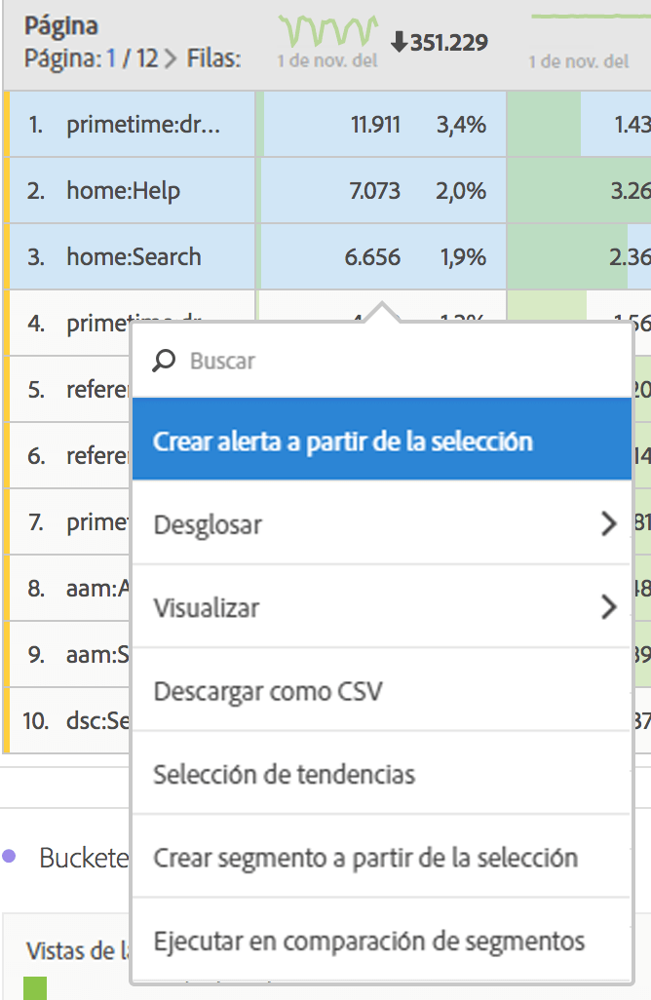

# Desglose de dimensiones

Desglose de dimensiones y elementos de dimensión en Analysis Workspace.

Desglose los datos ilimitadamente para sus necesidades específicas; genere consultas con métricas, dimensiones, segmentos, líneas de tiempo y otros valores de desglose de análisis relevantes.

1. [Cree un proyecto](/help/analyze/analysis-workspace/build-workspace-project/t-freeform-project.md) con una tabla de datos.
1. En la tabla de datos, haga clic con el botón secundario en un elemento de línea y seleccione **[!UICONTROL Desglosar]** > *`<item>`*.

   

   Puede desglosar métricas por elementos de dimensión o segmentos de audiencia entre periodos de tiempo seleccionados. También puede continuar desglosando hasta un nivel más granular.

   >[!NOTE]
   >
   >El número de desgloses de la tabla está limitado a 200 desgloses. Este límite aumentará para la exportación de desgloses.

[Dimensiones en Analysis Workspace en YouTube](https://www.youtube.com/watch?v=P9W0hhIHhCs&amp;index=12&amp;list=PL2tCx83mn7GuNnQdYGOtlyCu0V5mEZ8sS) (4:54)

[Desgloses de dimensiones en YouTube](https://www.youtube.com/watch?v=3mQ2HN7-lIc&amp;list=PL2tCx83mn7GuNnQdYGOtlyCu0V5mEZ8sS&amp;index=13) (2:02)

## Aplicar modelos de atribución a desgloses

Cualquier desglose dentro de una tabla también puede tener aplicado cualquier modelo de atribución. Este modelo de atribución puede ser el mismo o diferente de la columna principal. Por ejemplo, puede analizar Pedidos lineales en su dimensión de Canales de marketing pero aplicar Pedidos en forma de U a los códigos de seguimiento específicos dentro de un Canal. Para editar el modelo de atribución aplicado a un desglose, simplemente sitúe el ratón encima del modelo de desglose y haga clic en **[!UICONTROL Editar]**:

