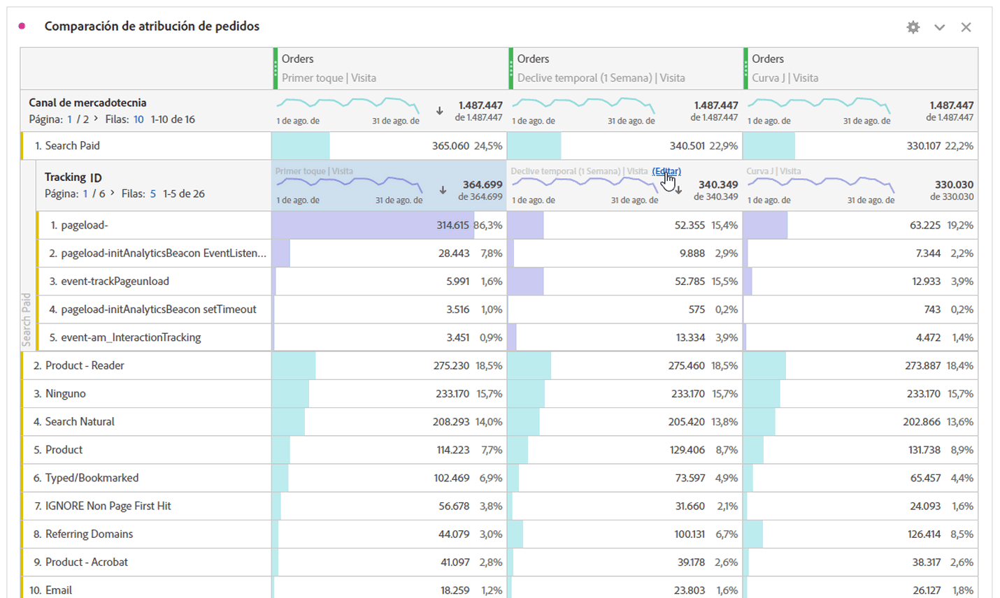

# Desglose de dimensiones

Desglose de dimensiones y elementos de dimensión en Analysis Workspace.

Desglose los datos ilimitadamente para sus necesidades específicas; genere consultas con métricas, dimensiones, segmentos, líneas de tiempo y otros valores de desglose de análisis relevantes.

1. [Cree un proyecto](/help/analyze/analysis-workspace/home.md) con una tabla de datos.
1. En la tabla de datos, haga clic con el botón secundario en un elemento de línea y seleccione **[!UICONTROL Desglosar]** > *`<item>`*.

   

   Puede desglosar métricas por elementos de dimensión o segmentos de audiencia entre periodos de tiempo seleccionados. También puede continuar desglosando hasta un nivel más granular.

   >[!NOTE]
   >
   >El número de desgloses de la tabla está limitado a 200 desgloses. Este límite aumentará para la exportación de desgloses.

[Añadir Dimension y métricas al proyecto en Analysis Workspace](https://docs.adobe.com/content/help/en/analytics-learn/tutorials/analysis-workspace/metrics/adding-dimensions-and-metrics-to-your-project-in-analysis-workspace.html) (11:39)

[Trabajo con Dimension en una tabla](https://docs.adobe.com/content/help/en/analytics-learn/tutorials/analysis-workspace/building-freeform-tables/working-with-dimensions-in-a-freeform-table.html) improvisada (15:35)

## Aplicar modelos de atribución a desgloses

Cualquier desglose dentro de una tabla también puede tener aplicado cualquier modelo de atribución. Este modelo de atribución puede ser el mismo o diferente de la columna principal. Por ejemplo, puede analizar Pedidos lineales en su dimensión de Canales de marketing pero aplicar Pedidos en forma de U a los códigos de seguimiento específicos dentro de un Canal. Para editar el modelo de atribución aplicado a un desglose, simplemente sitúe el ratón encima del modelo de desglose y haga clic en **[!UICONTROL Editar]**:

