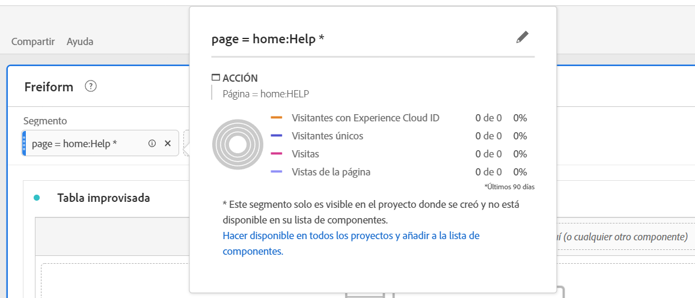

# Segmentos de proyecto ad hoc

Aquí tiene un vídeo sobre la creación de segmentos de proyecto ad hoc:

>[!VIDEO](https://video.tv.adobe.com/v/23978/?quality=12)

Puede crear segmentos de proyecto ad hoc si desea explorar rápidamente cómo un segmento podría afectar a su proyecto, sin ir al Generador de segmentos. Piense en estos segmentos como segmentos temporales del nivel de proyecto. Normalmente no formarán parte de la “biblioteca” de segmentos como los segmentos de componentes en el carril izquierdo. Sin embargo, puede guardarlos, como se muestra a continuación.

Para ver una comparación de lo que pueden hacer los segmentos ad hoc frente a los segmentos de nivel de componente completos, consulte [aquí](/help/analyze/analysis-workspace/components/segments/t-freeform-project-segment.md).

1. Suelte cualquier tipo de componente (dimensión, elemento de dimensión, evento, métrica, segmento, plantilla de segmento, intervalo de fechas) en la zona de colocación de segmentos en la parte superior de un panel. Los tipos de componente se convierten automáticamente en segmentos.
Este es un ejemplo de cómo crear un segmento para el dominio de referencia de Twitter:

   

   El panel aplica automáticamente este segmento y puede ver los resultados al instante.

1. Puede añadir un número ilimitado de componentes a un panel.
1. Si decide guardar este segmento, consulte la sección siguiente.

Recuerde:

* **No puede** soltar los siguientes tipos de componentes en la zona de segmento: métricas calculadas y dimensiones/métricas desde las que no se pueden crear segmentos.
* Para las dimensiones y eventos completos, Analysis Workspace crea segmentos de visita del tipo “existe”. Ejemplos: `Hit where eVar1 exists` o `Hit where event1 exists`.
* Si se suelta “sin especificar” o “ninguno” en la zona de colocación de segmentos, se convierten automáticamente en un segmento “no existe”, de modo que se los trate adecuadamente en la segmentación.

>[!NOTE]
>
>Los segmentos creados de esta forma son internos del proyecto.

## Guardado de segmentos de proyecto ad hoc {#ad-hoc-save}

Puede guardar estos segmentos siguiendo estos pasos:

1. Sitúese sobre el segmento de la zona de colocación y haga clic en el icono “i”.
1. En el panel de información que aparece, haga clic en **[!UICONTROL Guardar]**.

   

## ¿Qué son segmentos solo de proyecto?

Los segmentos solo de proyecto son segmentos rápidos o segmentos de proyecto ad hoc de Workspace. Al editarlos o abrirlos en el generador de segmentos, se mostrará el cuadro de solo proyecto. Si APLICAN un segmento rápido en el generador y no marcan la casilla de disponibilidad, sigue siendo un segmento solo de proyecto, pero ya no se puede abrir en el generador de segmentos rápidos. Si marcan la casilla y lo GUARDAN ahora es un segmento de lista de componentes.