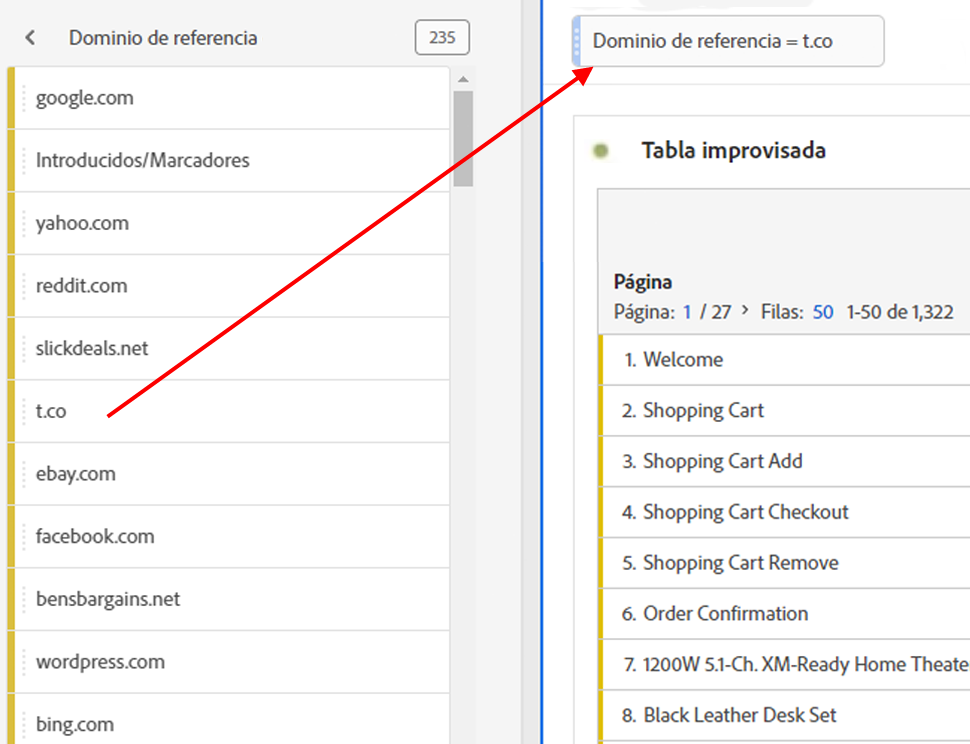

# Segmentos de proyecto ad hoc

Los segmentos de proyecto específicos le permiten arrastrar y soltar cualquier componente directamente en la zona de colocación del panel para crear un segmento. El segmento se convierte en un [segmento de nivel de proyecto](https://experienceleague.adobe.com/docs/analytics/analyze/analysis-workspace/components/segments/quick-segments.html?#what-are-project-only-segments%3F) local al proyecto actual.

Aquí tiene un vídeo sobre la creación de segmentos de proyecto ad hoc:

>[!VIDEO](https://video.tv.adobe.com/v/23978/?quality=12)

1. Suelte cualquier tipo de componente (dimensión, elemento de dimensión, evento, métrica, segmento, plantilla de segmento, intervalo de fechas) en la zona de colocación de segmentos en la parte superior de un panel. Los tipos de componente se convierten automáticamente en segmentos ad-hoc o [Segmentos rápidos](https://experienceleague.adobe.com/docs/analytics/analyze/analysis-workspace/components/segments/quick-segments.html) si es compatible.
Este es un ejemplo de cómo crear un segmento para el dominio de referencia de Twitter:

   

   El panel aplica automáticamente este segmento y puede ver los resultados al instante.

1. Puede agregar un número ilimitado de segmentos a un panel.
1. Si decide guardar este segmento, consulte la sección siguiente.

Recuerde:

* **No puede** soltar los siguientes tipos de componentes en la zona de segmento: métricas calculadas y dimensiones/métricas desde las que no se pueden crear segmentos.
* Para las dimensiones y eventos completos, Analysis Workspace crea segmentos de visita del tipo “existe”. Ejemplos: `Hit where eVar1 exists` o `Hit where event1 exists`.
* Si se suelta “sin especificar” o “ninguno” en la zona de colocación de segmentos, se convierten automáticamente en un segmento “no existe”, de modo que se los trate adecuadamente en la segmentación.

Para ver una comparación de los distintos segmentos que puede crear y aplicar en un proyecto, vaya a [here](/help/analyze/analysis-workspace/components/segments/t-freeform-project-segment.md).

## Guardar segmentos ad hoc {#ad-hoc-save}

Los segmentos específicos se pueden poner a disposición de otros proyectos si se guardan.

1. Sitúese sobre el segmento de la zona de colocación y haga clic en el icono “i”.
1. Haga clic en el lápiz de edición para ir al Generador de segmentos.
1. Marque **[!UICONTROL Poner a disposición de todos los proyectos y añadirlos a la lista de componentes]**.
1. Haga clic en **[!UICONTROL GUARDAR]**.

Una vez guardado, el segmento está disponible en la lista de componentes del carril izquierdo y se puede compartir con otros usuarios desde el Administrador de segmentos.
