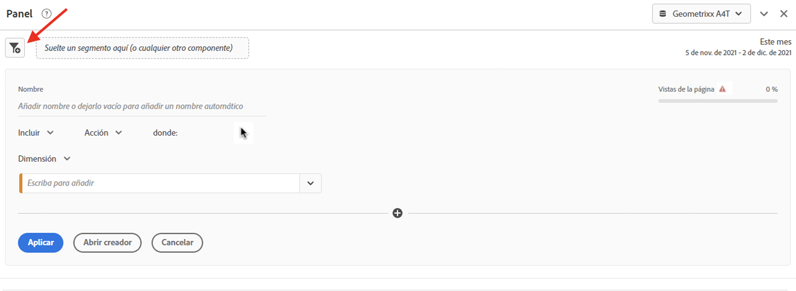
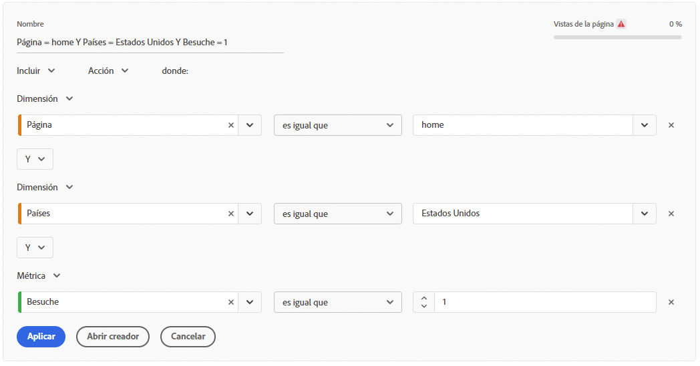
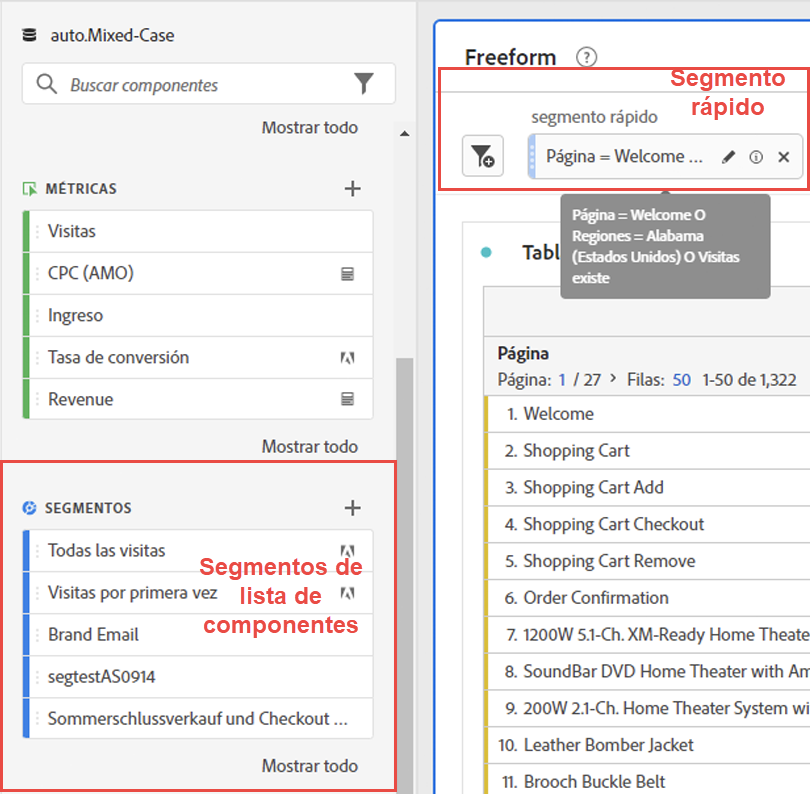
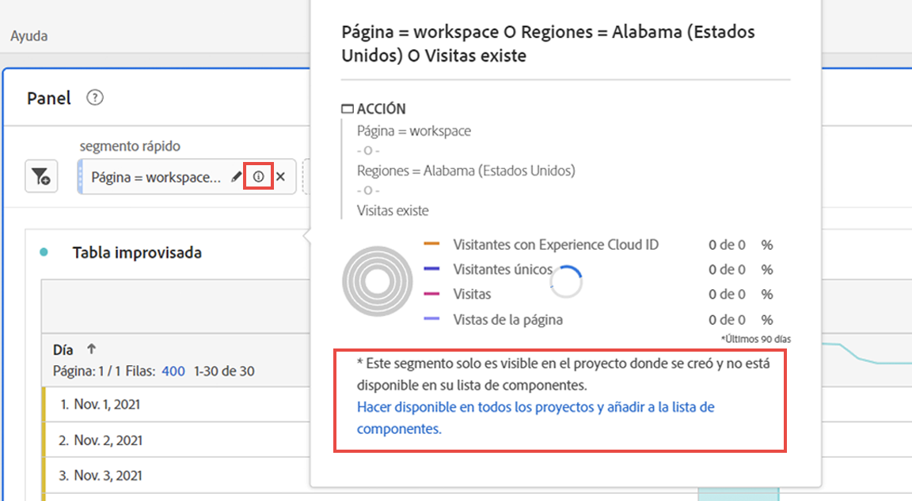
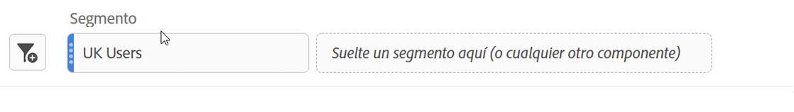

# Segmentos rápidos

Puede crear segmentos rápidos dentro de un proyecto para evitar la complejidad del [generador de segmentos](/help/components/segmentation/segmentation-workflow/seg-build.md) completo. Para ver una comparación de lo que pueden hacer los segmentos rápidos frente a los segmentos de lista de componentes completa, vaya [aquí](/help/analyze/analysis-workspace/components/segments/t-freeform-project-segment.md).

>[!IMPORTANT]
> Los segmentos rápidos están actualmente en pruebas limitadas y no están disponibles en general todavía.

## Crear segmentos rápidos

1. En una tabla improvisada, haga clic en el icono filter+ del encabezado del panel:

   

   Tenga en cuenta que:

   - Solo hay un contenedor de segmentos que le permite incluir una dimensión, métrica o intervalo de fechas en el segmento (o excluirlo de).
   - Puede establecer el contenedor en el nivel de visita individual, visita o visitante. El valor predeterminado es Visita individual.

1. Añada una dimensión/métrica/intervalo de fechas de una de las 3 maneras siguientes:

   - Empiece a escribir y el [!UICONTROL Generador de segmentos rápido] encuentre automáticamente el componente adecuado.
   - Utilice la lista desplegable para buscar el componente.
   - Arrastre y suelte los componentes desde el carril izquierdo.

1. Especifique la primera regla, como `Page equals workspace`. Puede tener hasta tres reglas en definiciones de segmento. Simplemente haga clic en el signo &quot;+&quot; para agregar otra regla. Puede agregar calificadores &quot;AND&quot; u &quot;OR&quot; a las reglas, pero no puede combinar &quot;AND&quot; y &quot;OR&quot; en una sola definición de segmento.

   Este es un ejemplo de un segmento que combina dimensiones y métricas:

   

1. Haga clic en **[!UICONTROL Aplicar]** para aplicar este segmento al panel.
El segmento aparece en la parte superior. Observe su barra lateral gris, a diferencia de la barra lateral azul para segmentos de nivel de componente en la biblioteca de segmentos a la izquierda.

   

## Editar segmentos rápidos

1. Pase el ratón sobre el segmento rápido y seleccione el icono de lápiz.
1. Edite la definición del segmento o el nombre del segmento.

## Guardar segmentos rápidos

Puede elegir guardar segmentos rápidos siguiendo estos pasos.

>[!IMPORTANT]
>Una vez guardado o aplicado el segmento, ya no puede editarlo en el Generador de segmentos rápido, solo en el Generador de segmentos normal.

1. Pase el ratón sobre el segmento rápido y seleccione el icono de información (&quot;i&quot;).
1. Seleccione **[!UICONTROL Guardar segmento]**

   

1. Deje el nombre tal cual o cambie el nombre del segmento.

   Vuelva a Workspace y observe cómo el segmento ahora tiene una barra lateral azul. Esto indica que ya no se puede editar ni abrir en el Generador de segmentos rápido. Al guardarlo, pasa a formar parte de la lista de componentes.

   

Después de aplicar el segmento, puede elegir agregarlo a su lista de componentes del segmento y ponerlo a disposición de todos sus proyectos.

1. Pase el ratón sobre el segmento guardado y seleccione el icono de lápiz.

1. En la parte superior del Generador de segmentos, observe este cuadro de diálogo:

   

1. Seleccione la casilla de verificación situada junto a **[!UICONTROL Hacer que este segmento esté disponible para todos sus proyectos y agréguelo a su lista de componentes.]**
1. Haga clic en **[!UICONTROL Guardar]**.
1. El segmento ahora aparece en la lista de componentes del segmento para todos sus proyectos.
1. También puede [compartir el segmento](/help/components/segmentation/segmentation-workflow/t-seg-share.md) con otras personas de su organización.

## ¿Qué son segmentos solo de proyecto?

Los segmentos solo de proyecto son segmentos rápidos o segmentos de proyecto específicos de Workspace. Al editarlas o abrirlas en el generador de segmentos, se mostrará el cuadro de solo proyecto. Si APLICAN un segmento rápido en el generador pero no marcan la casilla de disponibilidad, entonces sigue siendo un segmento solo de proyecto pero ya no se puede abrir en el generador de QS. Si marca la casilla y la opción GUARDAR ahora es un segmento de lista de componentes.