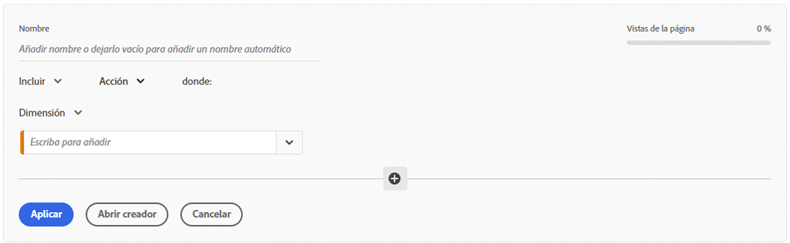
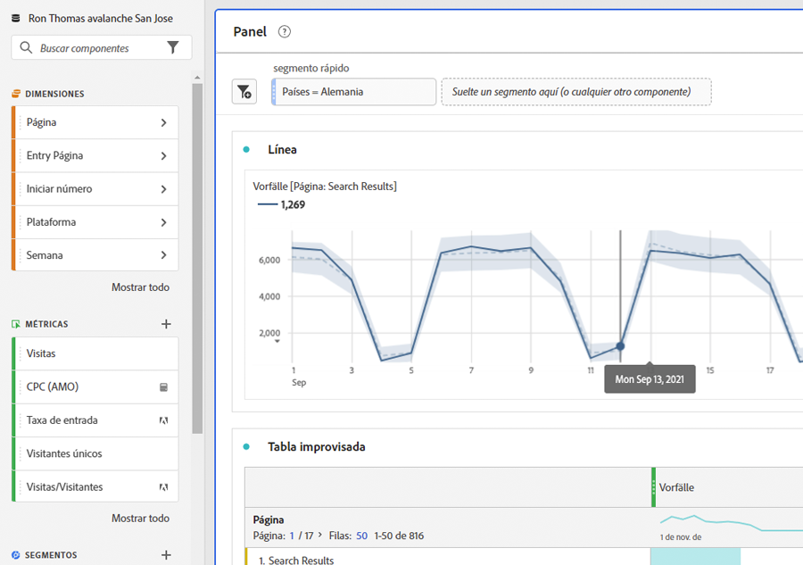
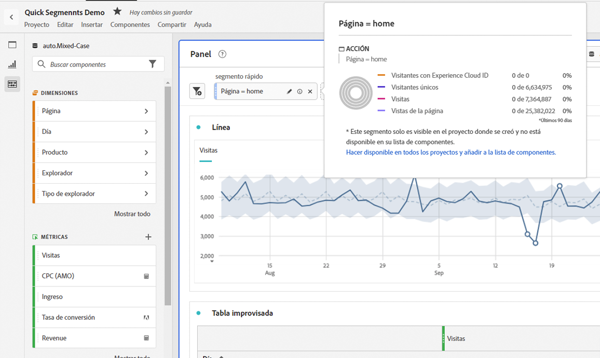
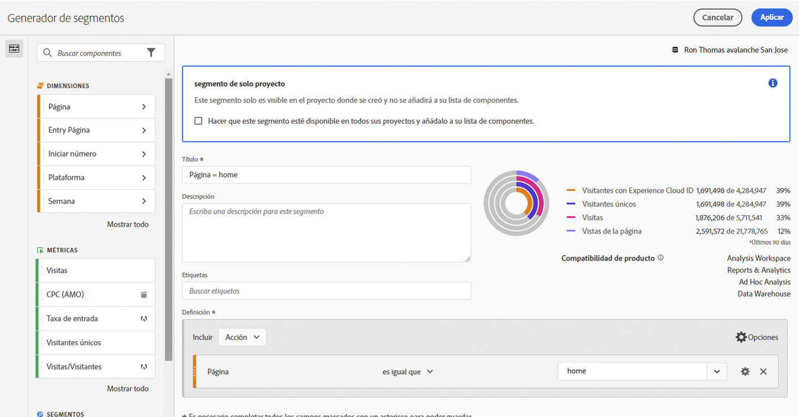
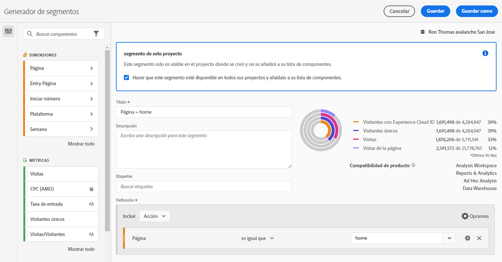

# Segmentos rápidos

Puede crear segmentos rápidos dentro de un proyecto para evitar la complejidad del [generador de segmentos](/help/components/segmentation/segmentation-workflow/seg-build.md) completo. Segmentos rápidos

* Se aplican solo a los proyectos en los que se crearon (puede cambiar esto).
* Permiten hasta 3 reglas.
* No se admiten contenedores anidados ni reglas secuenciales.
* Funcionan en proyectos con varios grupos de informes.

Para ver una comparación de lo que pueden hacer los segmentos rápidos frente a los segmentos de lista de componentes completos, consulte [aquí](/help/analyze/analysis-workspace/components/segments/t-freeform-project-segment.md).

>[!IMPORTANT]
> Los segmentos rápidos están actualmente en pruebas limitadas y estarán disponibles para el público general el 21 de octubre de 2021.

## Requisitos previos

Cualquiera puede crear un [!UICONTROL segmento rápido]. Sin embargo, necesita el permiso de [!UICONTROL Creación de segmentos] en [Adobe Admin Console](https://experienceleague.adobe.com/docs/analytics/admin/admin-console/permissions/summary-tables.html?lang=es#analytics-tools) para poder guardar segmentos rápidos o abrirlos en el [!UICONTROL Generador de segmentos].

## Creación de segmentos rápidos

En una tabla improvisada, haga clic en el icono Filtrar+ del encabezado del panel:

Configure el segmento rápido desde esta pizarra en blanco:

| Configuración | Descripción |
| --- | --- |
| Nombre | El nombre predeterminado de un segmento es una combinación de los nombres de reglas del segmento. Puede cambiar el nombre del segmento. |
| Inclusión/exclusión | Puede incluir o excluir componentes en su definición de segmento, pero no ambas cosas. |
| Contenedor de visita/visita individual/visitante | Los segmentos rápidos incluyen solo un [contenedor de segmentos](https://experienceleague.adobe.com/docs/analytics/components/segmentation/seg-overview.html?lang=es#section_AF2A28BE92474DB386AE85743C71B2D6) que le permite incluir una dimensión, métrica o intervalo de fecha en el segmento (o excluirlo). [!UICONTROL Visitante] contiene datos globales específicos del visitante en las visitas y vistas de páginas. El contenedor de [!UICONTROL visita] le permite establecer reglas para desglosar los datos del visitante en función de las visitas y el contenedor de [!UICONTROL visita individual] le permite desglosar la información del visitante según las vistas de página individuales. El contenedor predeterminado es [!UICONTROL Visita individual]. |
| Componentes (dimensión/métrica/intervalo de fecha) | Defina hasta 3 reglas agregando componentes (dimensiones o métricas e intervalos de fechas) y sus valores. Existen tres formas de encontrar el componente correcto:<ul><li>Empiece a escribir y el generador de [!UICONTROL segmentos rápidos] encontrará automáticamente el componente adecuado.</li><li>Utilice la lista desplegable para buscar el componente.</li><li>Arrastre y suelte los componentes desde el carril izquierdo.</li></ul> |
| Operador | Utilice el menú desplegable para buscar operadores estándares y operadores de [!UICONTROL recuento distinto]. [Más información](https://experienceleague.adobe.com/docs/analytics/components/segmentation/segment-reference/seg-operators.html?lang=es) |
| Signo más (+) | Adición de otra regla |
| Cualificadores AND/OR | Puede agregar calificadores AND u OR a las reglas, pero no puede combinar AND y OR en una sola definición de segmento. |
| Aplicar | Aplique este segmento al panel. Si el segmento no contiene datos, se le preguntará si desea continuar. |
| Abrir creador | Se abrirá el Generador de segmentos. Una vez guardado o aplicado el segmento en el Generador de segmentos, ya no se considera un &quot;segmento rápido&quot;. Forma parte de la biblioteca de segmentos de lista de componentes. |
| Cancelar | Cancele este segmento rápido: no lo aplique. |
| Intervalo de fechas | El validador utiliza el intervalo de fecha del panel para la búsqueda de datos. Sin embargo, cualquier intervalo de fechas aplicado en un segmento rápido anula el intervalo de fechas del panel en la parte superior del panel. |
| Vista previa (parte superior derecha) | Le permite previsualizar las métricas clave para comprobar si tiene un segmento válido y ver su amplitud. Representa el desglose del conjunto de datos que verá cuando aplique este segmento. Podría recibir un aviso que indique que este segmento no tiene datos. Si este es el caso, puede continuar o cambiar la definición del segmento. |

Este es un ejemplo de un segmento que combina dimensiones y métricas:

El segmento aparece en la parte superior. Fíjese en su barra lateral con bandas azules, a diferencia de la barra lateral azul para segmentos de nivel de componente en la biblioteca de segmentos a la izquierda.

## Edición de segmentos rápidos

1. Pase el ratón sobre el segmento rápido y seleccione el icono de lápiz.
1. Edite la definición del segmento o el nombre del segmento.
1. Haga clic en [!UICONTROL Aplicar].

## Guardado de segmentos rápidos

>[!IMPORTANT]
>Una vez guardado o aplicado el segmento, ya no puede editarlo en el Generador de segmentos rápidos, solo en el Generador de segmentos normal.

1. Una vez aplicado el segmento rápido, pase el ratón sobre él y seleccione el icono de información (“i”).

   

1. Haga clic en **[!UICONTROL Hacer disponible en todos los proyectos y añadir a la lista de componentes]**.
1. (Opcional) Cambie el nombre del segmento.
1. Haga clic en **[!UICONTROL Guardar]**.

Observe cómo la barra lateral del segmento cambia de azul rayado a azul. Ahora aparece en la lista de componentes en el carril izquierdo.

## ¿Qué son segmentos solo de proyecto?

Los segmentos solo de proyecto son segmentos rápidos o segmentos de proyecto ad hoc de Workspace. Al editarlas o abrirlas en el [!UICONTROL Generador de segmentos], aparece el cuadro solo proyecto. Si aplica un segmento rápido en el generador y no marca la casilla de verificación para que esté disponible, sigue siendo un segmento solo de proyecto, pero ya no se puede abrir en el [!UICONTROL Generador de segmentos rápidos].

Si marca la casilla y hace clic en **[!UICONTROL GUARDAR]**, ahora es un segmento de lista de componentes.

