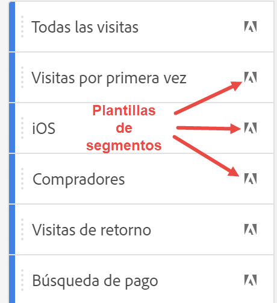

# Segmentos {#topic_DC2917A2E8FD4B62816572F3F6EDA58A}

Puede crear distintos tipos de segmentos en Workspace, en función de su complejidad, si solo deben aplicarse a este proyecto, etc. Este es un resumen de los tipos de segmentos:

| Tipo de segmento | ¿Creado dónde? | ¿Dónde se aplica? | Uso |
| --- | --- | --- | --- |
| Segmento de lista de componentes | Haga clic en +, que le lleva al [Generador de segmentos](/help/components/segmentation/segmentation-workflow/seg-build.md) | Todos los proyectos de Workspace | Para segmentos más complejos, segmentos secuenciales |
| Segmento rápido | [Generador de segmentos rápidos](/help/analyze/analysis-workspace/components/segments/quick-segments.md) | Solo proyecto, pero puede guardar y añadir a la lista de segmentos. | Se puede utilizar para segmentos ad hoc de una sola regla (con arrastrar y soltar) o para agregar o editar varias reglas (haciendo clic en el icono Segmento ) |
| Segmento basado en métricas calculadas | [Generador de métricas calculadas](https://experienceleague.adobe.com/docs/analytics/components/calculated-metrics/calcmetric-workflow/metrics-with-segments.html?lang=es) | Para métricas calculadas individuales | Aplicación de segmentos dentro de su definición de métrica |
| Segmento basado en grupo de informes virtuales | [Generador de grupos de informes virtuales](https://experienceleague.adobe.com/docs/analytics/components/virtual-report-suites/vrs-workflow/vrs-create.html?lang=es) | A un grupo de informes virtuales individual | Aplicación de segmentos dentro de su definición de grupo de informes virtuales |

## Vídeos

Uso de segmentos en Analysis Workspace:

>[!VIDEO](https://video.tv.adobe.com/v/23977/?quality=12)

Búsqueda y creación de segmentos:

>[!VIDEO](https://video.tv.adobe.com/v/334092/?quality=12)

Intervalos de fechas móviles en segmentos:

>[!VIDEO](https://video.tv.adobe.com/v/25403/?quality=12)

## Crear segmentos {#section_693CFADA668B4542B982446C2B4CF0F5}

Puede crear diferentes tipos de segmentos en Analysis Workspace:

* [Segmentos rápidos](/help/analyze/analysis-workspace/components/segments/quick-segments.md)
* Segmentos de lista de componentes normales que crea en el Generador de segmentos y que terminan en la biblioteca de segmentos (ver a continuación)

### Creación de segmentos de la lista de componentes {#section_3B07D458C43E42FDAF242BB3ACAF3E90}

El carril del segmento en el menú Componentes muestra
* Segmentos que usted o su compañía han creado
* Plantillas de segmentos, tal como lo indica el icono de Adobe:

Para crear un segmento de este tipo, tiene dos opciones. Ambos le llevan al [Generador de segmentos](/help/components/segmentation/segmentation-workflow/seg-build.md) en Adobe Analytics, donde puede encontrar más instrucciones.

* En el carril izquierdo, haga clic en el signo más (+) situado junto a [!UICONTROL Segmentos]:

o

* Vaya a [!UICONTROL Componentes] > [!UICONTROL Segmentos] y haga clic en [!UICONTROL + Añadir].

### Otros métodos para la aplicación de segmentos {#section_10FF2E309BA84618990EA5B473015894}

>[!VIDEO](https://video.tv.adobe.com/v/30994/?quality=12)

Existen varios métodos más para aplicar segmentos a un proyecto improvisado.

| Acción | Descripción |
|--- |--- |
| Crear segmento de selección | Cree un segmento en línea. Este segmento se aplica solamente al proyecto abierto y no se guarda como segmento de Analytics. 1. Seleccione filas.  2. Haga clic con el botón secundario en la selección.  3. Haga clic en *Crear segmento de selección*. |
| Componentes > Nuevo segmento | Se abre el Generador de segmentos. Consulte [Generador segmentos](https://experienceleague.adobe.com/docs/analytics/components/segmentation/segmentation-workflow/seg-build.html?lang=es) para obtener más información acerca de la segmentación. |
| Compartir > Compartir proyecto o Compartir > Depurar datos del proyecto | En [Depurar y Compartir](https://experienceleague.adobe.com/docs/analytics/analyze/analysis-workspace/curate-share/curate.html?lang=es#concept_4A9726927E7C44AFA260E2BB2721AFC6), los segmentos aplicados al proyecto se encuentran disponibles en análisis compartido para el destinatario. |
| Uso de segmentos como dimensiones | Vídeo: [Uso de segmentos como dimensiones en Analysis Workspace](https://experienceleague.adobe.com/docs/analytics-learn/tutorials/analysis-workspace/applying-segments/using-segments-as-dimensions-in-analysis-workspace.html?lang=es) |

## IQ de segmento

IQ de segmento (también conocido como Comparación de segmentos) incluye las siguientes funciones:

* [Panel de comparación de segmentos:](/help/analyze/analysis-workspace/c-panels/c-segment-comparison/segment-comparison.md) La función principal de IQ de segmento. Arrastre dos segmentos al panel y vea un informe completo que muestre las diferencias estadísticamente significativas y la superposición entre las dos audiencias.
* [Comparación de segmentos en abandonos: ](/help/analyze/analysis-workspace/visualizations/fallout/compare-segments-fallout.md)Ver cómo se comparan las distintas audiencias en el contexto de una visualización de abandonos.

## Más información

Para un análisis en profundidad de la segmentación en Adobe Analytics, consulte [aquí](/help/components/segmentation/seg-overview.md).
