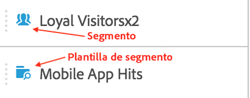
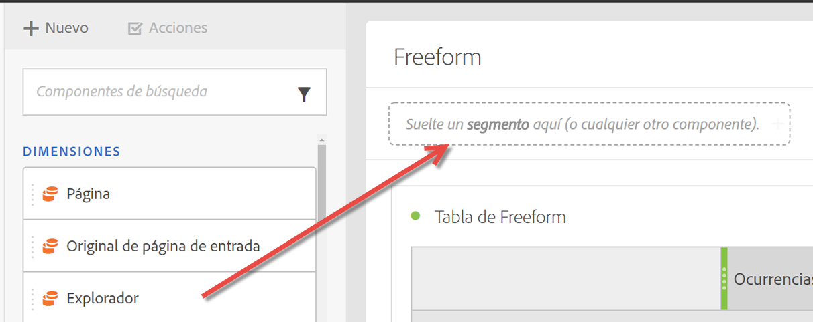
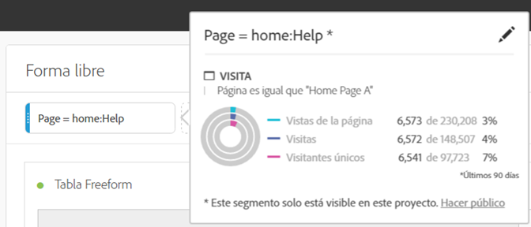

# Segmentos {#topic_DC2917A2E8FD4B62816572F3F6EDA58A}

## Carril del segmento {#section_3B07D458C43E42FDAF242BB3ACAF3E90}

El carril del segmento en el menú Componentes muestra los segmentos así como las plantillas de segmentos, como indican estos iconos:

[Uso de segmentos en Analysis Workspace](https://experienceleague.adobe.com/docs/analytics-learn/tutorials/analysis-workspace/applying-segments/using-segments-in-analysis-workspace.html?lang=es) (6:46)

## Crear segmentos {#section_693CFADA668B4542B982446C2B4CF0F5}

Puede crear segmentos instantáneos soltando cualquier tipo de componente (dimensión, elemento de dimensión, evento, métrica, segmento, plantilla de segmento, intervalo de fechas) en la zona de colocación de segmentos en la parte superior de un panel.

Los tipos de componente se convierten automáticamente en segmentos. También puede hacer clic en el signo “+” en el cuadro desplegable Agregar segmento.

Tenga en cuenta que:

* **No puede** soltar los siguientes tipos de componentes en la zona de segmento: métricas calculadas y dimensiones/métricas desde las que no se pueden crear segmentos.
* Para las dimensiones y eventos completos, Analysis Workspace crea segmentos de visita del tipo “existe”. Ejemplos: “Visita donde existe eVar1” o “Visita donde existe event1”.
* Si se suelta “sin especificar” o “ninguno” en la zona de colocación de segmentos, se convierten automáticamente en un segmento “no existe”, de modo que se los trate adecuadamente en la segmentación.

>[!NOTE]
>
>Los segmentos creados de esta forma son internos del proyecto.

Puede convertir estos segmentos en públicos (globales) siguiendo estos pasos:

1. Sitúese sobre el segmento de la zona de colocación y haga clic en el icono “i”.
1. En el panel de información que aparece, haga clic en **[!UICONTROL Convertir en público]**.

   

## Otros métodos para la aplicación de segmentos {#section_10FF2E309BA84618990EA5B473015894}

Existen varios métodos más para aplicar segmentos a un proyecto improvisado.

| Acción | Descripción |
|--- |--- |
| Crear segmento de selección | Cree un segmento en línea. Seleccione filas, haga clic con el botón secundario en la selección y cree un segmento en línea. Este segmento se aplica solamente al proyecto abierto y no se guarda como segmento de Analytics. 1. Seleccione filas.  2. Haga clic con el botón secundario en la selección.  3. Haga clic en *Crear segmento de selección*. |
| Componentes > Nuevo segmento | Se abre el Generador de segmentos. Consulte [Generador segmentos](https://experienceleague.adobe.com/docs/analytics/components/segmentation/segmentation-workflow/seg-build.html) para obtener más información acerca de la segmentación. |
| Compartir > Compartir proyecto o Compartir > Depurar datos del proyecto | En [Depurar y Compartir](https://experienceleague.adobe.com/docs/analytics/analyze/analysis-workspace/curate-share/curate.html#concept_4A9726927E7C44AFA260E2BB2721AFC6), los segmentos aplicados al proyecto se encuentran disponibles en análisis compartido para el destinatario. |
| Uso de segmentos como dimensiones | Vídeo: [Uso de segmentos como dimensiones en Analysis Workspace](https://experienceleague.adobe.com/docs/analytics-learn/tutorials/components/segmentation/using-segments-as-dimensions-in-analysis-workspace.html) |
