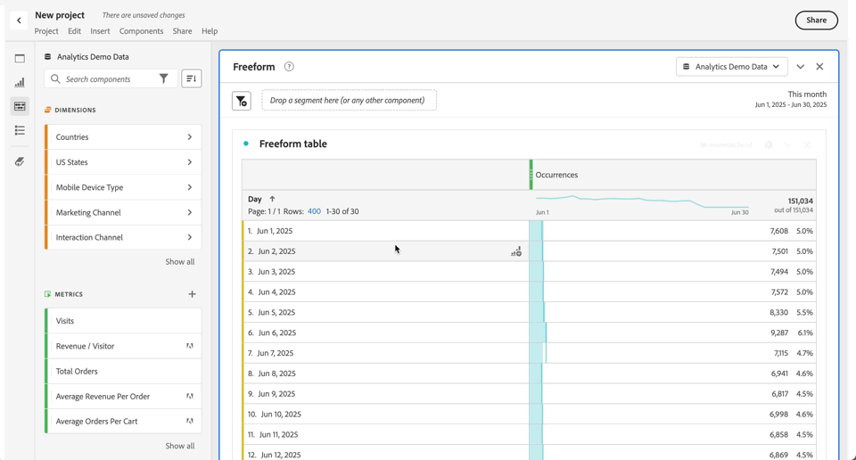

# Usar componentes en un proyecto

Los componentes constituyen los datos reales de cualquier proyecto en Analysis Workspace. Los componentes están formados por dimensiones, métricas, segmentos e intervalos de fechas. Puede añadir componentes a un proyecto arrastrándolos a visualizaciones o paneles.

Consulte la [Información general de componentes](/help/analyze/analysis-workspace/components/analysis-workspace-components.md) para obtener más información sobre los tipos de componentes que puede añadir.

>[!TIP]
>
>Para obtener información sobre cada componente, use . Consulte [Información del componente](#component-info) para obtener más información.

## Adición de componentes a un proyecto

1. [Cree un proyecto en Analysis Workspace](/help/analyze/analysis-workspace/build-workspace-project/create-projects.md).

1. [Añada un panel](/help/analyze/analysis-workspace/c-panels/panels.md#create-a-panel) o [una visualización](/help/analyze/analysis-workspace/visualizations/freeform-analysis-visualizations.md#add-visualizations-to-a-panel) al proyecto en Analysis Workspace. Si añade un componente a un proyecto en blanco, ya se habrá creado una visualización de tabla de forma libre.

1. Seleccione  **[!UICONTROL Componentes]** en el panel de botones. Verá todos los componentes disponibles en el panel izquierdo. Consulte [Interfaz](/help/analyze/analysis-workspace/home.md#interface) para obtener más información.

1. Desplácese hasta el componente que desea añadir o búsquelo y arrástrelo hasta un panel o a una visualización dentro de su proyecto.

1. Por ejemplo, puede arrastrar un componente a la zona de colocación de segmentos en un encabezado de panel. Esta acción de arrastrar y soltar define el componente como un segmento y aplica el segmento a todo el contenido del panel.
Para obtener información sobre cómo usar la zona de colocación de segmentos en un panel para segmentar el panel, consulte [Zona de colocación](/help/analyze/analysis-workspace/c-panels/panels.md#drop-zone) en [Información general de paneles](/help/analyze/analysis-workspace/c-panels/panels.md).

1. Para obtener información más detallada, consulte las siguientes secciones:

   * [Adición de dimensiones a un proyecto](#add-dimensions-to-a-project)

   * [Adición de métricas a un proyecto](#add-metrics-to-a-project)

   * [Adición de segmentos a un proyecto](#add-segments-to-a-project)

   * [Adición de intervalos de fechas a un proyecto](#add-date-ranges-to-a-project)

### Adición de dimensiones a un proyecto

[Las dimensiones](/help/components/dimensions/overview.md) son variables en Adobe Analytics que generalmente contienen valores de cadena. Por el contrario, las [métricas](/help/components/calculated-metrics/cm-overview.md) contienen valores numéricos que se vinculan a una dimensión. Un informe básico muestra filas de valores de cadena (dimensión) frente a una columna de valores numéricos (métrica).

1. Empiece a añadir una dimensión a su proyecto en Analysis Workspace, tal como se describe en [Adición de componentes a un proyecto](#add-components-to-a-project).

1. Elija uno de los siguientes métodos para añadir dimensiones y determinar el tipo de datos que desea analizar:

   

   * Arrastre una dimensión hasta una visualización (como una tabla de forma libre) en Analysis Workspace.

   * Arrastre una o varias dimensiones del panel izquierdo a la zona de colocación de segmentos para crear un segmento rápido, tal como se describe en [Adición de segmentos a un proyecto](#add-filters-to-a-project).

1. Si lo desea, puede desglosar dimensiones y elementos de dimensión en Analysis Workspace con otros componentes. Para obtener más información, consulte [Desglose de dimensiones en Workspace](/help/analyze/analysis-workspace/components/dimensions/t-breakdown-fa.md).

Para obtener más información sobre cómo usar dimensiones en Analysis Workspace, consulte [Vista preliminar de dimensiones](/help/analyze/analysis-workspace/components/dimensions/view-dimensions.md), [Desglose de dimensiones](/help/analyze/analysis-workspace/components/dimensions/t-breakdown-fa.md) y [Dimensiones de partición de tiempo](/help/analyze/analysis-workspace/components/dimensions/time-parting-dimensions.md).

### Adición de métricas a un proyecto

Las métricas permiten cuantificar los puntos de datos en Analysis Workspace. Normalmente se utilizan como columnas en una visualización y están vinculadas a las dimensiones.

Para añadir una métrica a un proyecto en Analysis Workspace, haga lo siguiente:

1. Comience a agregar una métrica al proyecto en Analysis Workspace, tal como se describe en [Agregar componentes a un proyecto](#add-components-to-a-project).

1. Elija uno de los siguientes métodos para añadir una métrica en Analysis Workspace:

   

   * Arrastre una métrica a la zona de colocación de métricas en una tabla de forma libre vacía para ver las tendencias de esa métrica durante el período de fechas del proyecto.

   * Arrastre una métrica cuando haya una dimensión presente para verla para cada elemento de dimensión.

   * Arrastrar una métrica sobre un encabezado de métrica existente para reemplazarla.

   * Arrastre una métrica junto al lado izquierdo o derecho del encabezado de una métrica existente para añadir la nueva métrica.

   * Arrastre una métrica por encima o por debajo del encabezado de una métrica existente para crear un solapamiento de métricas.

Para obtener más información sobre métricas, consulte [Métricas](/help/analyze/analysis-workspace/components/apply-create-metrics.md).

### Adición de segmentos a un proyecto

Los [segmentos](/help/components/segmentation/seg-overview.md) le permiten identificar subconjuntos de personas, sesiones o eventos según las características o interacciones específicas.

Puede utilizar segmentos en Analysis Workspace de cualquiera de las siguientes maneras:

* Adición de segmentos a un panel
Cuando añade segmentos a un panel, los segmentos se aplican a todo el contenido del panel.
Para obtener información sobre cómo usar la zona de colocación de segmentos en un panel para segmentar el panel, consulte [Zona de colocación](/help/analyze/analysis-workspace/c-panels/panels.md#drop-zone) en [Información general de paneles](/help/analyze/analysis-workspace/c-panels/panels.md).

* Adición de segmentos a una visualización
Cuando añade segmentos a una columna de una tabla de forma libre, los segmentos se aplican a todo el contenido de la columna de la tabla. También puede añadir segmentos como parte de una visualización de visitas en el orden previsto.

* Uso de segmentos en componentes
Cuando define componentes como [métricas calculadas](/help/components/calculated-metrics/workflow/c-build-metrics/metrics-with-segments.md), [anotaciones](/help/analyze/analysis-workspace/components/annotations/create-annotations.md#annotation-builder) o incluso [segmentos](/help/components/segmentation/segmentation-workflow/seg-build.md), puede usar segmentos como parte de la definición.

### Adición de intervalos de fechas a un proyecto

[Los intervalos de fechas](/help/analyze/analysis-workspace/components/calendar-date-ranges/calendar.md) determinan el lapso de tiempo de los informes en Analysis Workspace. Además, se puede aplicar un rango de datos a paneles dentro de un proyecto y también a algunas visualizaciones (como la tabla de forma libre).

Cada panel incluye un intervalo de fechas de forma predeterminada. Existen varias formas de actualizar un intervalo de fechas para un panel. Una forma de actualizar el intervalo de fechas de un panel en Analysis Workspace es arrastrar un componente de intervalo de fechas desde el panel izquierdo:

1. De forma opcional puede añadir un intervalo de fechas a su proyecto en Analysis Workspace, tal como se describe en [Adición de componentes a un proyecto](#add-components-to-a-project).

1. Arrastre y suelte un intervalo de fechas desde el panel izquierdo en:

   * El intervalo de fechas actual para modificar el intervalo de fechas del panel.

     

   * Una métrica o dimensión en una visualización de tabla de forma libre. Consulte [Usar intervalos de fechas](/help/analyze/analysis-workspace/components/calendar-date-ranges/calendar.md#use-date-ranges) para obtener más información. 

Para obtener más información sobre cómo usar y administrar intervalos de fechas en Analysis Workspace, consulte [Información general sobre los intervalos de fechas](/help/analyze/analysis-workspace/components/calendar-date-ranges/calendar.md).

## Información del componente

Puede pasar el puntero por encima de cualquier componente para mostrar . Al seleccionar , aparece una ventana emergente con información adicional sobre el componente.

En función del control de acceso, puede hacer lo siguiente:

* Acceder a las definiciones de  [!UICONTROL Diccionario de datos] para el componente.
* Obtenga acceso al generador de componentes  donde se definió el componente.

<!--
# Use components in Analysis Workspace

Components make up the actual data of any project in Analysis Workspace. Components consist of dimensions, metrics, segments, and date ranges. You can add components to a project by dragging them into visualizations or panels.

For overview information about the types of components you can add, see [Components overview](/help/analyze/analysis-workspace/components/analysis-workspace-components.md).

>[!TIP]
>
>For information about each component, select the Info icon next to a component's name in the left rail of Analysis Workspace, or see the [Analytics Components Guide](/help/components/home.md).

## Begin adding components to a project

1. [Create a project in Analysis Workspace](/help/analyze/analysis-workspace/build-workspace-project/create-projects.md) if you haven't already.

1. [Add a panel](/help/analyze/analysis-workspace/c-panels/panels.md) or [add a visualization](/help/analyze/analysis-workspace/visualizations/freeform-analysis-visualizations.md#add-visualizations-to-a-panel) to the project in Analysis Workspace. 

   If you add a component to a blank project, a freeform table visualization is automatically created.

1. Select the **[!UICONTROL Components]** icon in the left rail.

   

1. Scroll to or search for the component you want to add, then drag it to a panel or visualization within your project. 

1. (Optional) Drag a component to the segment drop zone in a panel header. 

   Segments apply to all content within the panel.

   For information about how you can use the segment drop zone on a panel to filter your panel, see [Drop zone](/help/analyze/analysis-workspace/c-panels/panels.md#drop-zone) in [Panels overview](/help/analyze/analysis-workspace/c-panels/panels.md).

   

1. For more detailed information, continue with one of the following sections, depending on the component type you are adding:

   * [Add dimensions to a project](#add-dimensions-to-a-project)

   * [Add metrics to a project](#add-metrics-to-a-project)

   * [Add segments to a project](#add-segments-to-a-project)

   * [Add date ranges to a project](#add-date-ranges-to-a-project)

## Add dimensions to a project

[Dimensions](/help/components/dimensions/overview.md) are variables in Adobe Analytics that typically contain string values. Common dimensions include [Page](/help/components/dimensions/page.md), [Referring domain](/help/components/dimensions/referring-domain.md), or an [eVar](/help/components/dimensions/evar.md). In contrast, [metrics](/help/components/metrics/overview.md) contain numeric values that tie to a dimension. A basic report shows rows of string values (dimension), against a column of numeric values (metric).

1. Start adding a dimension to your project in Analysis Workspace, as described in [Begin adding components to a project](#begin-adding-components-to-a-project).

1. Choose one of the following methods to add dimensions and determine the type of data you want to analyze:

   * Drag a dimension to a visualization (such as a freeform table) in Analysis Workspace.

     
   
   * Drag one or more dimensions from the left rail onto the segment drop zone to create an ad hoc segment, as described in [Add segments to a project](#add-segments-to-a-project).

     

1. (Optional) You can break down dimensions and dimension items in Analysis Workspace with other components. 

   For more information, see [Break down dimensions](/help/analyze/analysis-workspace/components/dimensions/t-breakdown-fa.md).

For more information about how to use dimensions in Analysis Workspace, see [Preview dimensions](/help/analyze/analysis-workspace/components/dimensions/view-dimensions.md), [Break down dimensions](/help/analyze/analysis-workspace/components/dimensions/t-breakdown-fa.md), and [Time-parting dimensions](/help/analyze/analysis-workspace/components/dimensions/time-parting-dimensions.md).

## Add metrics to a project

[Metrics](/help/analyze/analysis-workspace/components/apply-create-metrics.md) allow you to quantify data points in Analysis Workspace. They are most commonly used as columns in a visualization and tied to dimensions.

To add a metric to a project in Analysis Workspace:

1. Start adding a metric to your project in Analysis Workspace, as described in [Begin adding components to a project](#begin-adding-components-to-a-project).

1. Choose one of the following methods to add a metric in Analysis Workspace:

   * Drag a metric to the metric drop zone in an empty Freeform table to see that metric trended over the project's date period. 

     

   * Drag a metric when a dimension is present to see that metric compared to each dimension item. 

   * Drag a metric on top of an existing metric header to replace it.

   * Drag a metric next to a header to see both metrics side-by-side.

For more information about how to use metrics in Analysis Workspace, see [Metrics](/help/analyze/analysis-workspace/components/apply-create-metrics.md).

## Add segments to a project

[Segments](/help/components/segmentation/seg-overview.md) allow you to identify subsets of visitors based on characteristics or specific interactions.

You can use segments in Analysis Workspace in any of the following ways:

### Add segments to a panel

When you add segments to a panel, the segments apply to all content within the panel.

For information about how you can use the segment drop zone on a panel to filter your panel, see [Drop zone](/help/analyze/analysis-workspace/c-panels/panels.md#drop-zone) in [Panels overview](/help/analyze/analysis-workspace/c-panels/panels.md).

### Add segments to a column in a freeform table

When you add segments to a column in a freeform table, the segments apply to all content within the table column.

### Use segments when creating calculated metrics

In the Calculated metric builder, you can apply segments within your metric definition. 

For more information, see [Segmented metrics](/help/components/calculated-metrics/workflow/c-build-metrics/metrics-with-segments.md).

## Add date ranges to a project

[Date ranges](/help/analyze/analysis-workspace/components/calendar-date-ranges/custom-date-ranges.md) determine the reporting time frame in Analysis Workspace, and can be applied to one or more panels within a project.

Each panel includes a date range by default. There are multiple ways to update a date range for a panel. One way to update a date range for a panel in Analysis Workspace is to drag a date range component from the left rail:

1. Start adding a date range to your project in Analysis Workspace, as described in [Begin adding components to a project](#begin-adding-components-to-a-project).

1. Drag a date range from the left rail onto the current date range in the upper-right portion of the panel.

     

For more information about how to use calendars and date ranges in Analysis Workspace, see [Calendar and date ranges overview](/help/analyze/analysis-workspace/components/calendar-date-ranges/calendar.md).

-->