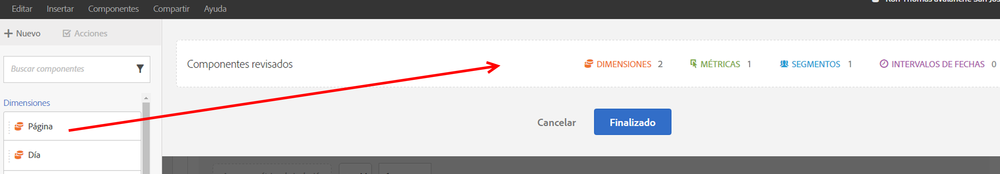
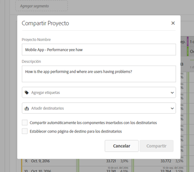

# Resumen de los procesos de curado y del uso compartido

Una depuración le permite limitar los componentes antes de compartir un proyecto. Puede compartir un proyecto y sus componentes con comerciantes y otros perfiles no analistas de su negocio. Anote y aplique etiquetas a proyectos.

**Descripción general del vídeo**

>[!VIDEO](https://www.youtube.com/watch?v=LJJRskdmlOg&index=79&t=0s&list=PL2tCx83mn7GuNnQdYGOtlyCu0V5mEZ8sS)

**[!UICONTROL Espacio de trabajo]** &gt; **[!UICONTROL Compartir]**&gt; **[!UICONTROL Depurar datos del proyecto]**

## Depurar datos de proyecto

1. Especifique el permiso para crear y depurar proyectos.

   Before creating or curating an Analysis Workspace project, administrators must add you to a [group](https://marketing.adobe.com/resources/help/en_US/reference/?f=groups) with the **[!UICONTROL Analysis Workspace Access]** permission enabled, or to the **[!UICONTROL All Report Access]** user group. ( **[!UICONTROL Admin]** &gt; **[!UICONTROL User Management]** &gt; **[!UICONTROL Groups]**).

1. [Cree y guarde](../../../analyze/analysis-workspace/build-workspace-project/t-freeform-project.md#task_C2C698ACC7954062A28E4784911E6CF2) un proyecto y, a continuación, haga clic en **[!UICONTROL Compartir]** &gt; **[!UICONTROL Depurar datos]** del proyecto.
1. Arrastre los componentes que desea compartir de la pila de componentes arrastrables de la izquierda al campo **[!UICONTROL Componentes depurados].**

   

   >[!IMPORTANT]
   >
   >No es necesario depurar componentes para compartir un proyecto. Puede compartir un proyecto con todos los componentes predeterminados disponibles o con los componentes seleccionados. To preserve all of the default components in a project, a best practice is to create a copy of a project for yourself (using **[!UICONTROL Save As]**) prior to curating components. Una vez depurados los componentes de un proyecto, los demás componentes ya no están disponibles para ese proyecto.

1. Haga clic en **[!UICONTROL Finalizado]**.

El proyecto que se obtiene se comporta como un proyecto típico en Analysis Workspace, pero solo con los componentes especificados para elegir.

## Compartir un proyecto depurado

Al compartir hace que este proyecto esté disponible para otros usuarios de Analysis Workspace de su organización. Cualquier depuración que realice se verá reflejada cuando los demás usuarios utilicen el proyecto.

1. After you curate the components of a report, click **[!UICONTROL Share]** &gt; **[!UICONTROL Share Project]**.

   

1. Agregue destinatarios.
1. Si lo desea, puede compartir componentes del proyecto incrustados (segmentos, métricas calculadas e intervalos de fechas) con todos los destinatarios. Después de compartirse, estos componentes aparecerán en el menú desplegable de componentes de Workspace del destinatario.

   >[!IMPORTANT]
   >
   >Esta configuración no persiste: es una acción única en el momento de compartir.

1. Si lo desea, puede establecer esta página como página de aterrizaje para destinatarios.

   >[!IMPORTANT]
   >
   >Esta configuración no persiste: es una acción única en el momento de compartir.

1. Haga clic en **[!UICONTROL Compartir]**.

<!-- 

 <b>Annotate and tag a project</b> 
 

An alternative way to collaborate on a project is to use the Information panel. This panel will be re-introduced in an upcoming release. 
 

 
 
<ul id="ul_EFD045FD9F3B4BF8A70637B00EE0BC9C"> 
 <li id="li_EC6C5EAF9C234E76BDA7FF0226B82083">Tag reports for sharing. </li> 
 <li id="li_CF6A438C55F847F8890F8CB674CAA4F7">Specify the recipient (filter by permission group or user name), the storage folder. In-product notifications let users know that they have a shared report waiting. </li> 
 <li id="li_C8E088DA43024277908705CB0F3A142A">Write messages or report descriptions for recipients. </li> 
 <li id="li_342EB4758C344B859757E23691068FA3"> Select the dimensions, metrics, and segments to recommend to a non-analyst colleague, who can view the report you are curating and sharing. Curating the component gives the recipient access to those components, based on their permission settings. </li> 
 <li id="li_6487500F9315481599B7F3897998879F"> Add suggested items to a previously configured report. These new items exist as recommended selectable options. </li> 
</ul>

 -->

