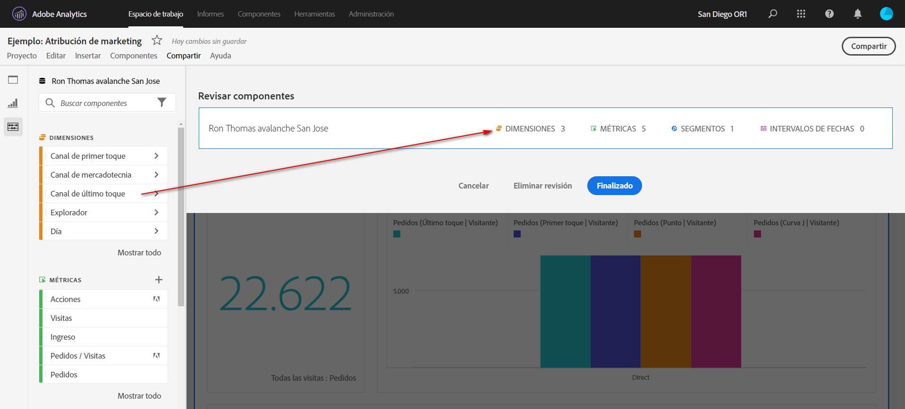

# Depurar proyectos de

La depuración permite limitar los componentes (dimensiones, métricas, segmentos e intervalos de fechas) antes de compartir un proyecto. Cuando un destinatario abre el proyecto, ve un conjunto limitado de componentes que ha seleccionado para ellos. La depuración es un paso opcional pero recomendado antes de compartir un proyecto.

>[!NOTE]
> Los perfiles de productos son el mecanismo principal que controla los componentes que puede ver un usuario. Se administran a través de Admin Console en Adobe Experience Cloud. La depuración es un filtro secundario.

>[!BEGINSHADEBOX]

Vea  [Depurar proyectos](https://video.tv.adobe.com/v/24711?quality=12&learn=on){target="_blank"} para ver un vídeo de demostración.

>[!ENDSHADEBOX]

## Aplicar depuración de proyecto

1. Seleccione **[!UICONTROL Compartir]** > **[!UICONTROL Depurar datos de proyectos]**.
Los componentes que se utilizan en el proyecto se añaden automáticamente.
Si un proyecto tiene varios grupos de informes, verá un destino de colocación depurada para cada grupo de informes en el proyecto.
1. (Opcional) Para agregar más componentes, arrastre los componentes que desee compartir desde el panel izquierdo a la zona de colocación de **[!UICONTROL Depurar componentes]** para la vista de datos.
1. Seleccione **[!UICONTROL Listo]**.

Cuando un destinatario abre un proyecto depurado, solo ve el conjunto depurado de componentes que ha definido:

## Eliminar depuración del proyecto

Para eliminar la depuración del proyecto y restaurar el conjunto completo de componentes en el carril izquierdo:

1. Seleccione **[!UICONTROL Compartir]** > **[!UICONTROL Depurar datos de proyectos]**.
1. Seleccione **[!UICONTROL Quitar revisión]**.
1. Seleccione **[!UICONTROL Listo]**.

## Depuración del grupo de informes virtuales

Para aplicar la depuración a nivel de grupo de informes, de modo que se aplique a muchos proyectos a la vez, puede [depurar componentes en un grupo de informes virtuales](https://experienceleague.adobe.com/en/docs/analytics/components/virtual-report-suites/vrs-components).

>[!NOTE]
>
> La depuración de grupos de informes virtuales siempre se aplica antes de la depuración de proyectos. Aunque el proyecto depurado incluya determinados componentes, se filtrarán si el grupo de informes virtuales depurado no incluye estos componentes.
> 

## Opciones de depuración de componentes

En un proyecto depurado o grupo de informes virtuales, el destinatario tiene la opción de **[!UICONTROL Mostrar todos]** los componentes en el carril izquierdo. [!UICONTROL Mostrar todo] revela diferentes conjuntos de componentes, según:

* Nivel de permiso del usuario (administrador o no administrador)
* Función del proyecto (propietario/editor o no)
* Tipo de depuración aplicada (grupo de informes virtual o proyecto)
* Componentes propiedad del usuario o que el usuario ha compartido. Entre los componentes propios o compartidos se incluyen los segmentos, las métricas calculadas y los intervalos de fechas. No incluyen componentes implementados, como eVars, props y eventos personalizados.

Nota: Las funciones de vista que no son de administración no tendrán acceso al carril izquierdo del proyecto, por lo que se han omitido de la tabla siguiente.

| Tipo de depuración | Administradores | Propietario del proyecto no administrador o función de edición | Función duplicada no perteneciente a administración |
|---|---|---|---|
| **Grupo de informes virtuales depurado** | Todos los componentes no depurados del grupo de informes virtuales | Componentes de grupo de informes virtuales no depurados que pertenecen a esta función o que se compartieron con esta función | Componentes de grupo de informes virtuales no depurados que pertenecen a esta función o que se compartieron con esta función |
| **Proyecto depurado** | Todos los componentes de proyecto no depurados | Todos los componentes de proyecto no depurados | Componentes de proyecto no depurados que pertenecen a esta función o que se compartieron con esta función |
| **Proyecto depurado en un grupo de informes virtuales depurado** | Todos los componentes no depurados, mostrados bajo **[!UICONTROL Componentes de proyecto no depurados]** y **[!UICONTROL Componentes de grupos de informes virtuales no depurados]** | Todos los componentes no depurados del proyecto Y los componentes no depurados del grupo de informes virtuales que pertenezcan a esta función o que hayan sido compartidos con ellos | Grupo de informes virtuales y componentes de proyecto no depurados que pertenecen a esta función o que han sido compartidos con ellos |
