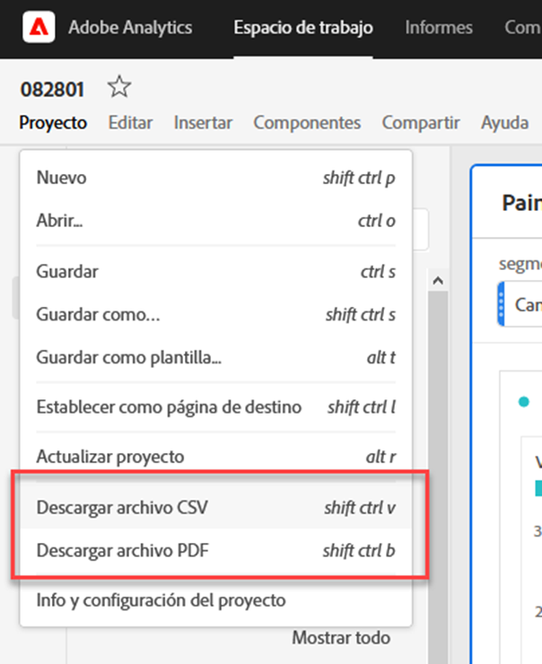
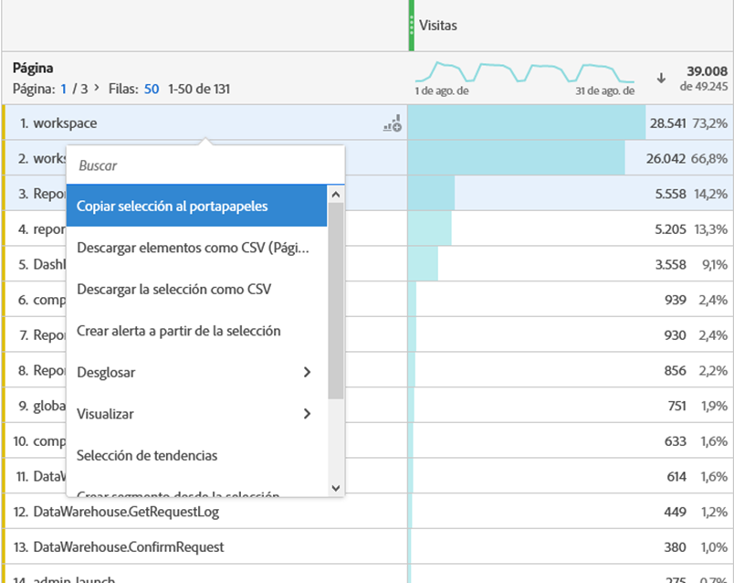
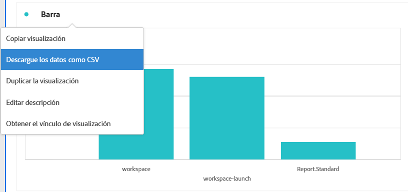
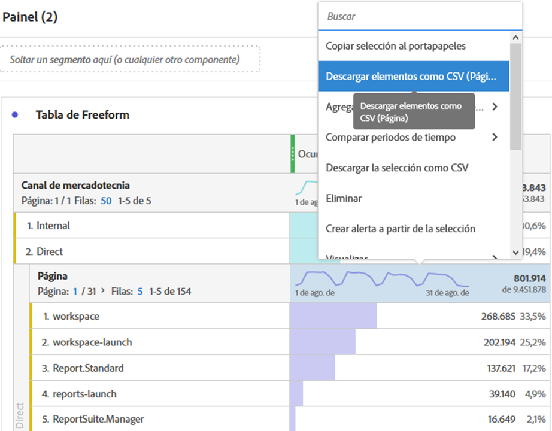
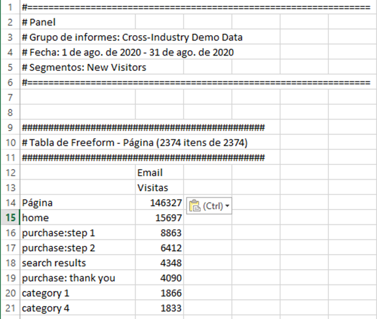

# Descargar proyectos y datos

Puede descargar proyectos y datos de Analysis Workspace en su dispositivo local. Esta descarga puede copiarse en datos, en un archivo CSV (datos de valores separados por comas) o en un documento PDF (formato de documento portátil).

* Seleccione la opción PDF si desea que las visualizaciones se incluyan en el archivo descargado.
* Seleccione las opciones CSV y datos copiados si solo necesita datos de texto sin formato.

En la [Guía de exportación](/help/export/home.md) se describen métodos adicionales para exportar datos de Adobe Analytics.

## Descargar un proyecto como archivo PDF o CSV {#download-project}

### Descargar un proyecto como archivo de PDF

Tenga en cuenta lo siguiente al descargar un proyecto como PDF:

* No abandone el proyecto hasta que el proyecto se descargue en la estación de trabajo. La descarga puede tardar varios minutos en ejecutarse de nuevo en los servidores de Adobe para que PDF pueda procesarse. Puede seguir realizando cambios en el proyecto mientras se procesa la descarga. Si un PDF tarda más de 5 minutos en procesarse, se le pedirá que [envíe por correo electrónico el PDF](../curate-share/send-schedule-files.md).
* Las descargas se representan como una sola página sin paginación.
* PDF contiene lo que es visible en la página del explorador en Analysis Workspace. Para evitar que el contenido se trunque, seleccione  para cambiar automáticamente el tamaño de las visualizaciones o paneles de tamaño personalizado.
* Se puede hacer clic en [hipervínculos](/help/analyze/analysis-workspace/visualizations/freeform-table/freeform-table-hyperlinks.md) dentro de tablas de forma libre en el PDF descargado.

Para descargar un proyecto como archivo de PDF:

1. Seleccione **[!UICONTROL Proyecto]** > **[!UICONTROL Descargar PDF]**.

   Aparece una barra verde con el siguiente mensaje:  **[!UICONTROL Se ha solicitado su descarga. Espere.]**

1. En cuanto la descarga esté lista, aparecerá una barra verde con el siguiente mensaje:  **[!UICONTROL *El nombre del proyecto *PDF está listo.]**

1. Seleccione **[!UICONTROL Descargar]** en la barra verde.

   Según la configuración del explorador, PDF se descarga automáticamente en la carpeta que configuró anteriormente, o se le pedirá que elija una carpeta en la que se descargará PDF.

   El nombre de archivo está compuesto por *nombre de proyecto* - *nombre del grupo de informes* - *fecha*. Por ejemplo, `Example Project - Omni-Channel - Luma - Jun 30, 2025.pdf`.

### Descarga de un proyecto como archivo CSV

1. Seleccione **[!UICONTROL Proyecto]** > **[!UICONTROL Descargar CSV]**.

   Según la configuración del explorador, el archivo CSV se descarga automáticamente en una carpeta que haya configurado anteriormente, o bien se le pedirá que elija una carpeta en la que se descargará el archivo CSV.

   El nombre de archivo está compuesto por *nombre de proyecto* - *nombre del grupo de informes* - *fecha*. Por ejemplo, `Example Project - Omni-Channel - Luma - Jun 30, 2025.csv`.

## Copiar datos de una visualización en el portapapeles {#copy-data}

La opción **[!UICONTROL Copiar al portapapeles]** del menú contextual le permite copiar rápidamente datos de Analysis Workspace y pegarlos en una herramienta de terceros.

* Si desea que se copien los datos de tabla mostrados, seleccione el encabezado de tabla y seleccione **Copiar datos al portapapeles** en el menú contextual.
* Si desea que se copie un subconjunto de los datos, realice una selección en la tabla y seleccione **Copiar selección al portapapeles** en el menú contextual.

>[!TIP]
>
>Puede usar la tecla de acceso directo **_cmd + c_** (macOS) o **_ctrl + c_** (Windows) para copiar la selección en el portapapeles. A continuación, use **_cmd + v_** (macOS) o **_ctrl + v_** (Windows) para pegar los datos.

{zoomable="yes"}

## Descarga de datos dentro de una visualización como archivo CSV {#download-data}

Las opciones Descargar como CSV del menú contextual le permiten descargar una tabla de datos o la fuente de datos de cualquier visualización como CSV.

Para ello, haga lo siguiente:

* En el encabezado de cualquier tabla o visualización, seleccione **[!UICONTROL Descargar datos como CSV]** en el menú contextual. Esto descarga los datos mostrados en la tabla o la fuente de datos subyacente para una visualización como CSV. 

<!-- Only relevant as soon as CJA supports Map visualization 
  >[!NOTE]
  >
  >  Note: the Map visualization does not support this option.
-->

* En una tabla, seleccione **[!UICONTROL Descargar selección como CSV]** en el menú contextual. Solo la selección se descarga con esta opción, a diferencia de la tabla mostrada completa.

## Descargar elementos como archivo CSV {#download-items}

Si desea analizar más de las 400 filas de datos visibles en una tabla, seleccione **Descargar elementos como CSV (_Dimension name_)** en el menú contextual del encabezado de tabla o de cualquier fila. Esta opción exporta hasta 50 000 elementos de dimensión (según la clasificación de la tabla) para la dimensión seleccionada, con opciones de clasificación y filtros aplicados. Si selecciona esta opción en la parte superior de la tabla, se exporta la primera dimensión de la tabla.

No se aplican límites en la tabla de forma libre. Para garantizar un rendimiento óptimo, se recomienda utilizar esta opción en tablas con menos de 20 columnas.

>[!TIP]
>
> Si la dimensión supera los 50 000 elementos, descargue el archivo con diferentes métricas de ordenación aplicadas o aplique un segmento. Por ejemplo, ordenar de forma descendente por Visitas en una descarga y, a continuación, ascendente por Visitas en una segunda descarga. Esta sugerencia puede ayudarle a recuperar elementos de mayor longitud.

Puede realizar varias tareas dentro del proyecto e incluso desplazarse a un nuevo proyecto de Workspace en la misma pestaña mientras la descarga está en curso. La descarga se detendrá si abre una nueva pestaña del explorador. La descarga se cancelará si deja Workspace por completo o si cierra la pestaña del explorador.

### Archivo de elementos descargados {#items-file}

Las siguientes funciones de una tabla de forma libre se aplican al archivo descargado:

* Todos los segmentos del panel se aplican como filtros.
* Los desgloses **superiores** a la dimensión seleccionada en la tabla se aplican como filtros encima de cada columna.
* Los desgloses **inferiores** a las dimensiones seleccionadas en la tabla se eliminan.

### Descarga de notificaciones {#notifications}

A medida que el archivo se descarga, verá las siguientes notificaciones:

* Se ha solicitado un **[!UICONTROL _nombre de tabla _-_Dimension _.csv azul._x _% completado]**&#x200B;que indica el progreso. Para cancelar la descarga en cualquier momento, selecciona **[!UICONTROL Cancelar descarga]**. Seleccione  si desea cerrar el mensaje, lo que no cancela la descarga.
* Se ha descargado una notificación de finalización verde **[!UICONTROL _Table name _-_Dimension _.csv]**&#x200B;una vez que se haya completado la descarga del archivo. El archivo se descarga en la carpeta de descargas configurada para su explorador.

Si solicita más de una descarga a la vez, recibirá una notificación avisando que cada descarga adicional se pone en cola hasta que finalice la descarga anterior.

## Preguntas frecuentes {#faq}

| Pregunta | Respuesta |
| --- | --- |
| ¿Por qué mi PDF descargado consiste en una sola página? | La funcionalidad [Descargar PDF](#download-as-csv-or-pdf) no pagina los archivos PDF descargados. |
| ¿Puedo exportar más de 50 000 elementos con la opción **[!UICONTROL Descargar elementos como CSV]**? | Aunque cada descarga puede contener hasta 50 000 elementos de dimensión, puede cambiar el tipo de tabla para recuperar elementos de cola más largos o aplicar un filtro para descargar elementos más específicos. |
| ¿Qué hace **[!UICONTROL Copiar visualización]**? | A diferencia de [!UICONTROL **Copiar datos al portapapeles**] o [!UICONTROL **Copiar selección al portapapeles**], la opción de menú contextual **[!UICONTROL Copiar visualización]** no es una opción de exportación. Esta opción le permite [copiar una visualización](/help/analyze/analysis-workspace/visualizations/freeform-analysis-visualizations.md#context-menu) o [copiar un panel](/help/analyze/analysis-workspace/c-panels/panels.md#context-menu) de un lugar de Workspace a otro. Por ejemplo, de un panel a otro en el mismo proyecto o de un proyecto a otro. |

<!--

# Download 

There are several ways to export data from Analysis Workspace. The method you choose depends on what set of data you want to analyze and who needs to access it.

Exported data can be in the form of copied data, CSV, or PDF. A PDF is typically preferred if you want visualizations included in the file. CSV and copied data is preferred if you simply want plain-text data.

## Download a project as CSV or PDF {#download-project}

Consider the following when downloading projects:

* When downloading projects as a CSV or PDF, the project can be saved or unsaved when you request a project download. However, only saved projects can be [scheduled](/help/analyze/analysis-workspace/curate-share/t-schedule-report.md). 

* When downloading projects as a PDF:
  * Downloads can take several minutes to export because the project is re-run on Adobe servers before rendering in PDF format. We recommend not leaving the project until the PDF downloads in your browser. However, you can continue to make changes to the project while you wait. If a PDF takes longer than 5 minutes to render, you will be prompted to email it instead.
  * Downloads are rendered as a single page with no pagination applied.
  * PDF renderings contain what is on the page in Workspace. If a project has custom-sized visualizations and panels, you need to change them to be auto-sized (button in top-right corner) so that there will be no truncated content.
  * Any [hyperlinks](/help/analyze/analysis-workspace/visualizations/freeform-table/freeform-table-hyperlinks.md) that exist within freeform tables are not functional in the downloaded PDF. 

To download a project as a CSV or PDF file:

1. Do either of the following, depending on what format you want to download the project in:

   * **PDF:** Select **[!UICONTROL Project]** > **[!UICONTROL Download PDF]**.

     Choose this option if you want the downloaded file to contain all the displayed (visible) tables and visualizations in the project.

   * **CSV:** Select **[!UICONTROL Project]** > **[!UICONTROL Download CSV]**. 

     Choose this option if you want plain-text data.

   

1. (Conditional) If you chose to download a PDF, a message is shown after the project is ready to be downloaded. Click [!UICONTROL **Download**].
1. Click the **[!UICONTROL Download this file]** icon and save the file to a folder of your choice.

## Copy data to clipboard (hotkey: cmd + c) {#copy-data}

The right-click option **[!UICONTROL Copy to clipboard]** lets you quickly copy data from Workspace and paste it in a third-party tool. 

* If you want the displayed table copied, right-click the table header and choose **Copy data to clipboard**. 
* If you want a subset of data copied, make a selection in the table and then right-click > **Copy selection to clipboard**.

>[!TIP]
>
>You can use the hotkey `Ctrl+C` to copy your selection to the clipboard, then use `Ctrl+V` to paste it into a third-party tool.

## Download data as CSV {#download-data}

The right-click option **[!UICONTROL Download data as CSV]** allows you to download a table of data or the data source of any visualization as a CSV.

* From the header of any table or visualization, right-click and choose **[!UICONTROL Download data as CSV]**. This downloads the displayed data in the table or the underlying data source for a visualization as a CSV. 

  >[!NOTE]
  >
  >  Note: the Map visualization does not support this option.

* Within a table, right-click and choose **[!UICONTROL Download selection as CSV]**. Only the selection is downloaded with this option, as opposed to the full, displayed table.

## Download items as CSV {#download-items}

If you want to analyze more than the visible 400 rows of data in a table, right-click the table header or any row and select **Download items as CSV (_Dimension name_)**. This option exports up to 50,000 dimension items (based on the table sort) for the selected dimension, with filters and segments applied. If you chose this option from the top of the table, the first dimension in the table will be exported. While no limits are enforced in the freeform table, it is recommended that the Download items option be used in tables with less than 20 columns to ensure optimal performance.

>[!TIP]
>
> If your dimension exceeds 50,000 items, download the file with different sort metrics applied or apply a filter. For example, sort descending by Visits in one download and then ascending by Visits in a second download. This tip can help you retrieve longer-tail items.

You can multi-task within the project and even navigate to a new Workspace project in the same tab while the download is in progress. The download pauses if you open a new browser tab. The download is canceled if you leave Workspace completely or close the browser tab.

### Downloaded items file 

Features of the table will be applied to the downloaded file as follows:

* All panel segments are applied as filters.
* Breakdowns **above** the selected dimension in the table are applied as filters above each column. 
* Breakdowns **below** the selected dimension in the table are removed.

In the example above, Page items are downloaded with the panel segment (New Visitors Customers) and components above (Marketing Channel = Email) applied as filters, and the components below (Mobile Device Type) removed from the downloaded CSV.

### Download notifications

As the file downloads, you will see an informational notification with the progress. At any time, you can cancel the download by clicking **[!UICONTROL Cancel download]**. Closing the toast **will not** cancel the download. 

Once the file completes, you will see a completion notification and the file will download to your browser.

If you request more than one download at a time, you will receive a notification that each additional download will be queued until the prior download completes.

## FAQ {#faq}

| Question | Answer |
| --- | --- |
| Why is my downloaded PDF one page? | Workspace does not paginate downloaded PDFs at this time. |
| Can I export more than 50,000 items with the "Download items as CSV" option? | While each download can contain up to 50,000 dimension items, you can change the sort of your table to retrieve longer tail items, or apply a filter to download more specific items. |
| What does **[!UICONTROL Copy visualization]** do? | Unlike [!UICONTROL **Copy data to clipboard**] or [!UICONTROL **Copy selection to clipboard**], the **[!UICONTROL Copy visualization]** right-click option is not an export option. It allows you to copy a visualization or panel from one place in Workspace to another. For example, from one panel to another in the same project, or from one project to another project. [Intra-linking video](https://experienceleague.adobe.com/docs/analytics-learn/tutorials/analysis-workspace/visualizations/intra-linking-in-analysis-workspace.html?lang=es) |

-->