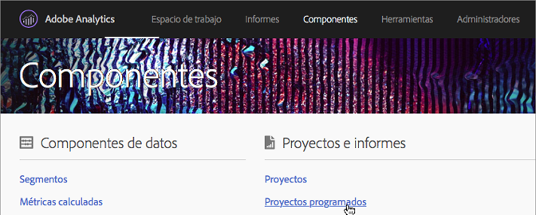
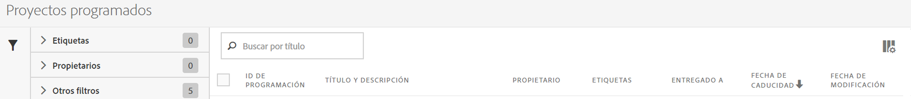

# Administrador de proyectos programados

Gestione proyectos programados de Analysis Workspace.

**[!UICONTROL Analytics]** &gt; **[!UICONTROL Componentes]** &gt; **[!UICONTROL Proyectos programados]**.

En el Administrador de programación de informes, puede editar y eliminar los envíos periódicos de proyectos. Puede crear programas de entregas que envíen los informes por correo electrónico a una dirección especificada. Puede configurar los programas a fin de que los informes se envíen automáticamente a intervalos especificados por un periodo de tiempo o indefinidamente, o bien para que se detenga el envío de un proyecto recurrente.

El Administrador de proyectos programados muestra los artículos que ha creado un usuario específico. Si la cuenta del usuario está desactivada en la aplicación, se detienen todos los envíos programados.

* Editar proyectos programados.
* Ver el ID de programación de un proyecto (se utiliza principalmente para la depuración).
* Buscar proyectos programados.
* Etiquetar proyectos programados.
* Especificar/cambiar el propietario de proyectos programados.
* Agregar otros filtros, como Aprobado, Fallido, Favoritos, Míos, Mostrar todo y Proyectos caducados.

* Definir una fecha de caducidad para los proyectos programados.

