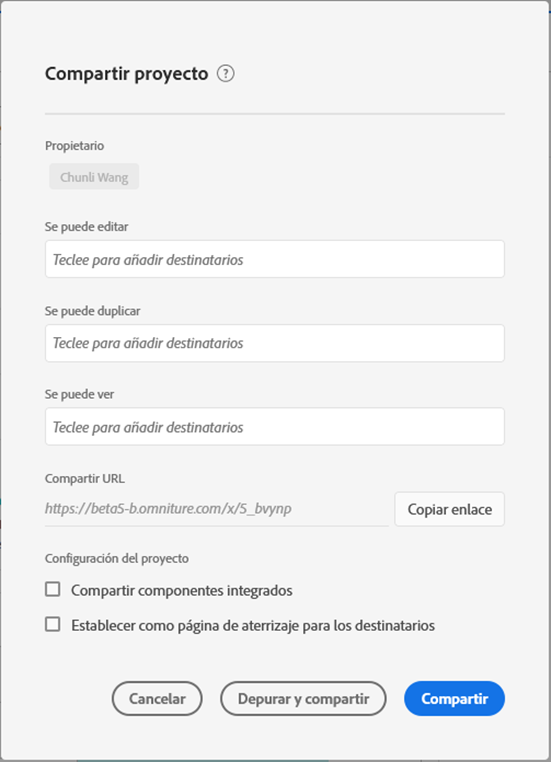
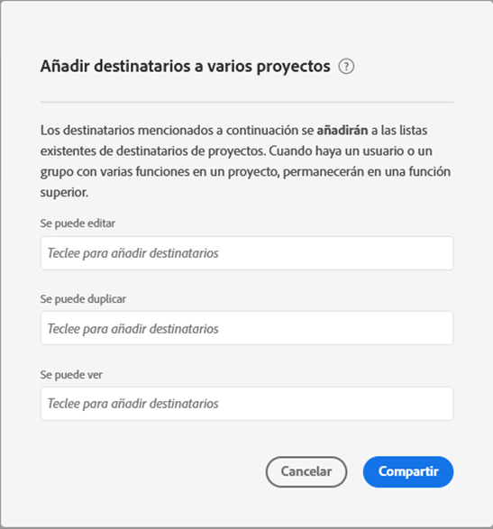

# Uso compartido de proyectos

Puede compartir un proyecto de Analysis Workspace con los siguientes tipos de personas:

* Usuarios y grupos de la organización que tienen acceso a Adobe Analytics

* Usuarios y grupos de su organización que no tienen acceso a Adobe Analytics

* Personas fuera de la organización

Cualquiera [depuración](curate.md) la aplicación anterior al uso compartido se refleja cuando los destinatarios abren el proyecto.

A continuación se muestra un vídeo introductorio del uso compartido de proyectos:

>[!VIDEO](https://video.tv.adobe.com/v/36207/?quality=12)

## Compartir con usuarios y grupos de Adobe Analytics en su organización {#Add}

Puede compartir un proyecto con usuarios o grupos de Adobe Analytics existentes de su organización. Cuando comparta un proyecto como se describe en esta sección, los usuarios con los que comparta ya deben tener una cuenta de Adobe Analytics.

Puede compartir una función específica con usuarios o grupos, o bien compartir un vínculo.

* [Compartir una función de proyecto específica](#share-a-specific-project-role)

* [Compartir un vínculo a un proyecto](#share-a-link-to-a-project)

### Compartir una función de proyecto específica

Cuando comparta una función de proyecto específica con usuarios y grupos de su organización, tenga en cuenta lo siguiente:

* Funciones de proyecto (**[!UICONTROL Puede editar]**, **[!UICONTROL Puede duplicarse]** y **[!UICONTROL Puede ver]**) están vinculados al usuario y al ID de proyecto específico. Las funciones de proyecto son independientes de los permisos de usuario administrados en [Admin Console de Adobe Experience Cloud](https://experienceleague.adobe.com/docs/core-services/interface/manage-users-and-products/admin-getting-started.html?lang=es).

* En Adobe Analytics, los grupos se definen mediante perfiles de producto en [Admin Console de Adobe Experience Cloud](https://experienceleague.adobe.com/docs/core-services/interface/manage-users-and-products/admin-getting-started.html?lang=es). Los administradores pueden compartir con cualquier grupo, incluido &quot;Todos&quot;. Los no administradores pueden compartir con cualquier grupo al que pertenezcan, con la excepción de &quot;Todos&quot;.

* Un usuario que se coloca en varias funciones siempre obtiene la experiencia más alta. Esto puede ocurrir si se agrega un usuario como individuo y como parte de un grupo. Por ejemplo, si a un usuario se le da la variable **[!UICONTROL Puede editar]** función individual y **[!UICONTROL Puede ver]** como miembro de un grupo, recibirán un **[!UICONTROL Puede editar]** experiencia del proyecto.

* Los administradores se colocan en la **[!UICONTROL Puede duplicarse]** o **[!UICONTROL Puede ver]** reciben esas experiencias limitadas cuando abren un proyecto. Si lo desea, un administrador puede aumentar su función a **[!UICONTROL Puede editar]** en cualquier momento mediante **[!UICONTROL Componentes] > [!UICONTROL Proyectos]**.

Para compartir una función de proyecto específica con usuarios o grupos de su organización:

1. Vaya al proyecto que desea compartir y, a continuación, haga clic en **[!UICONTROL Compartir]** > **[!UICONTROL Compartir proyecto]**. <!-- recommned changing "Share project" to "Share project internally" or something like that -->
Si hay cambios sin guardar, se le pedirá que guarde primero el proyecto.

   

   Para obtener información sobre cómo compartir varios proyectos simultáneamente, consulte [Compartir proyectos en el administrador de proyectos](#share-projects-in-the-project-manager).

1. Agregue destinatarios o grupos de destinatarios en uno de los campos de función proporcionados:

   **Puede editar:** Los destinatarios pueden **[!UICONTROL Guardar]** cambios en un proyecto y una función como copropietarios. Esta función resulta útil si desea administrar un proyecto conjuntamente con otros compañeros. Esto incluye editar, eliminar y modificar listas de destinatario para un proyecto compartido.  Nota: Actualmente, Analysis Workspace no admite la colaboración en tiempo real, por lo que se recomienda que solo un usuario edite un proyecto a la vez. Si los proyectos se guardan al mismo tiempo, se conservará la última versión.

   **Puede duplicar:** Los destinatarios pueden **[!UICONTROL Guardar como]** y tienen acceso al carril izquierdo. Las interacciones del proyecto no están limitadas en esta función. Esta función es útil si desea compartir un proyecto con usuarios que comprendan los datos de su organización y cómo usar Analysis Workspace, pero no desea que el proyecto se modifique.

   **Se puede ver:** Los destinatarios no pueden **[!UICONTROL Guardar]** o **[!UICONTROL Guardar como]** y no tienen acceso al carril izquierdo. Las interacciones del proyecto también están limitadas. Esta función es útil si desea compartir un proyecto con usuarios menos familiarizados con la estructura de datos de su organización, Analysis Workspace o Adobe Analytics en general. Sin embargo, aún desea que consuman datos y perspectivas en un entorno seguro. Obtenga más información sobre la [la función de proyecto “Puede ver”](/help/analyze/analysis-workspace/curate-share/view-only-projects.md).

1. Elija si desea habilitar las siguientes opciones al compartir el proyecto:

   * **Compartir componentes de proyecto incrustados:** Comparte segmentos, métricas calculadas e intervalos de fechas con todos los destinatarios. Después de compartirlos, estos componentes aparecerán en el menú desplegable de componentes de Workspace del destinatario. Esta configuración no se mantiene: se trata de una acción única en el momento de compartir.

   * **Establecer como página de aterrizaje para destinatarios:** Establece esta página como página de aterrizaje para destinatarios. Esta configuración no se mantiene: se trata de una acción única en el momento de compartir.

1. Haga clic en **[!UICONTROL Compartir]**.
También puede hacer clic en **[!UICONTROL Depurar y compartir]** para aplicar la depuración del proyecto automáticamente. Si un proyecto ya se ha compartido, estos botones indicarán **[!UICONTROL Actualizar]** y **[!UICONTROL Depurar y actualizar]**. Obtenga más información sobre la [depuración del proyecto](https://experienceleague.adobe.com/docs/analytics/analyze/analysis-workspace/curate-share/curate.html?lang=es).

### Compartir un vínculo a un proyecto

Cuando comparta un vínculo como se describe en esta sección, tenga en cuenta lo siguiente:

* Los destinatarios que utilicen el vínculo deben iniciar sesión en Adobe Analytics antes de obtener acceso al proyecto.

* Si a un destinatario no se le asigna una función y recibe una [vínculo](https://experienceleague.adobe.com/docs/analytics/analyze/analysis-workspace/curate-share/shareable-links.html?lang=es) al proyecto (**[!UICONTROL Compartir] > [!UICONTROL Obtener vínculo del proyecto]**), se les asigna una función de forma predeterminada. Los administradores reciben la función **[!UICONTROL Puede editar]** y los usuarios no administradores reciben la función **[!UICONTROL Puede duplicar]**.

Para compartir el vínculo del proyecto con los usuarios de su organización:

1. Haga clic en **[!UICONTROL Compartir]** > **[!UICONTROL Compartir proyecto]**. <!-- recommned changing "Share project" to "Share project internally" or something like that -->
Si hay cambios sin guardar, se le pedirá que guarde primero el proyecto.

   

1. Haga clic en **[!UICONTROL Copiar vínculo]** junto a la variable **[!UICONTROL Campo Compartir URL]**.

1. Comparta el vínculo con los usuarios de su organización. Por ejemplo, puede pegarlo en un correo electrónico, en un sitio web interno, etc.

## Compartir un vínculo público con cualquier persona (no se requiere inicio de sesión) {#share-public-link}

{{release-limited-testing-section}}

Puede compartir proyectos de Analysis Workspace con personas que no tengan acceso a Adobe Analytics. Esto puede incluir:

* Personas fuera de la organización

* Personas de su organización que no están aprovisionadas con Adobe Analytics

>[!NOTE]
>
>El administrador de Analytics puede deshabilitar esta opción, tal como se describe en [Preferencias](/help/analyze/analysis-workspace/user-preferences.md). Si no puede compartir un vínculo público como se describe en esta sección, su administrador de Analytics ha desactivado esta capacidad.

Para compartir un vínculo público a un proyecto de Analysis Workspace:

1. Abra el proyecto de Analysis Workspace que desee compartir.

1. Haga clic en **[!UICONTROL Compartir]** > **[!UICONTROL Compartir vínculo público]**.

   Si hay cambios sin guardar, se le pedirá que guarde el proyecto.

   <!-- Add screen shot of new modal -->

1. Active la variable **[!UICONTROL Vínculo activo]** si no está activada.

1. Elija si desea habilitar las siguientes opciones de seguridad (el administrador de Analytics puede controlar estas opciones):

   * **[!UICONTROL Requerir autenticación de inicio de sesión único (SSO)]:**

      Requiere que las personas con el vínculo se autentiquen mediante SSO antes de obtener acceso al proyecto compartido. Seleccione esta opción si desea que el proyecto solo sea accesible para los usuarios de su organización.

      Los administradores de Analytics pueden establecer esta preferencia para la empresa, tal como se describe en [Preferencias](/help/analyze/analysis-workspace/user-preferences.md). Puede encontrar las siguientes situaciones, según la configuración del administrador de esta opción:

      * Si esta opción no está visible, SSO no está habilitado para su organización o el administrador de Analytics no habilitó esta función.

      * Si esta opción está habilitada y atenuada, el administrador de Analytics requiere autenticación SSO para acceder a todos los vínculos públicos.
   * **[!UICONTROL Requerir contraseña]:** Se requiere que las personas con el vínculo especifiquen una contraseña antes de acceder al proyecto de Analysis Workspace. Esto proporciona un nivel adicional de seguridad al proyecto.

      Si selecciona esta opción, especifique una contraseña. Recuerde compartir esta contraseña junto con el vínculo del proyecto cuando lo comparta con otros usuarios. <!--go through this workflow and see how it works.-->

      Si esta opción está habilitada y atenuada, el administrador de Analytics requiere que todos los vínculos públicos estén protegidos con contraseña. Los administradores de Analytics pueden establecer esta preferencia para la empresa, tal como se describe en [Preferencias](/help/analyze/analysis-workspace/user-preferences.md).

1. Al lado de la variable **[!UICONTROL Compartir con cualquier persona (no se requiere inicio de sesión)]** , haga clic en el botón **Copiar vínculo** para copiar el vínculo en el portapapeles del sistema.

1. Comparta el vínculo con las personas a las que desee tener acceso al proyecto. Por ejemplo, puede pegar el vínculo en un correo electrónico.

   Cualquier persona con la que comparta el vínculo puede ver el proyecto de Analysis Workspace. Si elige requerir una contraseña, también debe compartir la contraseña con cualquiera que desee acceder al vínculo.

1. Select **[!UICONTROL Cerrar]** para cerrar el cuadro de diálogo compartir. Los cambios se guardan automáticamente. <!-- True? -->

## Compartir proyectos en el administrador de proyectos {#Manager}

Los proyectos también se pueden compartir desde **[!UICONTROL Componentes] > [!UICONTROL Proyectos]**. Un solo proyecto se puede compartir siguiendo los mismos pasos descritos anteriormente.  Si se seleccionan varios proyectos para compartirlos, se agregarán destinatarios a la lista de destinatarios existente para cada proyecto.

Por ejemplo:

* El proyecto A se comparte con los destinatarios 1, 2 y 3
* El proyecto B se comparte con los destinatarios 4, 5 y 6

Con el proyecto A y B seleccionado, los destinatarios 4 y 7 se agregan a las listas de uso compartido. La nueva lista de uso compartido para cada proyecto ahora es:

* Proyecto A: 1, 2, 3, 4, 7
* Proyecto B: 4, 5, 6, 7

## Uso compartido de componentes incrustados

A continuación se muestra un vídeo sobre este tema:

>[!VIDEO](https://video.tv.adobe.com/v/24713/?quality=12)

## Preguntas frecuentes {#FAQs}

| Pregunta | Respuesta |
| --- | --- |
| ¿Qué sucede si dos editores guardan un proyecto al mismo tiempo? | Los cambios no se combinan y se conservará la última versión guardada del proyecto. Actualmente, Analysis Workspace no admite la colaboración en tiempo real. |
| Como administrador, ¿qué experiencia de proyecto veré? | Los administradores con una función **[!UICONTROL Puede duplicar]** o **[!UICONTROL Puede ver]** recibirán esas experiencias limitadas cuando abran un proyecto. Si lo desea, un administrador puede aumentar su función a **[!UICONTROL Puede editar]** en cualquier momento mediante **[!UICONTROL Componentes] > [!UICONTROL Proyectos]**. |
| ¿Qué sucede si un destinatario se coloca en una función como individuo y otra como miembro de un grupo? | Si un destinatario se coloca en varias funciones, siempre recibirá la experiencia más alta. Por ejemplo, si a un destinatario se le asigna la función **[!UICONTROL Puede editar]** como individuo y la función **[!UICONTROL Puede ver]** como miembro de un grupo, recibirá una experiencia **[!UICONTROL Puede editar]** en el proyecto. |
| ¿Qué experiencia obtiene un destinatario si abre un vínculo de proyecto? | Los Destinatarios reciben la función que les ha asignado en el modal de uso compartido. Si a un destinatario no se le asigna una función y recibe un vínculo al proyecto (**[!UICONTROL Compartir] > [!UICONTROL Obtener vínculo de proyecto]**), se le asignará una función de forma predeterminada. Los administradores reciben la función **[!UICONTROL Puede editar]** y los usuarios no administradores reciben la función **[!UICONTROL Puede duplicar]**. |
