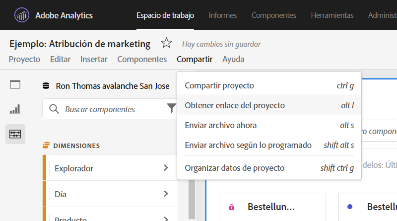
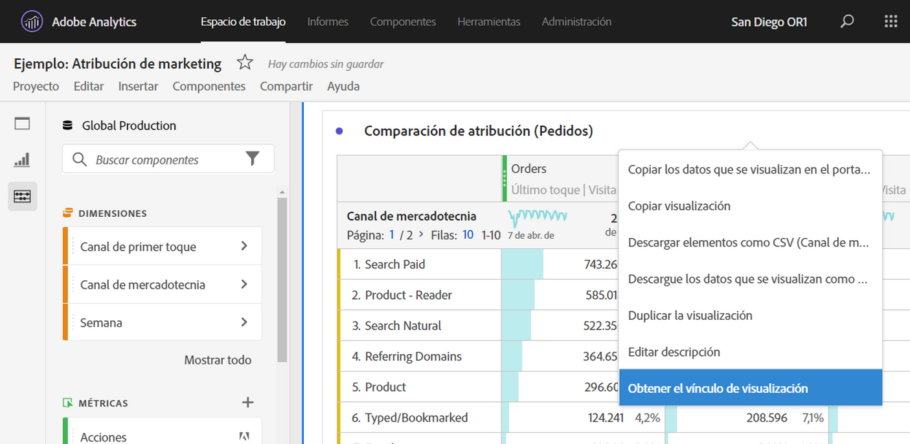

# Crear vínculos que se pueden compartir

Analysis Workspace ofrece varias formas de compartir un proyecto con los usuarios, incluida la posibilidad de obtener un vínculo a un proyecto o a una parte específica de un proyecto. Los usuarios que reciban un vínculo deben iniciar sesión en Adobe Analytics antes de poder acceder al proyecto.

## Obtener vínculo del proyecto {#project-link}

Para compartir un vínculo al proyecto completo, vaya a **[!UICONTROL Compartir > Obtener vínculo del proyecto]**. Si no se ha asignado al destinatario del vínculo una [función de proyecto](https://docs.adobe.com/content/help/es-ES/analytics/analyze/analysis-workspace/curate-share/share-projects.html), los administradores tendrán la función: **[!UICONTROL Puede editar]** y los que no sean administradores: **[!UICONTROL Puede duplicar]**.

## Obtener panel o vínculo de visualización {#panel-link}

También puede compartir un vínculo a una parte específica de un proyecto, como un panel o una visualización individual. Esto se denomina a veces intravínculos. Esto puede resultar útil para atraer la atención de los usuarios hacia perspectivas clave dentro del proyecto.

* Desde cualquier encabezado del panel, haga clic con el botón derecho en **[!UICONTROL Obtener vínculo del panel]**
* Desde cualquier tabla o encabezado de visualización, haga clic con el botón derecho en **[!UICONTROL Obtener vínculo de visualización]**

[Vea el vídeo](https://www.youtube.com/watch?v=lvmAdKNfWQw) sobre cómo crear vínculos y utilizarlos para dirigir destinatarios a partes específicas del proyecto.

## Uso de vínculos en una tabla de contenido {#TOC}

Una sugerencia para aprovechar las distintas opciones de vínculos es incluir siempre una tabla de contenido en la parte superior del proyecto de Workspace. En la tabla de contenido, puede vincular otros proyectos relevantes, paneles específicos y visualizaciones específicas. Esto ayuda al destinatario del proyecto a navegar más fácilmente.

[Vea el vídeo](https://www.youtube.com/watch?v=Xo6fTguWm-M) sobre cómo crear una tabla de contenido mediante vínculos y el editor de texto enriquecido de Workspace.

