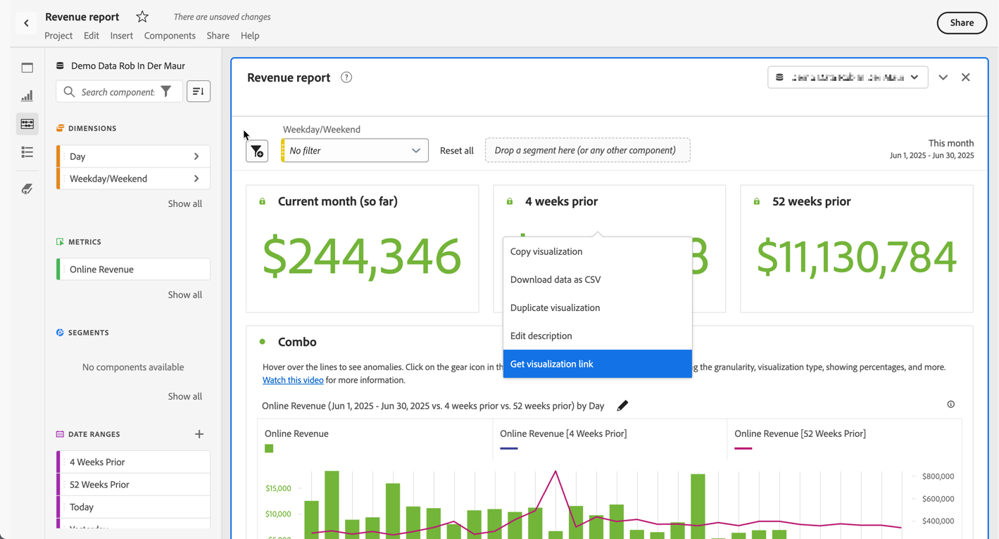
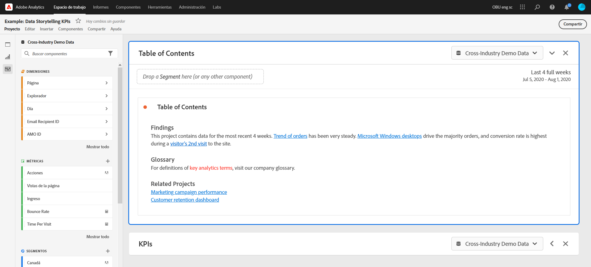
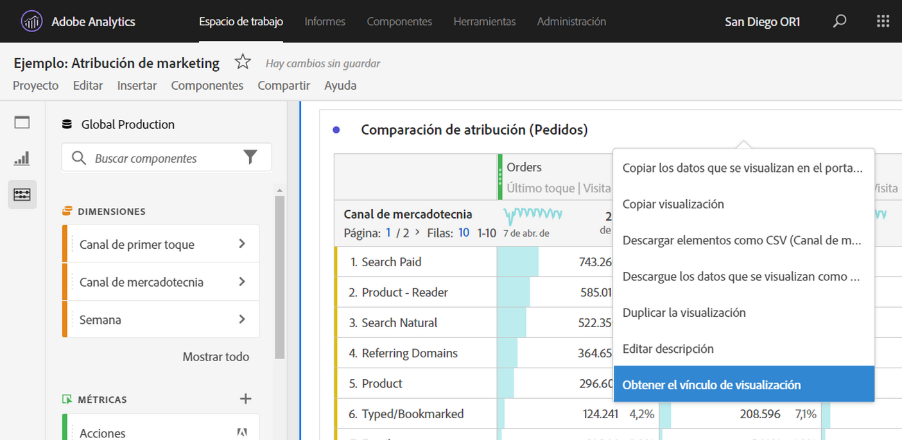

# Crear vínculos que se pueden compartir

Analysis Workspace ofrece varias formas de compartir un proyecto con los usuarios, incluida la posibilidad de obtener un vínculo a un proyecto o a una parte específica de un proyecto. Algunos tipos de vínculos requieren que el destinatario inicie sesión en Adobe Analytics antes de acceder al proyecto, mientras que otros no.

## Obtener un vínculo de proyecto para compartir con otros usuarios de Workspace

Para compartir un vínculo a un proyecto, ve al proyecto que deseas compartir y, a continuación, selecciona ir a **[!UICONTROL Compartir]** > **[!UICONTROL Obtener vínculo del proyecto]** (o **[!UICONTROL Compartir]** > **[!UICONTROL Compartir con usuarios de Workspace]** > **[!UICONTROL Compartir por vínculo]**). Los usuarios con los que comparte el vínculo deben iniciar sesión.

Si el destinatario del vínculo no se ha asignado a [función de proyecto](/help/analyze/analysis-workspace/curate-share/share-projects.md), los administradores recibirán **[!UICONTROL Editar original]** y los usuarios que no sean administradores recibirán experiencias de **[!UICONTROL Editar copia]**.

## Obtener un vínculo de solo lectura para compartir con cualquier persona

Puede compartir un vínculo de solo lectura a proyectos de Analysis Workspace con personas que no tengan acceso a Adobe Analytics.

Para obtener más información, vea [Compartir con alguien](/help/analyze/analysis-workspace/curate-share/share-projects.md#share-a-project-with-anyone-no-login-required).

## Obtener un panel o un vínculo de visualización

También puede compartir un vínculo a una parte específica de un proyecto, como un panel o una visualización individual. Esto se denomina a veces intravínculos. Esto puede resultar útil para atraer la atención de los usuarios hacia perspectivas clave dentro del proyecto.

* En el menú contextual del encabezado de un panel, seleccione **[!UICONTROL Obtener vínculo del panel]**
* En el menú contextual de un encabezado de visualización, seleccione **[!UICONTROL Obtener vínculo de visualización]**

[Vea el vídeo](https://experienceleague.adobe.com/docs/analytics-learn/tutorials/analysis-workspace/visualizations/intra-linking-in-analysis-workspace.html?lang=es) sobre cómo crear vínculos y utilizarlos para dirigir destinatarios a partes específicas del proyecto.

## Uso de vínculos en una tabla de contenido {#TOC}

Una sugerencia para aprovechar las distintas opciones de vínculos es incluir siempre una tabla de contenido en la parte superior del proyecto de Workspace. En la tabla de contenido, puede vincular otros proyectos relevantes, paneles específicos y visualizaciones específicas. Esto ayuda al destinatario del proyecto a navegar más fácilmente.

[Vea el vídeo](https://experienceleague.adobe.com/docs/analytics-learn/tutorials/analysis-workspace/navigating-workspace-projects/create-a-toc-in-analysis-workspace.html?lang=es) sobre cómo crear una tabla de contenido mediante vínculos y el editor de texto enriquecido de Workspace.

<!--
# Create shareable links

Analysis Workspace offers many ways to share a project to your users, including the ability to get a link to a project or a specific part of a project. Some link types require the recipient to log in to Adobe Analytics before accessing the project, while others do not. 

## Get a project link to share with other Workspace users

To share a link to a project, go to the project you want to share, then select go to [!UICONTROL **Share**] > [!UICONTROL **Share with Workspace users**] > [!UICONTROL **Share by link**]. Users you share the link with are required to log in. 

If the recipient of the link has not been assigned a [project role](/help/analyze/analysis-workspace/curate-share/share-projects.md), admins receive **[!UICONTROL Edit original]** and non-admins receive **[!UICONTROL Edit copy]** experiences.

## Get a read-only link to share with anyone

You can share a read-only link to Analysis Workspace projects with people who don't have access to Adobe Analytics. Users you share the link with are not required to log in. 

For more information, see "Share a project with anyone (no login required)" in the article [Share projects](/help/analyze/analysis-workspace/curate-share/share-projects.md).

## Get panel or visualization link

You can also share a link to a specific part of a project, such as a panel or individual visualization. This is sometimes referred to as intra-linking. This can be useful to draw your users' attention to key insights within the project.  

* From any panel header, right-click **[!UICONTROL Get panel link]** 
* From any table or visualization header, right-click **[!UICONTROL Get visualization link]** 

[Watch the video](https://experienceleague.adobe.com/docs/analytics-learn/tutorials/analysis-workspace/visualizations/intra-linking-in-analysis-workspace.html) on how to create links and use them to drive recipients to specific parts of your project. 

-->