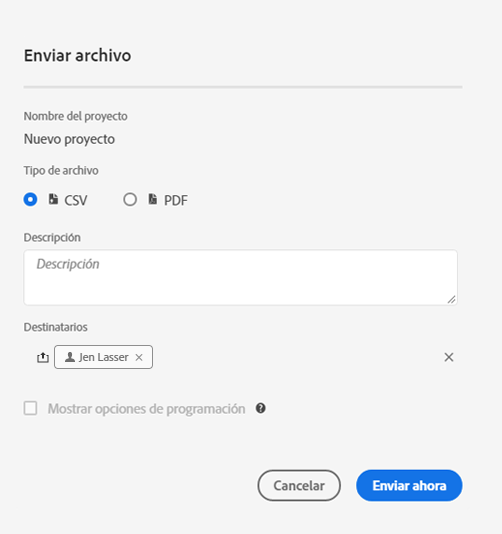
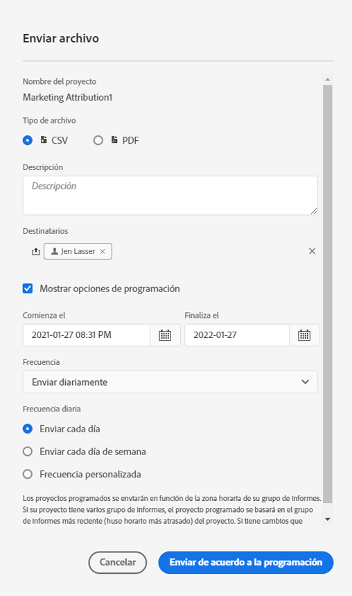

# Envío y programación de proyectos

Puede enviar proyectos de Adobe Analytics como archivos a usuarios seleccionados por correo electrónico. Puede enviar archivos ad hoc o configurar los archivos para que se envíen según una programación.

Tenga en cuenta lo siguiente al enviar archivos:

* Los archivos se pueden enviar en formato CSV o PDF.

* Todas las etiquetas aplicadas al proyecto se aplicarán automáticamente a la exportación.

También hay disponibles otros métodos para exportar datos de Adobe Analytics, como se describe en [Descripción general de la exportación](/help/export/home.md).

## Enviar archivo

Para enviar un archivo ad-hoc a los destinatarios por correo electrónico:

1. Seleccione **[!UICONTROL Compartir] > [!UICONTROL Enviar archivo]**.
1. Especifique el tipo de archivo:
   * [!UICONTROL **CSV**]: elija esta opción si desea datos de texto sin formato.
   * [!UICONTROL **PDF**]: elija esta opción si desea que el archivo descargado contenga todas las tablas y visualizaciones mostradas (visibles) en el proyecto.
1. (Opcional) Use **[!UICONTROL Descripción]** para agregar una descripción que incluir en el correo electrónico.
1. Añadir destinatarios o grupos. También puede introducir direcciones de correo electrónico.
1. (Opcional) Seleccione **[!UICONTROL Mostrar opciones de programación]** para [programar la exportación de un archivo](#schedule-file-export).
1. Haga clic en **[!UICONTROL Enviar ahora]**. Seleccione **[!UICONTROL Cancelar]** para cancelar.

## Programar la exportación del archivo {#schedule}

Para enviar un archivo según una programación a los destinatarios por correo electrónico:

1. Seleccione **[!UICONTROL Compartir] > [!UICONTROL Programar exportación de archivos]**.
1. Especifique el tipo de archivo:
   * [!UICONTROL **CSV**]: elija esta opción si desea datos de texto sin formato.
   * [!UICONTROL **PDF**]: elija esta opción si desea que el archivo descargado contenga todas las tablas y visualizaciones mostradas (visibles) en el proyecto.
1. (Opcional) Use **[!UICONTROL Descripción]** para agregar una descripción que incluir en el correo electrónico.
1. Añadir destinatarios o grupos. También puede introducir direcciones de correo electrónico.
1. (Solo para clientes de Healthcare Shield) Proporcione una contraseña para [proteger con contraseña un informe programado](#password-protect-a-new-scheduled-project).
1. Asegúrese de que **[!UICONTROL Mostrar opciones de horario]** esté seleccionado.
1. Seleccione una **[!UICONTROL frecuencia]**. Puede seleccionar entre:

   | Frecuencia | Opciones |
   |---|---|
   | **[!UICONTROL Enviar por hora]** | Escriba un valor para **[!UICONTROL Enviar cada número de horas]**. |
   | **[!UICONTROL Enviar diariamente]** | Seleccione una **[!UICONTROL Frecuencia diaria]**: **[!UICONTROL Enviar todos los días]**, **[!UICONTROL Enviar todos los días de la semana]** o **[!UICONTROL Frecuencia personalizada]**. Si selecciona **[!UICONTROL Frecuencia personalizada]**, escriba un valor para **[!UICONTROL Enviar cada número de días]**. |
   | **[!UICONTROL Enviar semanalmente]** | Escriba un valor para **[!UICONTROL Enviar cada número de semanas]**. Y selecciona **[!UICONTROL Día de la semana]**. |
   | **[!UICONTROL Enviar mensualmente por día de la semana]** | Seleccione un **[!UICONTROL Día de la semana]** y una **[!UICONTROL Semana del mes]**. |
   | **[!UICONTROL Enviar mensualmente por día del mes]** | Seleccione un valor de **[!UICONTROL Enviar en este día del mes]**. |
   | **[!UICONTROL Enviar anualmente por día del mes]** | Seleccione un **[!UICONTROL Día de la semana]**, una **[!UICONTROL Semana del mes]** y un **[!UICONTROL Mes del año]**. |
   | **[!UICONTROL Enviar anualmente por fecha específica]** | Seleccione un **[!UICONTROL Mes del año]** y elija un valor entre **[!UICONTROL Enviar en este día del mes]**. |

1. Escriba una fecha de inicio en **[!UICONTROL A partir del]**. Como alternativa, seleccione  para elegir una fecha de inicio del calendario.

1. Escriba una fecha de finalización en **[!UICONTROL Que termine el]**. Como alternativa, seleccione  para elegir una fecha de finalización del calendario.
1. Seleccione **[!UICONTROL Enviar según lo programado]**. Seleccione **[!UICONTROL Cancelar]** para cancelar.

## Administrador de proyectos programados {#manager}

Los proyectos programados de Analysis Workspace se pueden administrar desde la interfaz principal mediante **[!UICONTROL Componentes]** > **[!UICONTROL Proyectos programados]**. Para obtener más información, consulte [Proyectos programados](/help/components/scheduled-projects-manager.md)

<!--
# Schedule projects

From the Workspace **Share menu**, you can send Analysis Workspace projects using email to selected recipients. Files can be sent in CSV or PDF format. After you share scheduled projects, you can edit the schedule settings to modify the frequency, receipient list, or file type using the Scheduled Projects manager.

## Send file now

To send a file immediately to recipients via email:

1. Click **[!UICONTROL Share] > [!UICONTROL Export file]**.
1. Specify the file type:
   * [!UICONTROL **CSV**]: Choose this option if you want plain-text data.
   * [!UICONTROL **PDF**]: Choose this option if you want the downloaded file to contain all the displayed (visible) tables and visualizations in the project.
1. (Optional) Add a description to include in the email to explain the file being received. 
1. Add recipients or groups. Email addresses can also be entered. 
1. Click **[!UICONTROL Send Now]**.
1. (Optional) Click **[!UICONTROL Show scheduling options]** to specify a delivery schedule.

## Send file on schedule

To send a file on a recurring schedule to recipients via email:

1. Click **[!UICONTROL Share] > [!UICONTROL Schedule file export]**.
1. Specify the file type (CSV or PDF).
1. (Optional) Add a description that will be included in the email to explain the file being received. 
1. Add recipients or groups. Email addresses can also be entered. 
1. Specify the range the schedule should be delivered over by modifying Starting on and Ending on inputs. The end date must be within a year from the day the schedule is created or modified.
1. Specify the delivery frequency. Each frequency allows for different customizations. 
1. Click **[!UICONTROL Send on schedule]**.

## Manage scheduled projects

When you manage scheduled projects, you can edit and delete recurring project schedules:

*  Change the file type (.csv or PDF)
*  Update the project description
*  Add or remove recipients
*  Change the frequency

Scheduled Analysis Workspace projects can be managed under **Analytics > Components > Scheduled Projects**.

For more information, see [Scheduled projects](/help/components/scheduled-projects-manager.md)
-->
