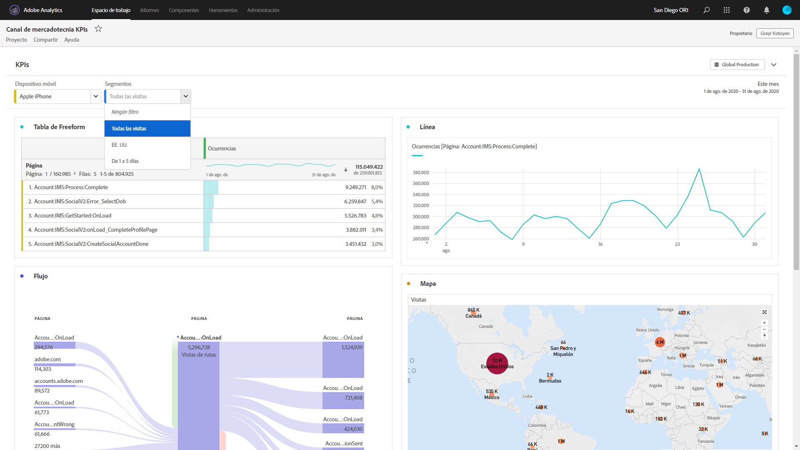

# Proyectos de solo de vista

Puede compartir proyectos como “Solo consulta” a destinatarios a través del [flujo de trabajo de uso compartido de proyectos](/help/analyze/analysis-workspace/curate-share/share-projects.md). Los Destinatarios que se tengan la función “Puede ver” tendrán opciones limitadas dentro del proyecto. Esto puede ser útil si comparte un proyecto con usuarios que están menos familiarizados con la estructura de datos de su organización, con Analysis Workspace o con Adobe Analytics en general pero, aun así, desea que consuman datos y perspectivas en un entorno seguro.

Tenga en cuenta que puede editar el intervalo de fechas del calendario del panel incluso en proyectos de solo vista.

>[!BEGINSHADEBOX]

Vea  [Proyectos de solo vista](https://video.tv.adobe.com/v/40057?quality=12&learn=on&captions=spa){target="_blank"} para ver un vídeo de demostración.

>[!ENDSHADEBOX]

## Interacciones desactivadas

Las interacciones desactivadas en un proyecto de Solo consulta incluyen:

* Barra izquierda oculta
* Grupo de informes
* Filtro improvisado
* N.º de filas visibles improvisado
* Configuración de fila, columna o visualización improvisada
* Segmentos de panel
* Menús Editar, Insertar y Componente
* Sugerencias de Workspace

## Interacciones habilitadas

Algunas de las interacciones habilitadas más notables en un proyecto de Solo consulta incluyen:

| Área | Interacciones habilitadas |
| --- | --- |
| Tablas improvisadas | <ul><li>Paginación y ordenación</li><li>Pasar el cursor por las opciones</li><li>Seleccionar celdas que actualizan las visualizaciones vinculadas</li><li>Haga clic con el botón derecho > Obtener vínculo de visualización</li><li>Haga clic con el botón derecho > Copiar al portapapeles</li></ul> |
| Visualizaciones | <ul><li>Hacer clic para activar o desactivar la leyenda</li><li>Pasar el cursor por las opciones</li><li>Haga clic con el botón derecho > Obtener vínculo de visualización</li><li>Contraer/expandir</li><li>Flujo: expandir nodos de flujo</li><li>Mapa: zoom</li></ul> |
| Paneles | <ul><li>Filtros desplegables interactivos</li><li>Haga clic con el botón derecho > Obtener vínculo del panel</li><li>Contraer/expandir</li></ul> |
| Proyecto | <ul><li>Inspección de todos los iconos de información</li><li>Menú Proyecto: Nuevo, Abrir, Definir como página principal, Actualizar, Descargar CSV/PDF, Información y configuración limitadas del proyecto</li><li>Menú Compartir: Obtener vínculo del proyecto, Enviar archivo ahora</li><li>Menú Ayuda: Todas las acciones excepto Sugerencias y opciones de Debugger</li></ul> |
