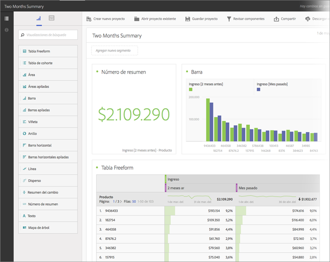
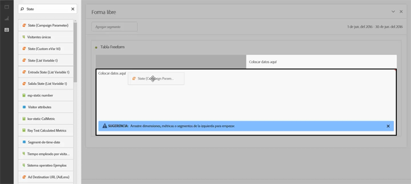
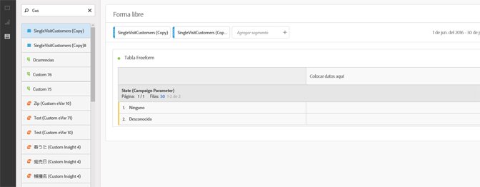
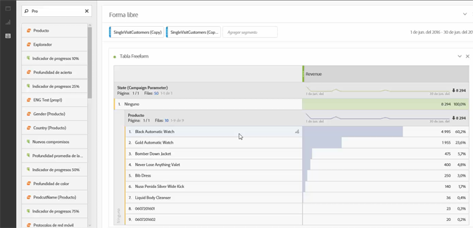
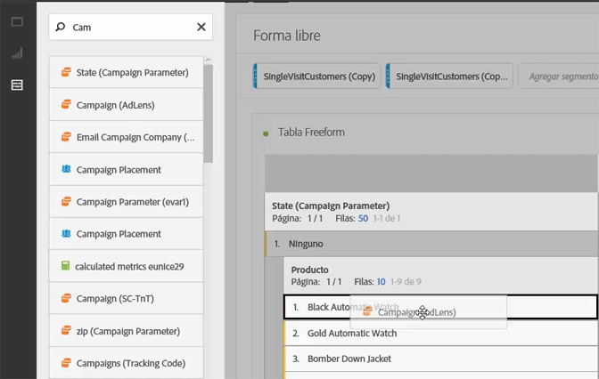
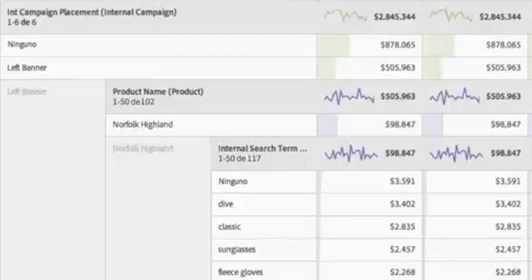

# Casos de uso de Analysis Workspace

Ejemplos de cómo usar tablas de datos, segmentos e ideas de casos de uso para Analysis Workspace.

Puede dirigir la investigación en los datos para responder preguntas específicas y elaborar narrativas sobre las interacciones del cliente y los intereses de audiencia. En un entorno improvisado, puede aplicar dimensiones, métricas y segmentos durante un periodo de tiempo para recuperar directamente los datos de destino. Modifique el análisis para personalizar preguntas específicas y, luego, publique la información en informes y visualizaciones atractivos para compartirlos y para que los usuarios comerciales básicos que disponen de menos tiempo los puedan interpretar.

**Ejemplos**

* Como empresa multimedia, podría necesitar comparar sus nuevos visitantes, los visitantes que regresan, y los visitantes más fieles para ver cómo el consumo de contenido cambia con el transcurso del tiempo para cada segmento diferente.
* Compare las tasas de conversión para palabras clave con marca y sin marca.
* Desglose vistas de página por búsqueda interna, búsqueda externa, páginas de aterrizaje, etc., para comprender por qué los términos con marca y sin marca rinden diferente.
* Compare un día con el siguiente para comparar columnas o filas y analizar el crecimiento en distintas métricas.
* Realice una consulta sencilla como devoluciones por dimensión.

## Ejemplo de minorista {#section_9EFDEF038CAD4954BCFB118A8F33A96F}

Supongamos que es un analista de marketing para un minorista de engranajes exterior y se le encarga que examine el rendimiento de una promoción reciente de Acción de Gracias y que haga recomendaciones sobre cómo mejorar las campañas in situ. Este ejemplo muestra cómo puede comparar los datos de ingresos de campaña para segmentos diferentes y agregar desgloses para profundizar más en la campaña.

1. Seleccione el grupo de informes correspondiente.
1. Busque, por ejemplo, su dimensión de ubicaciones de campañas internas y arrástrela en la sección izquierda del lienzo de tabla (estos datos constituirán las filas de la tabla).

   

1. Ahora haga clic en el icono de segmento en el extremo superior izquierdo y arrastre diferentes segmentos de fidelidad de cliente a la mitad derecha del lienzo. Va a comparar los segmentos entre sí sobre la marcha. Estos constituirán las columnas de la tabla.

   

1. Haga clic en el icono Eventos (Métricas) en el extremo superior izquierdo y agregue la métrica de ingresos debajo de cada segmento. Observe cómo el informe se genera automáticamente. Ahora puede empezar a comparar ingresos de campañas para estos segmentos de clientes.

   

1. Ahora, si quisiera ver qué productos resultaron más eficaces en la parte del banner izquierdo de sus páginas, desglose Banner izquierdo por Nombre de producto. Simplemente haga clic en el icono Dimensiones y arrastre la dimensión de nombre de producto en el Banner izquierdo.

   

1. Pero puede desglosar más aún. Podría preguntar qué términos de búsqueda usaron las personas para llegar a su producto más vendido, Norfolk Highland. Todo lo que tiene que hacer es arrastrar la dimensión Término de búsqueda interna en la parte superior del nombre del producto:

   

   Aparecerá un nuevo resultado de desglose:

   

   Ya ha desglosado los datos de una manera que puede generar recomendaciones y ventas cruzadas para que sus equipos de comercialización implementen en otras campañas y aporten incluso más ingresos para su compañía. Puede realizar más desgloses hasta llegar a los resultados que busca.

   Ahora puede [compartir](/help/analyze/analysis-workspace/curate-share/curate.md) el informe con esos equipos de comercialización.

