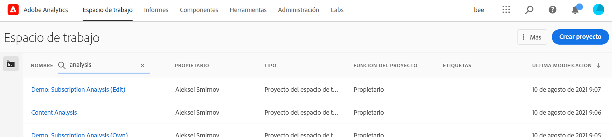
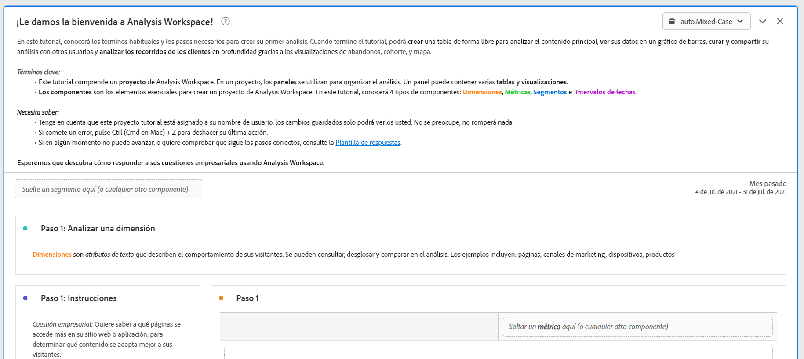
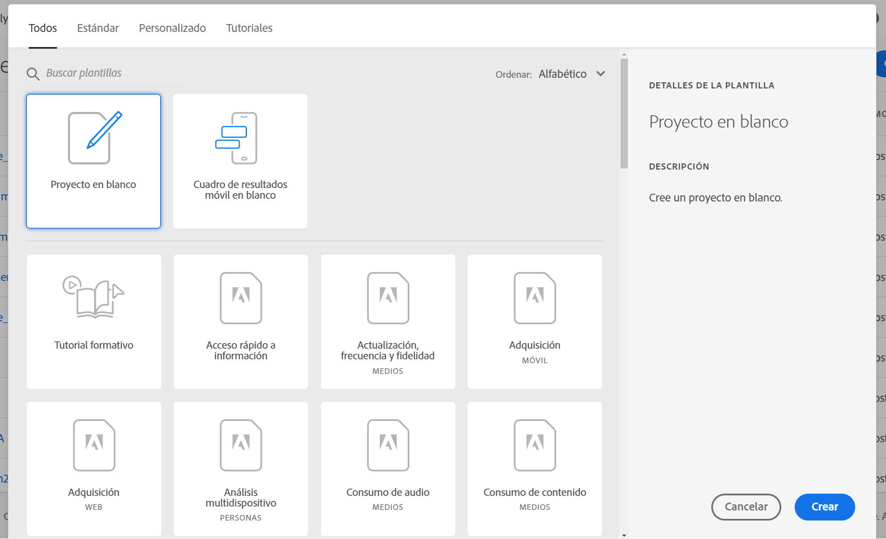
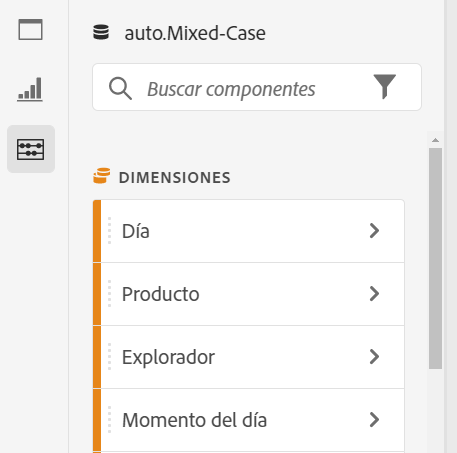
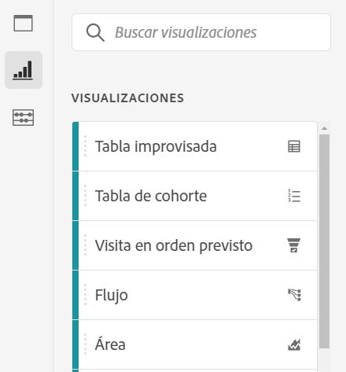
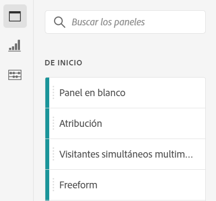

# Información general de Analysis Workspace

Analysis Workspace es una herramienta de navegador flexible que le permite crear análisis y compartir perspectivas rápidamente. Mediante la interfaz de arrastrar y soltar, puede crear su análisis, agregar visualizaciones para dar vida a los datos, depurar un conjunto de datos, compartir y programar proyectos con cualquier persona de su organización.

Si solo tiene unos minutos, consulte esta breve descripción general para ver qué es posible.

>[!VIDEO](https://video.tv.adobe.com/v/26266/?quality=12&captions=spa)

## Iniciar sesión en Adobe Analytics {#login}

Para empezar a usar Analysis Workspace, inicie sesión en Adobe Analytics en [experience.adobe.com/analytics](http://experience.adobe.com/analytics). Aterrizará en la página de inicio de la lista del proyecto de Workspace si no se ha seleccionado anteriormente un proyecto específico.

## Uso del tutorial de formación {#training-tutorial}

Una vez que haya iniciado sesión, la primera parada debe ser el Tutorial de formación de Analysis Workspace, que le explicará la terminología común y los pasos para crear su primer análisis en Workspace. Para comenzar el tutorial, haga clic en **[!UICONTROL Crear nuevo proyecto]** y, a continuación, seleccione **Tutorial de formación** dentro del nuevo modal de proyecto.

## Creación de un nuevo proyecto {#new-project}

Una vez completado el tutorial, estará listo para empezar a crear el primer proyecto. El **nuevo modal de proyecto** le ofrece diferentes opciones para iniciar el análisis. Puede elegir el inicio de un proyecto en blanco o de un [informe de valoración móvil](https://docs.adobe.com/content/help/es-ES/analytics/analyze/mobapp/curator.html) en blanco, en función de si desea compartir el análisis desde el navegador o desde la aplicación móvil de paneles de Adobe Analytics.

También puede iniciar el análisis a partir de **plantillas** creadas previamente, ya sea plantillas estándar proporcionadas por Adobe o plantillas personalizadas creadas por su organización. Hay varias plantillas disponibles, según el análisis o el caso de uso que tenga en mente. [Obtenga más información](https://docs.adobe.com/content/help/es-ES/analytics/analyze/analysis-workspace/build-workspace-project/starter-projects.html) sobre las distintas opciones de plantilla disponibles.

## Cree su análisis {#analysis}

En el proyecto de Workspace, se accede a **paneles, tablas, visualizaciones y componentes** desde el carril izquierdo. Estos son los componentes básicos del proyecto.

### Componentes

**Los componentes** son dimensiones, métricas, segmentos o intervalos de fechas, los cuales se pueden combinar en una **[!UICONTROL tabla improvisada]** para responder en inicio a las preguntas comerciales. Asegúrese de familiarizarse con cada [tipo de componente](/help/analyze/analysis-workspace/components/analysis-workspace-components.md) antes de sumergirse en su análisis. Una vez dominada la terminología de los componentes, puede empezar a arrastrar y soltar para [crear el análisis](https://docs.adobe.com/content/help/es-ES/analytics/analyze/analysis-workspace/build-workspace-project/t-freeform-project.html) en una **[!UICONTROL tabla improvisada]**.

### Visualizaciones

**Las visualizaciones**, como una barra o un gráfico de líneas, se agregan a continuación sobre los datos para darle vida visualmente. En el carril del extremo izquierdo, seleccione el icono **[!UICONTROL Visualizaciones]** del medio para ver la lista completa de [visualizaciones](https://docs.adobe.com/content/help/es-ES/analytics/analyze/analysis-workspace/visualizations/freeform-analysis-visualizations.html) disponibles.

### Paneles

**Los paneles** se utilizan para organizar el análisis dentro de un proyecto y pueden tener muchas tablas y visualizaciones. Muchos de los paneles que se proporcionan en Analysis Workspace generan un conjunto completo de análisis basados en unas pocas entradas del usuario. En el carril del extremo izquierdo, seleccione el icono **[!UICONTROL Paneles]** en la parte superior para ver una lista completa de [paneles](https://docs.adobe.com/content/help/es-ES/analytics/analyze/analysis-workspace/panels/panels.html) disponibles.

## Recursos adicionales {#resources}

* Adobe ofrece cientos de [tutoriales de formación en vídeo de Analytics](https://docs.adobe.com/content/help/en/analytics-learn/tutorials/overview.html).
* Consulte [Novedades de Analysis Workspace](/help/analyze/analysis-workspace/new-features-in-analysis-workspace.md) para estar al día de las últimas funciones.
